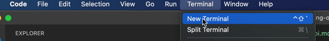
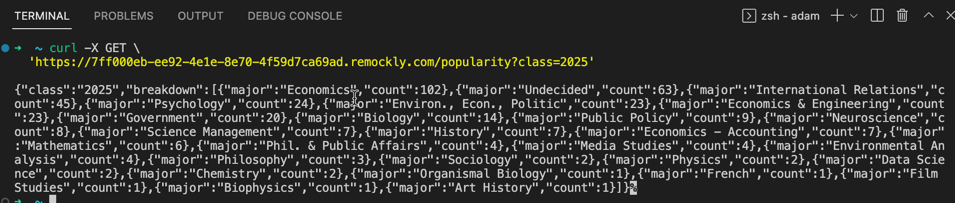
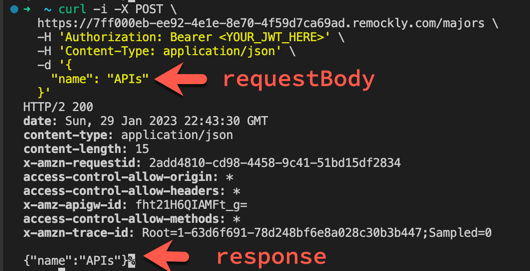
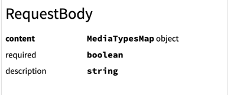
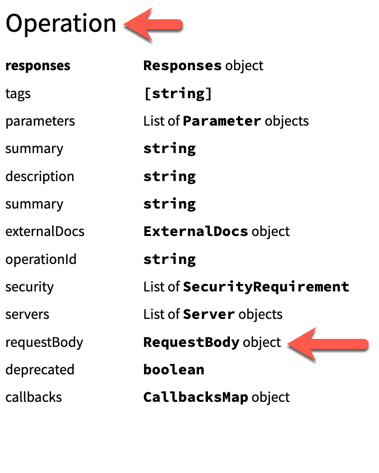
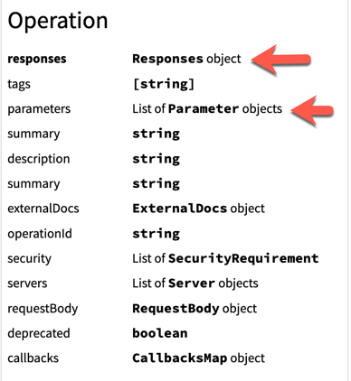
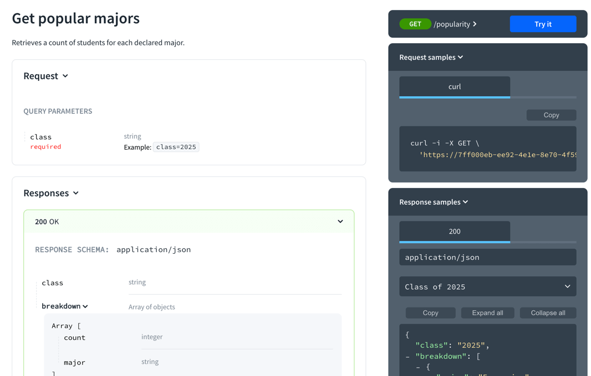

## Catalyst

At Redocly, we've pointed new hires to 3rd-party OpenAPI content, including the specification itself, and various tutorials freely available online.
At the 90-days marker, most people have not completed even half of the tutorials.

Amanda, a student at Claremont McKenna College (CMC), my alma mater, began a 90-day internship in product management at Redocly last week.
The internship is a total of 90 calendar days which is about 60 work days.
She'll want to hit the ground running with no month-long tutorials to learn OpenAPI.
She has a non-technical background and is interested in adding technical skills.
APIs are a great place to start.

## Challenge

Can we train Amanda to learn the basics of OpenAPI in a day or two max?

## Prior knowledge

Amanda is coming without prior knowledge.
Does she know what an API is, YAML, Git, the command-line, or OpenAPI?
No.

This blog post outlines exactly what I'll have Amanda do to get acclimatized to APIs.

## Philosophy

> I hear and I forget.
> I see and I remember.
> I do and I understand.
> - Confucius

We'll rely on some ancient wisdom to make sure she **does** things and isn't only reading.
Where reading is involved, there should be some corresponding "doing" exercise.

## Prerequisites

1. Read my [blog post about APIs](./whats-an-api.md)
    - Homework: Explain what an API is to someone else in your own words.
1. Take Redocly's [YAML essentials course](/learn/yaml/index.md) (the exercises are built-in)
1. Install VS Code.

## Your first API request

If you've made it this far, you can explain what an API is.
Now, let's use an API.

### Step 1: Open VS Code Terminal

Open the VS Code terminal.


The cursor of the command line may look something like the following.


### Step 2: Copy and paste the command into the terminal

The following command uses a tool, curl, that makes HTTP (and API) requests.
Fun fact, the tool is older than Amanda, and is maintained by the original creator, [Daniel Stenburg](https://twitter.com/bagder).


Copy the following curl command.
```sh
curl -X GET \
  'https://7ff000eb-ee92-4e1e-8e70-4f59d7ca69ad.remockly.com/popularity?class=2025'
```


The server is `https://7ff000eb-ee92-4e1e-8e70-4f59d7ca69ad.remockly.com`.

The path is `/popularity`.

The query parameter is `class` with a value of `2025`.
A question mark (`?`) typically separates the path from query parameters.


Paste it into the VS code terminal and press return.

The following is a screenshot of the response.



 🎉 Woo hoo! You've sent your first API request.

## OpenAPI intro

While OpenAPI is the predominant standard for describing HTTP APIs, the step above is the way most APIs are actually described today.

Even though OpenAPI (formerly known as Swagger) has been around for a decade, it takes time for organizations to adopt new technology.
And it takes reasons.

Isn't the example above good enough?

It is good enough for some simple cases, but as the schema of an API gets more complex, and as an API has more paths (also known as endpoints) and operations, it becomes increasingly difficult to describe and organize.

In addition, OpenAPI isn't used only for documentation.
It is used to generate mock servers (that's how the API you tested above is powered by Redocly's mock server).
It is used to generate code samples.
It is used to do contract and security-based testing.
And to generate server and client code.

OpenAPI is a structured document in YAML or JSON.
In this tutorial, we'll use YAML.

The following is an excerpt of the OpenAPI description of the CMC API.

```yaml
openapi: 3.1.0
info:
  title: CMC Majors
  version: v1
paths:
  /popularity:
    get:
      operationId: getPopularMajors
      summary: Get popular majors
      description: Retrieves a count of students for each declared major.
      parameters:
        - name: class
          in: query
          required: true
          schema:
            type: string
            example: "2025"
      responses:
        '200':
          description: OK
          content:
            application/json:
              schema:
                type: object
```

A quick review of the snippet above reveals there is some structure to the file.

We use the term "type" to mean the type of complex data being described (as opposed to scalar data).
This means they are going to be one of two kinds:
- objects also known as maps
- arrays also known as sequences or lists or collections

Quick check: do you remember what scalars are from the [YAML essentials course](/learn/yaml/scalars.md)?

 🎉 Woo hoo! We refreshed on scalars.

To connect with our teaching and learning philosophy, you'll learn the structure of an OpenAPI document in a hands-on way.

## OpenAPI structure

I designed 24 note cards to help you learn the structure of OpenAPI.
Print this [PDF](../static/downloads/oas-3_1-notecards.pdf) and following the accompanying instructions.

I did this exercise and I wrote them out by hand (and my hand is not accustomed to writing so much -- it hurt).
There is evidence that writing results in deeper learning and better knowledge retention.
I'll leave it up to you if you want to write them out.

The purpose is not to memorize these types.
The purpose is to understand the relationships between these types of data.

> ### "[I do not] carry such information in my mind since it is readily available in books." -- Einstein

By now, you should have 24 note cards cut out.

 🎉 Woo hoo! You've got 24 OpenAPI note cards.

Find the `Root` card.
This is the most important card, because OpenAPI documents start at the root.

1. List the types where a `security` property is found. (Hint: more than one.)
1. List the types where a `servers` property is found. (Hint: more than one.)
1. List the types where a `parameters` property is found. (Hint: more than one.)

We've seen that types can appear in multiple places of the specification.
In the root, they set the global or default values.
Deeper in the specification, they impact a specific path or operation.

 🎉 Woo hoo! You understand how these cards relate to each other.

Look back at the YAML snippet of the OpenAPI document above.
Take your cards out and pull out the ones that correspond to that snippet.
Start with the `Root` card.
Then, take out the `Info` card.

Complete this exercise on your own.

<details>
<summary>Click to see a hint</summary>

Hint: you should have 12 cards

<details>
<summary>Click to see the answer</summary>

- `Root`
- `Info`
- `Paths`
- `PathItem`
- `Operation`
- `Parameter`
- `Responses`
- `Response`
- `Schema` (there are 4 schema cards)
</details>
</details>

This operation retrieves data and didn't have any request body (typically used when submitting data).

### Inform the registrar of your new major

It's time to make some data.
You realize CMC needs a new major: APIs.

Copy and paste the following request into the terminal and then press enter.
```sh
curl -i -X POST \
  https://7ff000eb-ee92-4e1e-8e70-4f59d7ca69ad.remockly.com/majors \
  -H 'Authorization: Bearer <YOUR_JWT_HERE>' \
  -H 'Content-Type: application/json' \
  -d '{
    "name": "APIs"
  }'
```

The `-d` flag is followed by the data.
This time we pass the `-i` flag, so we can see the full response headers to confirm the request was accepted.



 🎉 Woo hoo! You've sent your second API request.

Now, take out those OpenAPI note cards and walk through how you think you would describe this one.

It's pretty much the same cards as the last request with minor changes:

- You don't use the `Parameter` card.
- You use the `RequestBody` card.
- If you pay close attention, you would use the `Header` card to describe the response headers.
- You would also use the `SecurityRequirement` card, which means the security scheme needs to be defined, which require the `Component` card and `SecurityScheme` card.

Look through these cards and follow the relationships from the `Root` card onward.

```yaml
paths:
  /majors:
    post:
      operationId: postMajors
      summary: Create a major
      security:
        - admin: ['admin']
      description: Creates a new major (must be approved by the administration).
      requestBody:
        content:
          application/json:
            schema:
              $ref: "#/components/schemas/major"
      responses:
        '200':
          description: OK
          content:
            application/json:
              schema:
                $ref: "#/components/schemas/major"
```

You'll notice the schema has this underneath it: `$ref: "#/components/schemas/major"`.
That is a reference object, which allows us to reuse a schema in more than one place.
It is common to use reference objects for schemas, parameters, and headers.
We'll learn more about those another time.

At this point, the goal is not to know the structure of OpenAPI, but to be able to identify the corresponding types (starting from the `Root` type) involved in a description.

 🎉 Woo hoo! You can identify different types.

## Schemas

The most complex of the types is `Schema` which is mostly inherited from JSON Schema.
JSON Schema has its own specification and there are multiple versions of it too.

In our note cards, `Schema` takes four cards, where no other type takes more than one card.

And `Schema` references itself which makes for a lot of complexity.

The most common properties (fields) to know are:

- type
- description
- format
- properties (for objects)
- items (for arrays)
- examples (or example)
- enum
- default

In practice, the most common uses of JSON Schema are much more manageable.

Also, there isn't a strong need to write JSON Schema from scratch.
Instead, refine it by adding descriptions, a format, or extra constraints.
We have a [JSON to JSON Schema tool](https://redocly.com/tools/json-to-json-schema/) which can transform a JSON snippet into JSON Schema.

For example, using the request or response from the most recent create a major API, we can copy the following.
```json
{
  "major": "APIs"
}
```
And paste it into the tool.

The output for OAS 3.1 with examples is as follows:

```yaml
type: object
properties:
  major:
    type: string
    examples:
      - APIs
```

The tool is practical.
Use it.

 🎉 Woo hoo! You've gone from a JSON example to a JSON Schema.

## Parent shuffle game

Take out the four schema cards and the root card.
Shuffle the remaining cards.
Pick one randomly.
Identify the parent or parents as quickly as you can.

For example, let's say you pick the `RequestBody` card.



Then, you need to figure out which cards reference the `RequestBody` object.
The `Operation` object is the parent.



Play this game for 10 minutes.

 🎉 Woo hoo! You've got a better sense of the relationships between the data types.

## Writing your first OpenAPI file

Let's get writing already.

Open VS Code and create a file named `cmc.yaml`.

Redocly has a VS Code extension (do not install that yet or turn it off for this tutorial).
There is one school of thought that learning to ride a bike is better without training wheels.
We recommend you install the extension after you complete this tutorial.

 🎉 Woo hoo! You made a YAML file! (Okay, it's empty and we can't celebrate this too much yet.)

Pull the `Root` type card.

Put these in your file.

```yaml
openapi: 3.0.1
info:
paths:
components:
```

Next: `Info` card.

When we pull that card, we see that the `title` and `version` are required properties.
We'll focus on the minimally required fields before we make it a richer description.

Notice the indentation for the `title` and `version` in the following example, which is putting your YAML essentials knowledge to the test.
```yaml
openapi: 3.0.1
info:
  title: CMC Majors
  version: v1
paths:
components:
```

Next: `Paths` card.

Let's describe the major popularity first, starting with the path (see `/popularity` added in the following example).

```yaml
openapi: 3.0.1
info:
  title: CMC Majors
  version: v1
paths:
  /popularity:
components:
```

Next: `PathItem` card.

Even though nothing is required, we want to describe the request.

```sh
curl -X GET \
  'https://7ff000eb-ee92-4e1e-8e70-4f59d7ca69ad.remockly.com/popularity?class=2025'
```

Notice the `-X GET` which let's curl know to send a GET request.
We need to use the `get` field, as shown in the example.

```yaml
openapi: 3.0.1
info:
  title: CMC Majors
  version: v1
paths:
  /popularity:
    get:
components:
```

It is possible to describe parameters on the path item level or on the operation level.
We'll do it on the operation level.

Grab the `Operation` card and start finding and filling out the fields where applicable.
I always fill the `summary` for an operation.

```yaml
openapi: 3.0.1
info:
  title: CMC Majors
  version: v1
paths:
  /popularity:
    get:
      responses:

      parameters:
        -
      summary: Get popularity by major
components:
```



We need the `Responses` and `Parameter` cards based on the `Operation` card.

Let's do the `Responses` first.

We need the response status code, which means we need to add the `-i` to the curl request and run it again.

```sh
curl -i -X GET \
  'https://7ff000eb-ee92-4e1e-8e70-4f59d7ca69ad.remockly.com/popularity?class=2025'
```

You'll see the following in the headers of the response.

```sh
HTTP/2 200
```

The "200" is the response status code.
Here we've added it to our YAML file.
It should look like the following snippet.

```yaml
openapi: 3.0.1
info:
  title: CMC Majors
  version: v1
paths:
  /popularity:
    get:
      responses:
        '200':

      parameters:
        -
      summary: Get popularity by major
components:
```

We'll look at the `Response` type card next, and not forget about the `Parameter` type (we'll come back to it later).

The response type has a description.
In this case, the 200 response means the request was OK.
We'll use a brief description here.
Since we added the `-i`, we can see there are some response headers, like `x-amzn-requestid: 534f1ef3-a62a-49cc-89d0-7a2ebbe67307` where `x-amzn-requestid` is a header and the `:` separates it from a value.
In this tutorial, we'll describe that one header only.
You can try to describe the other headers for extra credit.
We won't use `links`.

```yaml
openapi: 3.0.1
info:
  title: CMC Majors
  version: v1
paths:
  /popularity:
    get:
      responses:
        '200':
          description: OK
          headers:
            x-amzn-requestid:
          content:
      parameters:
        -
      summary: Get popularity by major
components:
```

As of now, we're keeping track of `Parameter`, `Header`, and `MediaType`.

Let's start with `Header`.

As a note, the `content-type` is a special header and is described as the map key for the content in the `MediaTypesMap`.

It looks like we also need the `Schema` card to describe the header.

```yaml
openapi: 3.0.1
info:
  title: CMC Majors
  version: v1
paths:
  /popularity:
    get:
      responses:
        '200':
          description: OK
          headers:
            x-amzn-requestid:
              schema:
                description: ID of the Amazon request
                type: string
          content:
      parameters:
        -
      summary: Get popularity by major
components:
```

Next we'll describe the content, which has a map key of the content-type `application/json`.

```yaml
openapi: 3.0.1
info:
  title: CMC Majors
  version: v1
paths:
  /popularity:
    get:
      responses:
        '200':
          description: OK
          headers:
            x-amzn-requestid:
              schema:
                description: ID of the Amazon request
                type: string
          content:
            application/json:
      parameters:
        -
      summary: Get popularity by major
components:
```

Grab the `MediaType` card (and we need the `Schema` card again too).

Use the [JSON to JSON Schema tool](https://redocly.com/tools/json-to-json-schema/) to generate a schema and then paste it in paying careful attention to fix indentation as VS Code may automatically change it (I did it without the examples to keep the YAML shorter for this tutorial).

```yaml
openapi: 3.0.1
info:
  title: CMC Majors
  version: v1
paths:
  /popularity:
    get:
      responses:
        '200':
          description: OK
          headers:
            x-amzn-requestid:
              schema:
                description: ID of the Amazon request
                type: string
          content:
            application/json:
              schema:
                type: object
                properties:
                  class:
                    type: string
                  breakdown:
                    type: array
                    items:
                      type: object
                      properties:
                        major:
                          type: string
                        count:
                          type: integer
      parameters:
        -
      summary: Get popularity by major
components:
```

Next, we'll add the `Parameter` info.
Parameters are a list, so they are prefixed with the `-` before each parameter (not before each line).

```yaml
openapi: 3.0.1
info:
  title: CMC Majors
  version: v1
paths:
  /popularity:
    get:
      responses:
        '200':
          description: OK
          headers:
            x-amzn-requestid:
              schema:
                description: ID of the Amazon request
                type: string
          content:
            application/json:
              schema:
                type: object
                properties:
                  class:
                    type: string
                  breakdown:
                    type: array
                    items:
                      type: object
                      properties:
                        major:
                          type: string
                        count:
                          type: integer
      parameters:
        - name: class
          in: query
          required: true
          schema:
            type: string
            example: "2025"
      summary: Get popularity by major
components:
```

 🎉 Woo hoo! You've described an API operation.

This is a great spot to reflect.
We've completed describing one operation.
The goal is to become more comfortable navigating between the types using the cards.

Let's start on our next operation.
Not everyone is able to add a major, and let's describe the security first.

Grab the `Components`, `SecurityScheme`, and `SecurityRequirement` cards.
I understand you won't understand so much about API security, so follow along as best you can.
There are a lot of ways to secure the API, and we'll use a JWT bearer token.

First, we'll add the components and security scheme named `admin`.
```yaml
components:
  securitySchemes:
    admin:
      type: http
      scheme: bearer
      bearerFormat: JWT
```
Then, we'll be able to register the security requirement when we describe our operation by adding something like the following:

```yaml
security:
  - admin: []
```

Here is our YAML file so far.

```yaml
openapi: 3.0.1
info:
  title: CMC Majors
  version: v1
paths:
  /popularity:
    get:
      responses:
        '200':
          description: OK
          headers:
            x-amzn-requestid:
              schema:
                description: ID of the Amazon request
                type: string
          content:
            application/json:
              schema:
                type: object
                properties:
                  class:
                    type: string
                  breakdown:
                    type: array
                    items:
                      type: object
                      properties:
                        major:
                          type: string
                        count:
                          type: integer
      parameters:
        - name: class
          in: query
          required: true
          schema:
            type: string
            example: "2025"
      summary: Get popularity by major
components:
  securitySchemes:
    admin:
      type: http
      scheme: bearer
      bearerFormat: JWT
```

Now, we'll repeat the steps.
This time, I'll do it in bigger chunks of work.

I'll add the path, path item, and operation.
Notice that this request is a POST request and uses the `post` property for the `PathItem`.
I also fill the `security` as part of the operation.
I left the `requestBody` and `responses` empty for the next step.

```yaml
openapi: 3.0.1
info:
  title: CMC Majors
  version: v1
paths:
  /majors:
    post:
      summary: Add a major
      requestBody:
      responses:
      security:
        - admin: []
  /popularity:
    get:
      responses:
        '200':
          description: OK
          headers:
            x-amzn-requestid:
              schema:
                description: ID of the Amazon request
                type: string
          content:
            application/json:
              schema:
                type: object
                properties:
                  class:
                    type: string
                  breakdown:
                    type: array
                    items:
                      type: object
                      properties:
                        major:
                          type: string
                        count:
                          type: integer
      parameters:
        - name: class
          in: query
          required: true
          schema:
            type: string
            example: "2025"
      summary: Get popularity by major
components:
  securitySchemes:
    admin:
      type: http
      scheme: bearer
      bearerFormat: JWT
```

Using the JSON to JSON schema tool, we have the same request and response body schema.

The following is an example request and response body.

```json
{
  "major": "APIs"
}
```

The corresponding JSON schema follows.

```yaml
type: object
properties:
  major:
    type: string
    examples:
      - APIs
```

Next, we'll complete the description of the `RequestBody`, `Responses`, and `Response` types.

```yaml
openapi: 3.0.1
info:
  title: CMC Majors
  version: v1
paths:
  /majors:
    post:
      summary: Add a major
      requestBody:
        content:
          application/json:
            type: object
            properties:
              major:
                type: string
                examples:
                  - APIs
      responses:
        '200':
          description: OK
          content:
            application/json:
              type: object
              properties:
                major:
                  type: string
                  examples:
                    - APIs
      security:
        - admin: []
  /popularity:
    get:
      responses:
        '200':
          description: OK
          headers:
            x-amzn-requestid:
              schema:
                description: ID of the Amazon request
                type: string
          content:
            application/json:
              schema:
                type: object
                properties:
                  class:
                    type: string
                  breakdown:
                    type: array
                    items:
                      type: object
                      properties:
                        major:
                          type: string
                        count:
                          type: integer
      parameters:
        - name: class
          in: query
          required: true
          schema:
            type: string
            example: "2025"
      summary: Get popularity by major
components:
  securitySchemes:
    admin:
      type: http
      scheme: bearer
      bearerFormat: JWT
```

 🎉 Woo hoo! You've described the other API operation.

That nearly concludes the API description.
The schema was copy and pasted in two spots.
Instead of doing that, we can reuse a single source of truth.
That way, if it evolves it is updated in all places.
To do that, we'll use a reference object (`$ref`).
Reference objects could be in different files, or even remote files, or within the same file OpenAPI has a special place for named schemas in components.

The following shows a sample implementation in components named schemas.

```yaml
components:
  schemas:
    major:
      type: object
      properties:
        major:
          type: string
          examples:
            - APIs
```

Then, we can adjust our usages.

```yaml
openapi: 3.0.1
info:
  title: CMC Majors
  version: v1
paths:
  /majors:
    post:
      summary: Add a major
      requestBody:
        content:
          application/json:
            $ref: '#/components/schemas/major'
      responses:
        '200':
          description: OK
          content:
            application/json:
              $ref: '#/components/schemas/major'
      security:
        - admin: []
  /popularity:
    get:
      responses:
        '200':
          description: OK
          headers:
            x-amzn-requestid:
              schema:
                description: ID of the Amazon request
                type: string
          content:
            application/json:
              schema:
                type: object
                properties:
                  class:
                    type: string
                  breakdown:
                    type: array
                    items:
                      type: object
                      properties:
                        major:
                          type: string
                        count:
                          type: integer
      parameters:
        - name: class
          in: query
          required: true
          schema:
            type: string
            example: "2025"
      summary: Get popularity by major
components:
  schemas:
    major:
      type: object
      properties:
        major:
          type: string
          examples:
            - APIs
  securitySchemes:
    admin:
      type: http
      scheme: bearer
      bearerFormat: JWT
```

 🎉 Woo hoo! You've use the `$ref`.

If you've made it this far, you're absolutely cooking.

There is one more API to document regarding athletics.

You can try it with this curl command.

```sh
curl -i -X GET \
  https://7ff000eb-ee92-4e1e-8e70-4f59d7ca69ad.remockly.com/athletics
```
(I only added my favorite team.)

Remember the process, reference the type cards, and share your YAML file with us.
Good luck.
And don't forget to install the [Redocly VS Code extension](../docs/vscode/index.md).

 🎉 Woo hoo! You've done this without guidance on your own.

## Conclusion

If you were able to do that, you know OpenAPI good enough to be a productive member of any API team.

If you were not able to complete the description, don't despair.
First, we're trying to cram a whole "semester" of information into a day.
Second, this is a first draft blog post that definitely needs some revisions.
I'd love [feedback on where you got stuck](../pages/contact-us/contact-us.page.tsx).

Next you'll learn what you can do with OpenAPI tools, such as rendering docs for APIs.


