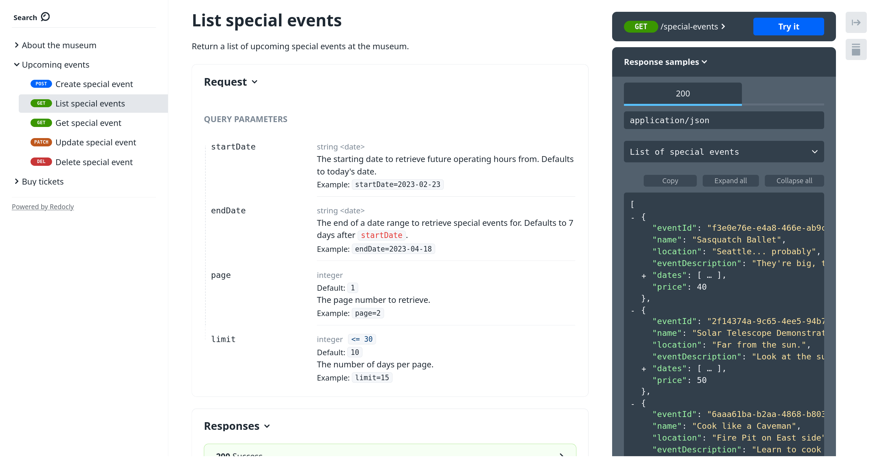
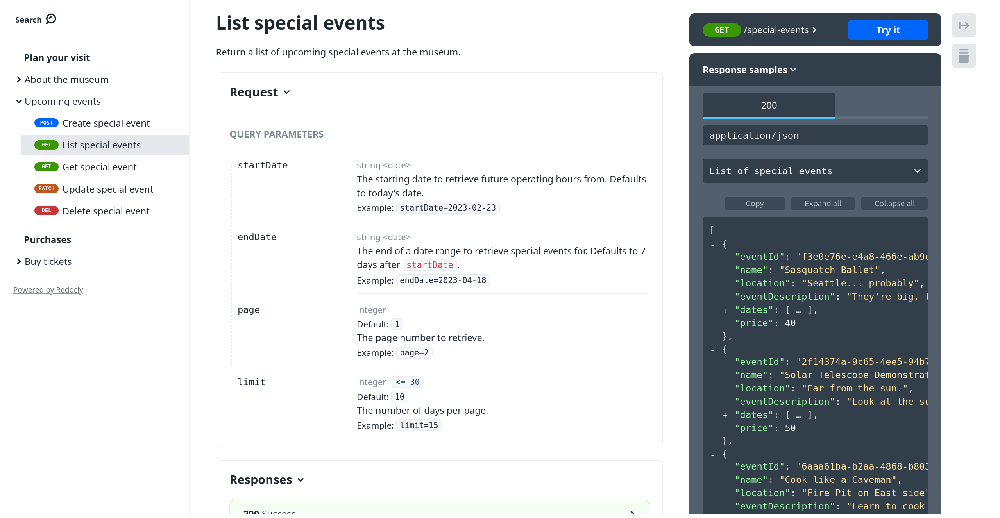

Getting to know a new API is always daunting, but for the larger APIs, the hardest part is knowing where to start.
Help users find their way with your API by adding tags to your [OpenAPI](https://www.openapis.org/) [endpoints](https://blog.hubspot.com/website/api-endpoint).

## What are OpenAPI tags?

OpenAPI has tagging functionality that allows users to attach one or many arbitrary labels to each endpoint in an OpenAPI description.
Users define their own tags at the top level of the OpenAPI file, then use them wherever they are needed.

Common use cases for tags include grouping endpoints together in navigation sections of API reference documentation, and providing a way to include or exclude a subset of endpoints from an OpenAPI description.

## How to use tags in OpenAPI

Using tags in an OpenAPI description requires the following two-steps:

1. Declare the tag at the top level of the OpenAPI description.
2. Add the tag to the endpoints that belong in it.

As an example, take a look at the [Museum Example API](https://github.com/Redocly/museum-openapi-example).
Its `tags` section looks like the following:

```yaml
tags:
  - name: Operations
    description: Operational information about the museum.
  - name: Events
    description: Special events hosted by the Museum.
  - name: Tickets
    description: Museum tickets for general entrance or special events.
```

Each endpoint has the tag or tags that relate to it.
Still with the museum example, here's the first few lines of the endpoint that returns a list of special events going on at the museum:

```yaml
  /special-events:
    post:
      summary: Create special events
      description: Creates a new special event for the museum.
      operationId: createSpecialEvent
      tags:
        - Events
```

The `tags` field of an operation is an array, so you can add multiple tags to any operation to indicate different things.

## OpenAPI tags and tag extensions

Already you have seen the value that tags can bring to an OpenAPI description, introducing order and supporting user discovery of related endpoints.
There are also some widely-used [extensions](../docs-legacy/api-reference-docs/spec-extensions.md) that can make an even better experience.
We'll look at two in particular: `x-tagGroups` and `x-displayName`.

### How to use `x-displayName` in OpenAPI

Since `tags` in OpenAPI 3.x do not have a `summary` field, usually the tag `name` is used for display.
`x-displayName` lets the user add a more human-readable label to a tag.
If we extend the Museum API example, we can add some display names to the tag block, like the following example:

```yaml
tags:
  - name: Operations
    x-displayName: About the museum
    description: Operational information about the museum.
  - name: Events
    x-displayName: Upcoming events
    description: Special events hosted by the Museum.
  - name: Tickets
    x-displayName: Buy tickets
    description: Museum tickets for general entrance or special events.
```

The changes are reflected in the documentation, with the navigation sections using this new data as seen in the following screenshot:



The other nice extension for tags that was mentioned earlier is `x-tagGroups`.
As the name implies, it's a way of grouping tags; this approach is ideal for very large APIs where a single level of categorizing isn't enough.
The Museum API isn't really large enough to need `x-tagGroups`. Still, it can work as an example to illustrate the idea in action.

### How to use `x-tagGroups` in OpenAPI

`x-tagGroups` is a new top-level OpenAPI addition, where the groups are listed, and tags from the `tags` section are added into the groups.
The following shows an example of `x-tagGroups` that could be used with the existing `tags` in the Museum API:

```yaml
x-tagGroups:
  - name: Plan your visit
    tags:
      - Operations
      - Events
  - name: Purchases
    tags:
      - Tickets
```

This addition is useful for all sorts of tools, but again can be seen in the documentation output.
The following screenshot shows how the same API reference documentation looks with the tag groups in place:



These additions are supported by Redocly tooling and others. They can give an extra level of context to the users of your API that can prove very valuable.

## Take your OpenAPI tags to the next level

Check your OpenAPI descriptions and see if you are taking advantage of tags and their related extensions.
Using tags to group the endpoints in your API is useful beyond producing user-friendly documentation.
Many code generation tools such as [SDK generators](https://github.com/OpenAPITools/openapi-generator) may use this information to group functionality into modules.
You can also publish reduced versions of your API description, filtering by tag.

Ready for more? You might find some of these suggestions interesting as your next read:

* [Documentation for `x-tagGroups`](../docs-legacy/api-reference-docs/specification-extensions/x-tag-groups.md).
* [Documentation for `x-displayName`](../docs-legacy/api-reference-docs/specification-extensions/x-display-name.md).
* Publish [OpenAPI descriptions without internal endpoints](../docs/cli/guides/hide-apis).
* [Use Operation IDs](./operationid-is-api-design.md) for better API design.
