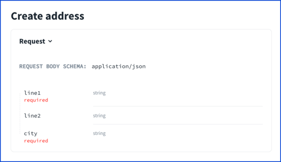
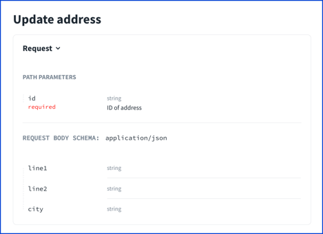

# Extending schemas with `allOf`

Question from C-3PO (yes, names and content are changed to protect the innocent):

> We are currently using a shared Address schema to document multiple API endpoints. For example, we have one endpoint to update an address, and another one to create an address.
>
> The obvious problem is that all documentation that references the shared Address schema must conform. In other words, it might not be possible to document the address fields as optional for the "update" endpoint, and required for the "create" endpoint. Or is it?
>
> We considered using a separate Address schema dedicated to certain endpoints, but ideally, we would like to keep the shared Address schema (for convenience).
>
> Is there some kind of middle ground between shared schemas and dedicated schemas? I imagine a contextual schema that "shifts" (so to speak) depending on which endpoint is in scope. For example, the schema fields are optional for the "update" endpoint, but they become required for the "create" endpoint.

Great question, C-3PO.

Make two schemas. One schema would be your base schema. The other would reference the base schema and use an `allOf` to "add" the required properties to it.
The `allOf` is a bit tricky to grok for me sometimes; however, this is the perfect use case for it.

Let me explain.

While `allOf` can be used to extend objects, it cannot override values.
Your particular use case is entirely an extension - adding information on which properties are required without overriding anything.

This uses a simplified address for illustration, but you can imagine something similar with all of the address properties.
```yaml
  schemas:
    Address:
      type: object
      properties:
        line1:
          type: string
          example: 123 Main Street
        line2:
          type: string
          example: Suite 301
        city:
          type: string
          example: Austin
    AddressRequired:
      allOf:
        - $ref: "#/components/schemas/Address"
        - required:
          - line1
          - city
```

Then, you can use the schemas as appropriate from the "create" or "update" endpoints.

This [GitHub repository](https://github.com/redocly-demo/blog-all-of-schemas) holds a minimalist OpenAPI definition.
It illustrates extending schemas using `allOf`.

The following screenshots are from the corresponding [demo API docs](https://blog-all-of-schemas.redoc.ly/) with two operations: **Create address** and **Update address**.
Compare their request body schemas - that's `allOf` in action!






The docs show the correct required fields.
What about the mocks?

The **Update address** operation works with or without fields such as `line1` in the following animated screenshot.


The **Create address** operation works with the required fields, but it fails without them as shown in the following animated screenshot.


Now that you've seen how it works, try it with your schemas.

Let me know how it goes. And send my regards to R2.
