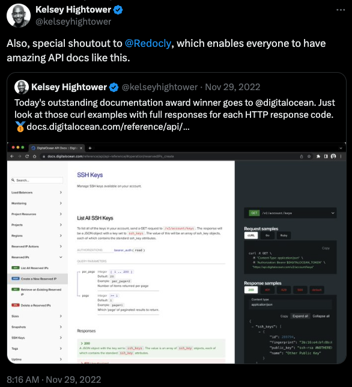
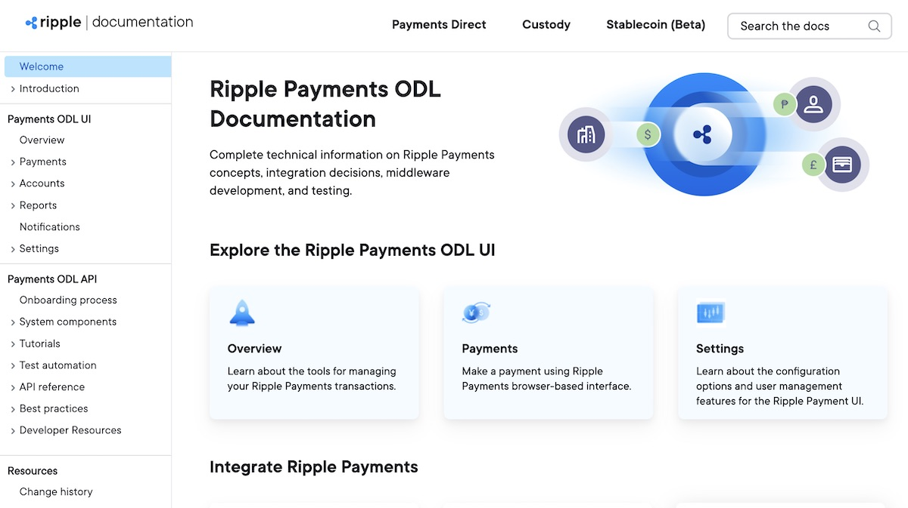
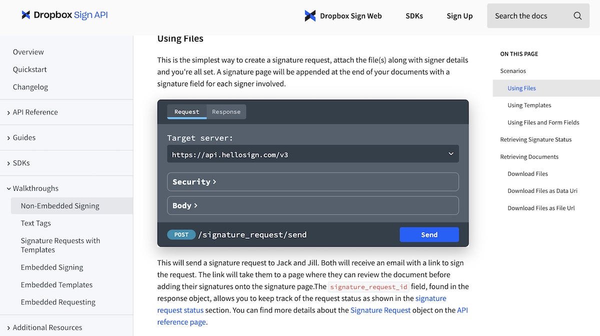
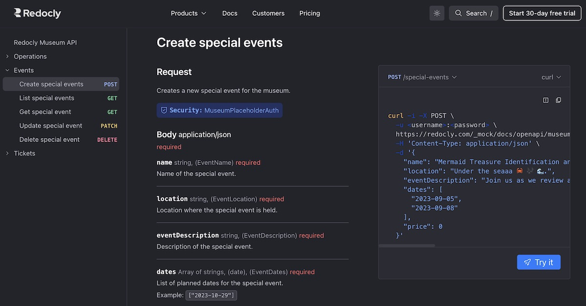

For companies that offer an API, providing great API documentation makes good business sense.
Developers use API documentation to discover the capabilities of an API and learn to build with it successfully.

Well-crafted API documentation improves developer productivity, reduces support cost, and establishes a competitive edge in the developer community.

This post covers the essentials of effective API documentation, how to evaluate documentation tools, and explains how to create great API docs of your own.

## More than API reference documentation

API documentation refers to the educational materials that developers use when they're learning about and building with your API.
Well-crafted API documentation includes a mix of resources:

- **Reference documentation** - Detailed technical information about each endpoint, method, request, and response in the API.Covers the implementation details of each API operation.

- **Concept guides** - Exploratory topics that help developers successfully build with your API.
Topics can range from things like core concepts and design decisions to authorization and rate limiting.

- **Tutorials** - Step-by-step instructions that help developers build something with your API.
These instructions frequently center around common use cases, best practices, and how to get started with the API.

- **Supporting resources** -- Resources like a changelog, error messages, status pages, or even pricing can also fall under the "API documentation" category.

Great API documentation does more than document; it teaches users what to expect.
It helps them understand the capabilities and limits of your API, find answers to their questions, and add the different features into their projects.
Great API documentation minimizes the learning curve of your product, empowering users to solve real-world problems with your API without guessing, struggling, or consulting lots of external resources.

### API docs we love and why

We think the following examples showcase important qualities for effective API documentation:



- Screenshot
- Description

---

- 
- 🔗 [Ripple API documentation](https://docs.ripple.com/)

  ⭐ Demonstrates how to effectively document multiple API products.

  - Consistent look and feel, but clear separation between APIs.

  - Well-organized, excellent guides, and clear happy paths for users to follow.

  - Robust, thorough examples and explanations.

  - A feedback collection page (which they've clearly excellent use of).

---

- 
- 🔗 [Dropbox Sign API documentation](https://developers.hellosign.com/)

  ⭐ Demonstrates how technical detail and conceptual knowledge can be combined for more effective learning.

  - Full coverage of SDK examples for every endpoint.

  - Features and use cases are covered by mixing guides and reference docs together.

  - Good mix of reference docs, guides, and tutorials.



## Build great API docs

Building great API documentation starts with choosing the right tools and approach.
Designing your own documentation system provides deep customization and control.
However, it's also resource-intensive and hard to maintain as your API evolves.

We recommend creating an [OpenAPI](https://www.openapis.org/) description for your API as the best path forward.
OpenAPI provides a standardized framework for describing RESTful APIs, which improves collaboration, enables automation, and unlocks powerful integrations.
It offers extensive tool support, facilitates excellent API documentation (...[Redoc](https://redocly.com/redoc) 🙂), versioning, and maintenance, leading to a better developer experience.

### Adopt OpenAPI

Creating an API description with OpenAPI unlocks a broad ecosystem of powerful tools that create better developer experiences.
An early focus on OpenAPI can unite stakeholders around your docs and sets a clear path towards comprehensive, user-friendly API documentation (...as well as SDKs and other tooling).

Use the [Redocly CLI](https://github.com/Redocly/redocly-cli) to more smoothly adopt OpenAPI for your own API.
When [learning OpenAPI](../docs/cli), the following two CLI features help build early comprehension:

- `lint` - The [lint command](../docs/cli/commands/lint) validates your API description, helping test and identify errors during development.

- `preview` - The [preview command](../docs/cli/commands/preview) renders API reference documentation from your API description, empowering you to experience your API docs as an end-user would.

Gain valuable insights from OpenAPI experts on the Redocly blog. Try the following posts:

- [OpenAPI parameter types for great API design](./openapi-parameter-types.md)
- [Add OpenAPI tags for next-level API descriptions](./add-openapi-tags-for-next-level-api-descriptions.md)
- [Better examples for better API experience](./openapi-examples.md)
- [OpenAPI Operation IDs make good API design](./operationid-is-api-design.md)
- [Document webhooks with OpenAPI](./document-webhooks-with-openapi.md)

It's important to have a valid API description for at least part of your API _before evaluating documentation tools_ so you can test their capabilities.

### Evaluate your tool choices

One of the most important steps in choosing the right API documentation tool is refining your evaluation criteria and tailoring it to your needs.
You should evaluate documentation tools based on your specific context and requirements.

Use the following questions to help build your own evaluation criteria:

**Context questions:**

1. Which specific features do we need in an API docs tool to support our current offerings and future offerings?

1. How does the tool fit into our existing tech stack and workflows?

1. What's our budget for a tool?

1. What internal resources do we have to support API documentation?

**User questions:**

1. Who are the main users of our API docs? What are their needs when they access the information?

1. How do users prefer to consume our documentation?

1. What user feedback do we have about docs already?

**Contributor questions:**

1. What is the technical skill of current and future contributors to the docs?

1. How many contributors will use it? Are specific collaboration features needed?

1. Biggest pain points currently faced by contributors?

### Key components

Good API documentation should be comprehensive but user-friendly.
Developers should have all the information they need, but also be able to discover it and understand how to use it.

The following key components contribute to creating comprehensive, user-friendly documentation:

**Overview** - Introduces developers to your API by explaining its purpose and capabilities.
This section can also explain core concepts or use cases that help developers better understand the API.
It's also a good place to include links or contact information related to your API.

**Authentication** - Teaches developers about your API's authentication scheme and security protocols.
The goal of this section is to help developers authenticate against your API so they can make calls to it.
By reducing friction in this area, you can improve new user onboarding and empower more developers to use your API.

**Endpoint descriptions** - Describes the behavior of an endpoint and lists all the operations (methods) available for that URL path.
This section contains implementation details for each operation, including request/response schemas and descriptions of each property.

**Request examples** - Shows examples of how to send requests to the operations, including any headers, query parameters, or payloads for the request body.
It's a good idea to offer these in multiple programming languages (especially if you have SDKs).
You can use multiple request examples to demonstrate how to use different features of the same operation.

**Response examples** - Shows examples of response objects from each operation.
These should show _exactly_ what the API returns after a request so developers know what to expect.
This section should also include any explanations of error codes or headers related to a possible response.

**Error codes** - Catalogue of the possible errors that can be returned by the API.
You should explain what each code means, common causes, and troubleshooting steps.

**Rate limits, quotas, billing** - Communicates any logistical information related to actually consuming the API.
You want to set expectations as clearly as possible to reduce friction.

#### Interactive API docs

Some documentation tools, like Redocly, emphasize the use of [interactive documentation](./rise-of-interactive-documentation.md), which can greatly enhance the developer experience by allowing real-time exploration and testing of endpoints.

In addition to helping developers learn about new endpoints, bringing the API closer to the surface empowers less-technical users to interact with the API and communicate about it more clearly, which helps build partnerships and drive purchasing decisions.

## API documentation

Exceptional API documentation is a strategic asset.
Investing in high-quality documentation will minimize the learning curve, empower developers to succeed, and expand the impact of your API.

By adopting OpenAPI and using a powerful documentation tool like Redocly [Revel](https://redocly.com/revel), [Reef](https://redocly.com/reef), or [Realm](https://redocly.com/realm), you can improve your developer experience and drive deeper engagement with your API.

⭐ Learn about the new products: [Redocly launches new API tools suite](./launch-2024.md)

⭐ Try the new products: [Sign up for free 30-day trial](https://auth.cloud.redocly.com/registration)
