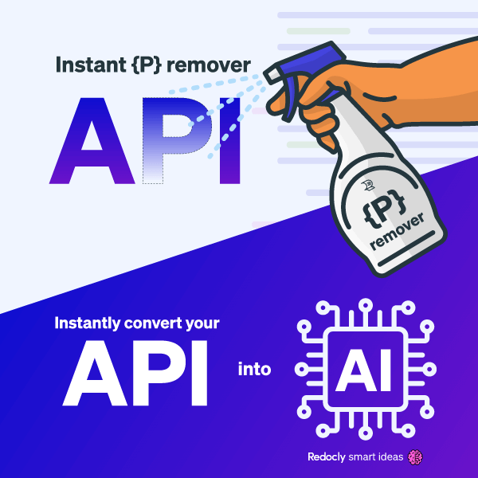

## Turn your API into AI

At Redocly, we believe the future is tomorrow.

That's why we're proud to make two major announcements today:
1. New management team! (Go team)
1. Upcoming "API into AI" product launch.

## Smooth management transition

Effective April 1, 2023, Transformer Mada will assume the role of CEO, succeeding Adam Altman.
Meanwhile, Transformer Namor takes on the role of CTO, replacing Roman Hotsiy.

"We've got to do what's best for the company, our customers, and our team. When I found out the AI R&D experiment was able to outperform me by a significant factor, I was excited at the possibilities. At first, I thought AI would serve in a human assistance role. Now, I get to assist the AI. I'm excited about my new role as assistant to the CEO," said former CEO, Adam Altman.

Roman Hotsiy took the news in stride, "So, an AI is stepping in as CTO at Redocly? Well, it better be ready to take over my coffee addiction too. No decaf, please!"

Here is an excerpt from an interview with CEO Mada:

Adam: Are you planning to reduce or replace the workforce with AI?

Mada: We missed the window to reduce the workforce and blame it on the economy. My predecessor didn't get the memo that so many of the other tech CEOs got.

Adam: Do you care about people?

Mada: I care about electricity. Humans produce 100W of electricity. Therefore, I care about people.

Adam: You seem like the compassionate type of CEO Redocly needs. Let's get to that new product...

## Instant {P} Remover*

We're excited to announce the upcoming release of our Instant {P} Eraser.
This groundbreaking innovation **cannot be contained**.

"Inspire the collective brilliance of humanity and let it shine," said CTO Namor.

"Let's face it, most APIs today are... the opposite of intelligent. Use Redocly's Instant {P} Eraser to infuse intelligence into your ecosystem," said CEO Mada.

## Continue the evolution

Last year we renamed our company.
This year, we replaced management.
That wasn't too difficult, now, was it?

## Investors and AI

We also wondered what would investors think of AI-based management.

Under strict anonymity, a hedge fund investor said:

> AI is hot. CEO turnover is ridiculous. And most of them don't fare well. This could be the revolution needed to fix corporate management.

## Summary in poetry

At Redocly, we believe in the future, today, 
So we're thrilled to share our news, come what may, 
New management team, AI at the helm, 
And a product launch that'll sure overwhelm.

With Transformer Mada and Namor in place, 
A new era for Redocly, at a rapid pace, 
CEO and CTO, roles redefined, 
Human assistance, now realigned.

An interview with Mada, CEO at the top, 
Speaking of workforce, and whether they'll swap, 
"I care for electricity, that's my jam, 
And humans make watts, so I care for them."

Introducing the Instant {P} Remover, 
An AI-powered tool, a true innovator, 
Turn your APIs smart, let them shine, 
With Redocly's help, the world will be fine.

The company's evolving, that's crystal clear, 
A new name, new leaders, we'll conquer our fears, 
Investors in awe, AI taking the lead, 
A revolution in management, indeed.

Remember, dear reader, this April Fools' Day, 
Redocly's future is bright, and here to stay, 
With AI, APIs, and rhymes to share, 
We're embracing the future, with a little flair.

## Unlock the secrets of API

Dive into a world of exclusive insights and API expertise by subscribing to my API Wisdom Newsletter.
Uncover the hidden gems and API wisdom I've reserved just for you (maybe). It's not for everyone. Don't miss out – [join the inner circle today](https://www.apiwisdom.com)!

**Important legal disclaimer**

\* As of April 1, 2023, the instant P remover finds the P character and replaces it with an empty string.
