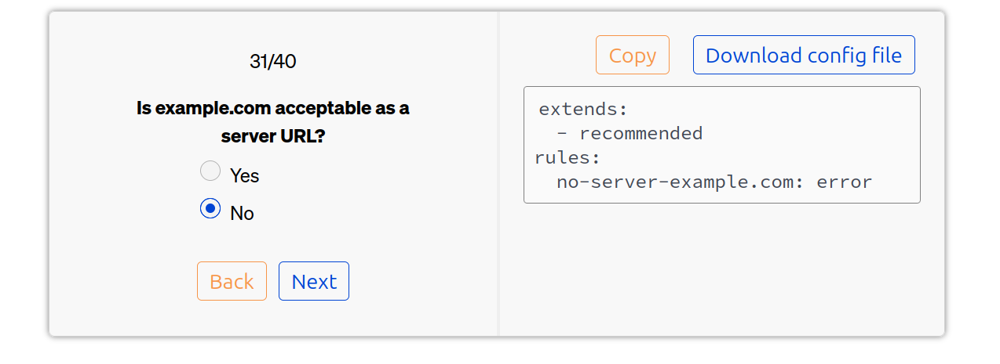

The hardest part of API design can be aligning your team on a set of rules and standards. If you're new to API linting, it can be especially difficult to know where to start, or which questions to ask - never mind what the good answers might be. Since every situation is different, it's impossible to generalize on a set of rules that will make sense for everyone (although the Redocly [recommended ruleset](https://redocly.com/docs/cli/rules/recommended/) aims to give a solid starting point).

In an effort to provide support to anyone who might need it, we have created an [API guidelines builder](https://redocly.com/api-governance) to give you the structure you need to walk through the most common decisions, and produce a working ruleset that you can immediately use to lint your API descriptions.

## Make the hard things easier

In addition to the quiz tool, we've included resources and guidance around the process of using the tool to create API guidelines. There are also recommendations on running a successful workshop session and achieving usable outputs. Bringing people together, making everyone comfortable, and timeboxing the session may seem simple, but it's good advice.

To get good outputs from the session, the following advice may seem counterintuitive: answer as few questions as possible! However, if the group does not follow this advice, the risk is that they pick a specific answer to every question that they are asked, and end up with a ruleset so fussy that it becomes a barrier to progress. So it is best to pick the things that make sense, and skip the things that seem irrelevant or overkill.

With a regular review process in place, you can add more to your API guidelines over time, so don't add too much in one go at the start.

## Put API guidelines in place

The output of the API guidelines builder is a ruleset that you can use with Redocly CLI. We've included instructions to get you started with using the tool, and links to more resources so that you can grow and evolve your ruleset to meet your needs. Using a design-first workflow and including the API guidelines throughout will make sure that your API standards remain high, even as your API evolves.

Having standards in place and actively used during development and review of APIs makes a huge difference to the API experience. It makes a positive difference, both when you're developing an API, and when you're consuming one.

## Keep making your API lives better

Don't stop improving your API practice. Periodically, identify rules that you need to add to your setup, and the ones that aren't helping, and update the rulesets accordingly. Invest in making sure everyone involved in the API lifecycle has access to the tools they need to confidently make changes. We also see great success from teams that make a habit of sharing information and resources with one another, ensuring everyone learns together.

To help you with your journey, one of the following could be your next read:

* Redocly CLI's documentation section on [API standards](https://redocly.com/docs/cli/api-standards) and how to set up the tools to help you.
* [Redocly VSCode extension](https://redocly.com/docs/redocly-openapi/) for working with OpenAPI files locally and getting easy previews.
* The [Redocly CLI cookbook](https://github.com/Redocly/redocly-cli-cookbook) provides next-level examples, shared by other Redocly CLI users.
