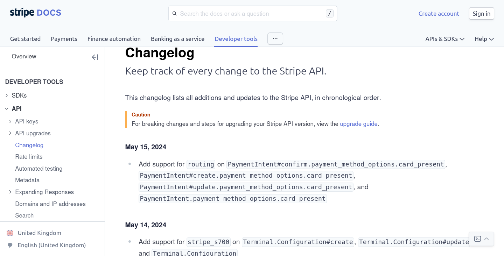

APIs underpin so much of modern software development and deployment.
But just like our applications, APIs must grow and evolve with the needs of the businesses that rely on them.
API changes can be disruptive, difficult and painful, but they're a healthy part of the API lifecycle when they're well-managed and well-communicated.
In this post we'll walk through how to safely make and communicate API changes, keeping everyone happy.

## Update the API description version

API versioning strategies deserve an article of their own, but they all have one key thing in common: when your API changes, update the metadata of your API to make that clear.
In OpenAPI, use the `info.version` field to indicate what version of the API descripion it is.
This field can update independently of your official API version, and indicate that the _description_ has changed.

The following example shows the first few lines of an OpenAPI description with a version field:

```yaml 
openapi: 3.1.0 # OpenAPI specification version
info:
  version: 1.12.4 # API description version
```

If you improve the descriptions for the operations and parameters: update the API description version.
If there's a new endpoint available, but nothing changed for existing consumers: upddate the API description version.
If you change the tags or other metadata to improve the output of another tool such as documentation rendering: update the API description version.

It's important to note that the `info.version` field in OpenAPI is **not the API version**, but rather the version of the description document.
When the description changes, the version field should change.
The API version may be aligned with the description version, but it doesn't have to be.

Use a clear versioning of the API description to help consumers know which version of the description they're using, and if an update is available.

## Publish a changelog

Knowing what version of the description you are using, and whether that's the latest version is very important, as we already mentioned.
It's even more important to know what the differences between versions are, and that's where a changelog is a powerful tool.

Publishing a changelog to accompany your API is a great way to communicate with users and help them understand what's new, what's changing, and when they need to take action themselves.
As an example, take a look at the following screenshot from [Stripe's API changelog](https://docs.stripe.com/changelog):



Stripe has a large API surface and uses a date-based API versioning strategy that allows users to pin to a specific version, and update it when they are ready.
Providing users with a clear list of changes means that users can be well-informed, identify which changes will impact them, and choose when they upgrade to a specific version.

Writing a great changelog takes some effort, but with a clear strategy and the audience in mind, you will be successful.

**Key principles of writing good changelogs**

- Use the language that the users know and use themselves, avoiding internal project names, complex terms, or jargon.
- Include only the changes that they can observe or make use of; do not include internal changes.
- Link to additional resources such as migration guides, related documentation, or blog announcements.
- Make it clear what exactly changed and how this will be seen by users.
- Provide an explanation for why the change was made, exactly which bug was fixed, or what the intended outcomes are.

Ask your technical writers or other word-enabled professionals to help with getting the wording correct and consistent in your changelogs.
These are customer-facing interfaces and deserve at least as much care as the API changes themselves (and you do take great care with those, right?).

## Communicate the changes

For open or self-service APIs, a clearly published changelog might be enough, but for an even better API experience it is good to proactively send change information to users.

For APIs used by third parties, publishing an RSS or Atom feed of updates is a great way to keep everyone "in the loop" with API changes.
Using a standard format like RSS/Atom lets users make use of the information however they would like, such as adding the information to a feed reader, or using integrations to get updates in Slack.

For internal APIs, your dedicated developer platform may already have a system for offering notifications of updates through an API catalog or similar functionality.
Your colleagues are _at least_ as important as a paying customer, so take just as much care publishing API updates for them as you would for a third party.

Whatever your audience, reach out to them and help them stay informed.
A good addition to the changelog is a friendly email newsletter, showcasing some of the main updates, and signposting users to other resources or documentation for more details.

## Learn more

- Add linting to your API, the [struct rule](../docs/cli/rules/oas/struct) requires that the version be set. Remember you'll need to update it yourself.
- Adjust your linting standards as you improve your API version-by-version using the [per-API configuration](../docs/cli/configuration/apis).
- New to API Governance? Read our post about [how to take your first steps in API Governance](./getting-started-api-governance.md).

Speaking of email newsletters, [sign up for ours](https://redocly.com/product-updates/) and we'll follow our own advice and keep you in touch with our news!
