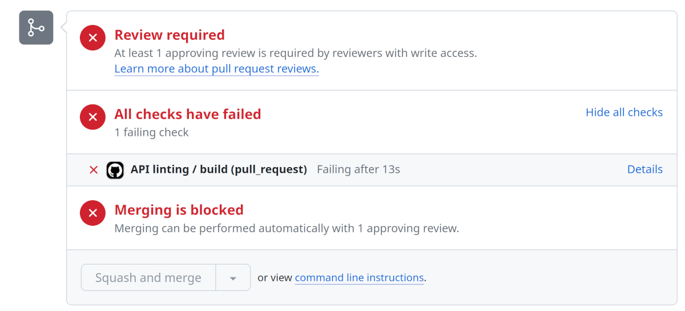
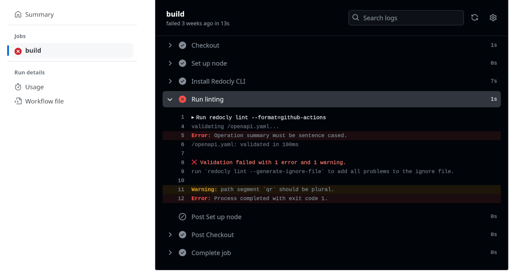
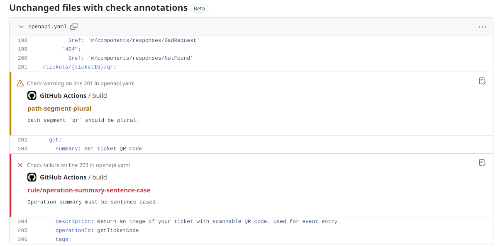

Having great tooling to support your API standards is really important.
By making that tooling part of your development lifecycle, you can always be confident that every change meets the expected standard.
To help you achieve this setup, today's article shows how to add linting to your project using GitHub Actions.

## Consistency is key to API experience

It's very difficult to hold the micro and the macro in your head at the same time, and this is especially true with API changes.
For larger APIs, that's a lot of endpoints to be familiar with before you can be confident that what you're adding is a good fit and that users will find it familiar and easy to adopt.
In addition to the big-picture consistency aspect, the nitty-gritty details are also important.
Naming and describing parameters and data fields in the same way across multiple endpoints helps a lot, and OpenAPI supports this by allowing re-use with the `$ref` syntax.

Having a comprehensive written set of [API governance guidelines](./rulesets-are-not-governance.md) is good practice for producing consistent and reliable APIs.
But your written guidelines mean very little if the API is allowed to evolve without checking incoming changes.
Adding API tooling, and particularly good API linting rules, makes the standards achievable.
Once the tools are in place and configured, they deliver value for every change that you make, and they achieve that most aspirational of goals: make the right thing the easy thing.

- **Do the right thing:** check all API changes against the API guidelines before implementing.
- **Do the easy thing:** let the tooling check every API change and give immediate feedback for each.

## Automate API linting with GitHub Actions

For this example, we'll keep things simple with the default linting behavior from Redocly using the [recommended ruleset](https://redocly.com/docs/cli/rules/recommended/). You will need:

- A GitHub repository.
- An OpenAPI description in the repository (try the [Museum API example](https://github.com/Redocly/museum-openapi-example) if you want something to test with).

### Create the action

GitHub Actions are yaml files in the `.github/workflows` directory of your repository.
If you're new to GitHub Actions, [their documentation](https://docs.github.com/en/actions) will be a useful reference to help you get started.

Create a file named `api-lint.yml` in the `.github/workflows` directory of your repository.
If the directory doesn't already exist, create it - but notice the dot in the `.github/` directory name.

The contents of the file will be like the following:

```yaml
name: API linting

on: [pull_request]

jobs:
  build:
    runs-on: ubuntu-latest
    steps:
      - name: Checkout
        uses: actions/checkout@v4
      - name: Set up node
        uses: actions/setup-node@v4
      - name: Install Redocly CLI
        run: npm install -g @redocly/cli@latest
      - name: Run linting
        run: redocly lint openapi.yaml --format=github-actions
```

Working through the steps in the action in turn, it does the following:

1. Check out the contents of the repository.
1. Prepare to use NodeJS in the project.
1. Install [Redocly CLI](https://redocly.com/docs/cli/).
1. Run the lint command to check a file called `openapi.yaml`, and use the `github-actions` format as the output.

If you have multiple APIs, or your OpenAPI description isn't named `openapi.yaml` you will need to adjust the final line in the example.
A good approach for complex (or even not-so-complex) projects is to [describe the APIs in the configuration file](https://redocly.com/docs/cli/configuration/reference/apis/), and omit the filename and path from the command.
Redocly CLI uses a [config file](../docs/cli/configuration) to determine what APIs it should lint and which linting rules to apply, or you can specify which ones to include in the command.

Once the workflow file is in place, create a branch and commit the file there.
Push your commit to GitHub, and open a pull request for the branch.

### Check the pull request


  If your API description is already compatible with the recommended ruleset, the action doesn't have anything to show you.
  Feel free to introduce some errors to make this a more interesting demonstration of the tool 😉


Visit the new pull request in your browser.
You should see that one of the checks failed, with output similar to the following screenshot - if not, please make your API description less correct!
(That's a piece of advice we don't give often!)



The "Details" view of the failed job shows a report of what failed, so you can inspect a list of errors and warnings similar to the one in the following image:



The best bit is on the "Files changed" tab.
Scroll down and if your OpenAPI description has linting errors, which on this one occasion it hopefully does, each one will be annotated.
You can see an example of this in the following screenshot:



Providing automated and immediate feedback on pull requests, with the messages displayed in the context of where the problem was detected, is an excellent way to help users to help themselves and improve the quality of APIs.


Don't wait for the pull request to see if the API changes conform with the standards.
The [Redocly VSCode Extension](https://redocly.com/docs/redocly-openapi/) can provide in-editor feedback using the same `redocly.yaml` configuration settings.


With linting running automatically for every pull request, you can focus on the more interesting things and know that the tools will let you know if something doesn't meet the standards.

## Next steps

The recommended ruleset is a good starting point, but the majority of organizations should adapt and evolve their linting configuration to fit the needs of their API and their business.
Here are some resources to get you started:

- Try our [API guidelines builder tool](../pages/api-governance/index.md), answer a few questions and get a set of starter rules to use immediately.
- Check the [documentation on API linting](https://redocly.com/docs/cli/api-standards) to learn more and see all the available options.
- Learn how to [create configurable rules](https://redocly.com/docs/cli/rules/configurable-rules/) for API linting.
- For more ideas and examples, the [Redocly CLI cookbook](https://github.com/Redocly/redocly-cli-cookbook) has plenty of ideas from our community to keep you busy and inspired.

