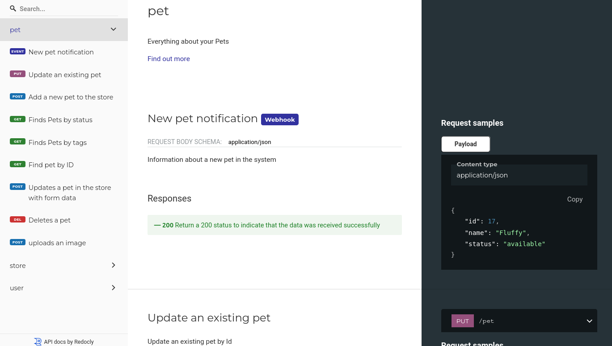

Modern applications have requirements that go beyond the simple request/response model of HTTP data transfer. Thankfully, both the OpenAPI standard and the tools that support it are ready to grow with our applications. In this post we'll cover adding webhooks to an OpenAPI description to give developers a great API experience.

## What is a webhook?

An API endpoint describes an incoming HTTP request followed by an outgoing HTTP response. A webhook describes only the response part, because the trigger for sending the response is something other than an incoming request. Common examples of webhooks include:

- Sending a notification that something happened, such as a user buying an item, or subscribing to a newsletter.
- A report which takes a long time to generate notifies another system that it is ready for download, by sending a webhook.
- Connecting two systems so that one can react to another, such as pushing new code to GitHub, and your hosting provider picking up the changes and rebuilding your website.


GitHub's [OpenAPI description](https://github.com/github/rest-api-description/) is a great example of webhooks in the wild, take a look (but be warned it's a very large file!)


Using a webhook is a faster and less processing-intensive way to exchange data between systems than polling an endpoint to check for changes. Before webhooks were mainstream, a developer would push code to a repository, and wait for the CI (Continuous Integration) system to poll for updates, and start processing the new code changes. With webhooks, the data is sent when it is available, and there is no need for repeated polling only to receive an empty response.

## How to document a webhook in OpenAPI

OpenAPI introduced webhook support in version 3.1.0, and it's now widely used and supported. It adds a new optional top-level element `webhooks`, and the official specification includes [this example](https://github.com/OAI/OpenAPI-Specification/blob/main/examples/v3.1/webhook-example.yaml):

```yaml
webhooks:
  newPet:
    post:
      requestBody:
        summary: Pet added
        description: Information about a new pet in the system.
        content:
          application/json:
            schema:
              $ref: '#/components/schemas/Pet'
            example:
              id: 17
              name: Fluffy
              status: available
      responses:
        '200':
          description: Return a 200 status to indicate that the data was received successfully
```

Every webhook needs a name; this example uses `newPet`. When a new pet is added to the system, this webhook is sent containing the `Pet` schema with information about the new pet. By adding an example alongside the schema, users get a clear picture of the payload they should expect to receive. The `responses` section explains how to correctly respond to the webhook when it arrives; some platforms will retry repeatedly if a successful acknowledgement isn't received.

Adding this webhook to an existing API example, it shows up as a first-class entry in the documentation, as seen in the [Redoc](https://github.com/redocly/redoc)-rendered example below:



## Webhooks in modern APIs

As our APIs grow and evolve, so our standards and tools also need to keep adopting new API features. Webhooks is a great example of a feature that serves a real need, and best of all: it's already well supported by most OpenAPI tooling. We see customers achieving great things in their API evolution projects, and by sharing this post about webhooks, we hope to help you on your API journey too. For more news and updates like this, [sign up to our product newsletter](https://redocly.com/product-updates/) and let us know what you build.
