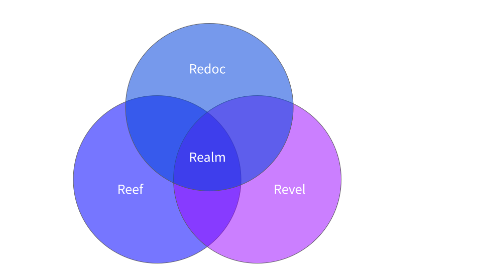

## Welcome back

As I shake off the holiday mode, I find myself reflecting on 2023, a year of learning and growth at Redocly, contrasted starkly against the challenges of 2022.
If you recall, my last year's blog titled "A Challenging Year" touched on the hurdles of 2022.
You can revisit it [in the previous year's blog post](https://redocly.com/blog/end-of-year-2022/).

## From survival to revival in 2023

2023 began with us picking up the pieces left by the tumultuous 2022.
We saw tech markets crumble and inflation skyrocket, putting our capital, hiring, and growth plans in a bind.
But as they say, every cloud has a silver lining.
The unexpected talent availability was ours.
Throughout the year, we heard from brilliant minds seeking new opportunities, some of whom we had admired from afar.
This influx of talent led to our team growing by 37%, infusing fresh perspectives and energy into Redocly.

## Bridging the gaps

Our mission to turn APIs into your company's superpowers gained new dimensions as we identified and started bridging critical gaps.

1. **Inclusive stakeholder engagement**: We're evolving from developer-only API teams to a more inclusive model.
  Our pilot program, still in the works, aims to empower all team members, regardless of their technical background, to contribute effectively through content creation, curation, and feedback.

2. **Tailored solutions for internal and external audiences**: Recognizing the distinct needs of internal and external API users, we're developing two specialized products which will replace our Gatsby-based developer portal: Revel for external applications and Reef for internal needs.
  For those needing a blend of both, our Realm product offers the perfect middle ground.
  

3. **Revamping core technologies**: Moving away from our initial Gatsby-based portal, we're crafting a more dynamic, server-based solution, reducing dependencies and enhancing flexibility.
  This shift is aimed at aligning our architecture more closely with our evolving vision.

4. **Expanding beyond documentation**: While Redoc remains our flagship, we're pushing boundaries into areas like developer onboarding, mock servers, and API testing.
  We're also reinvigorating Redoc with exciting updates slated for mid-year, aiming to bring our community and premium offerings closer.

## Looking ahead to 2024

As we step into 2024, we're not just chasing growth; we're nurturing it.
We're still on the lookout for passionate individuals to [join us on this journey](/careers).
Together, let's make 2024 a year of peace, health, and unparalleled API superpowers.

## Stay connected with insights and stories

Don't miss out on the journey ahead!
Join my email list for direct, personal updates.
You'll receive founder thoughts, API wisdom, and reflections on being human in the tech world of 2024.
It's more than just updates; it's a conversation about where we're going and how we're growing.
[Sign up here](https://apiwisdom.com) and be part of our story.
