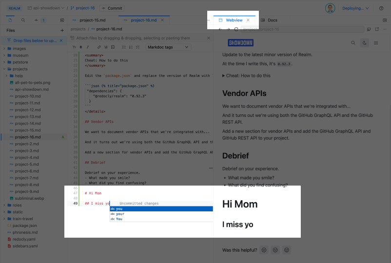
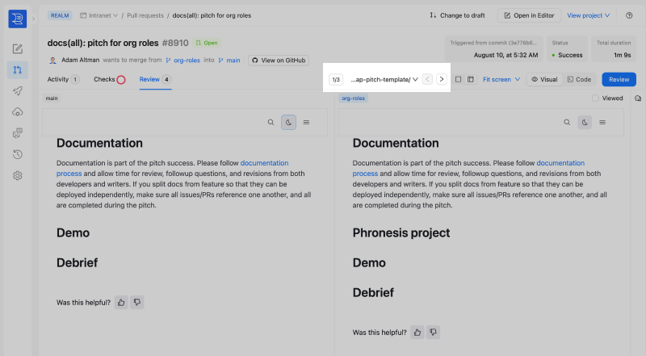
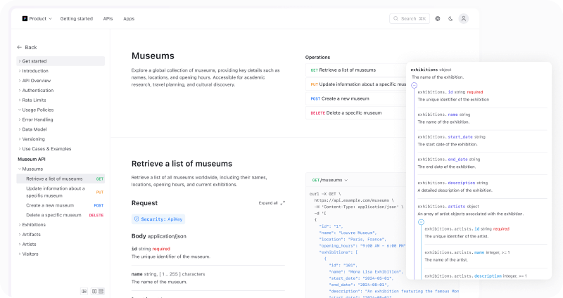
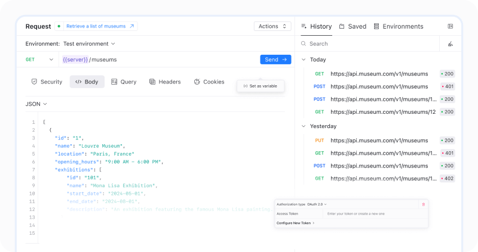
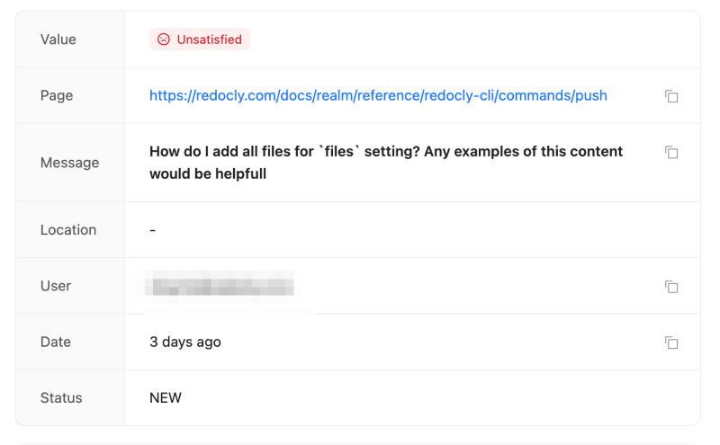
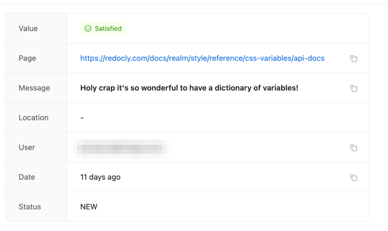
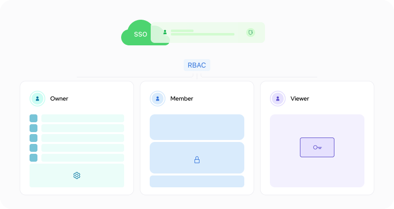
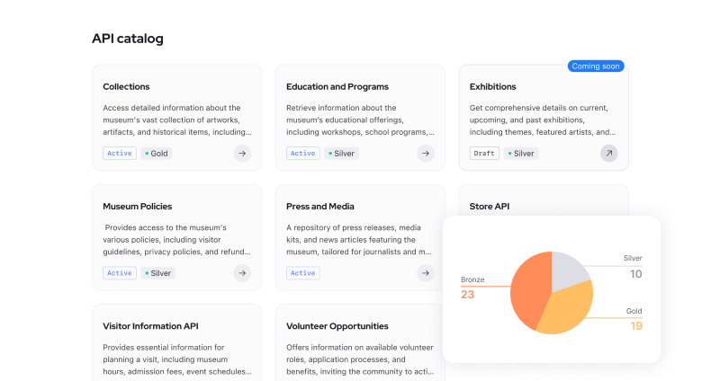
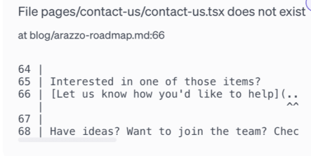
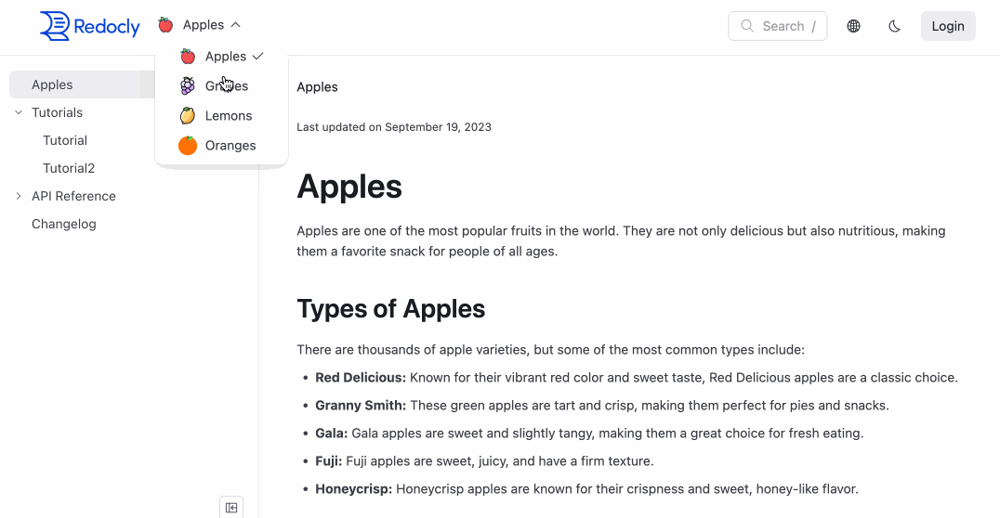

### Top 8 new features I’m most excited about

We’re releasing a new suite of products:

* Redoc: renders API reference (including OpenAPI, GraphQL, AsyncAPI, SOAP WSDL), virtualized mock servers (for OpenAPI), and lint capabilities.
* Revel: an external showcase (includes rendering Markdown, Markdoc, React pages), and has multi-product and localization capabilities.
* Reef: an internal service catalog that includes Catalog, Scorecard, producer API onboarding and consumer developer onboarding with dynamic client registration.
* Realm: a perfectly integrated combination of Redoc, Revel, and Reef.
* Reunite: a collaboration tool that prepares, deploys, hosts projects (websites and mock servers), in a connected to Git way that allows for ways to view uncommitted work-in-progress with a Webview, committed work-in-progress with branch Previews, and automated GitOps production releases too.

We’ve had an extra focus on dogfooding our products for the last quarter. This focus has given us exposure to features we wouldn’t normally use in our day-to-day lives.

## Editor with Webview

Though not a software developer, I am very comfortable with an IDE and Git on the command line.
Nevertheless, I wanted other stakeholders to be able to contribute to content and reviews.
We set out to build a collaborative Editor with Webview to preview your work-in-progress changes.

I didn’t expect I would use it.
However, I use it as my primary authoring tool.

## Visual reviews

In Workflows, we build project previews for PRs. We still do that.
When you have a small website, it’s easy to review changes.
When you have a website with many pages,  open up a preview and it’s hard to navigate to which pages have changed.

The visual review helps quickly navigate through the pages that have changed.

In addition, it’s so important to actually review the changes visually.
Approving from a diff alone is a bit like approving code changes from reviewing diffs only and not actually testing the software changes.

## API docs UX

Redoc brought the 3-panel docs mainstream almost a decade ago.
We have a major revision as a result of hiring two full-time product designers.
They conducted dozens of user interviews, analyzed usage, and I couldn’t be happier with the result.
Not only were we able to streamline configuration options (fewer options is better), but the actual user experience is on point.

In particular, I like the upgraded schema rendering, the continuous scrolling that still supports SEO-friendly routes, the deep links, and the sticky examples.

## Replay

The "try it" console of the API docs is completely redone, and renamed Replay.
We observed how people prefer to try APIs visually and fit our designs to their expectations.
I like the environments feature in particular where I can set and reuse environment variables across different API operations.

## Feedback

You'll see a thumbs up or down, or an emoji sentiment widgets embedded on pages.
In addition, code snippets can accept problem reports.
These get sent to Reunite where it reports the issues.

We started using this to upgrade our docs.
We quickly got feedback on particular screens.

In fact, if it wasn't for looking at the feedback I would have forgotten about CSS variables support.
We used to style Redoc and the Developer portal using configuration, but have support for CSS variables in the new products.
This is a huge win because designers know CSS and they don't know Redoc's proprietary theme format.
But don't worry, I won't be styling anything anytime soon; I'll leave that to the experts.

## SSO and RBAC

Our previous products did have support for SSO and RBAC (although RBAC was only available to bigger enterprises with bigger contracts).
There were a bunch of limitations and we've made it all much more smooth.

For example, we used to need to ask you to add allowed callback URLs to your identity provider every time you changed a custom domain or added new projects.
No more.

We refactored RBAC (which is inherently complex).
We actually use it (not just to protect a whole website like our intranet, but also to restrict access to certain upcoming feature docs).

In particular, I like the RBAC can be used for on-page content with conditionals (Markdoc if/else tags).

## Catalog and Scorecard

Generating an API catalog is easy with the catalog component.
Adding metadata for quick search filters is straightforward.

I even went outside the box and generated a catalog of non-API content -- in this case, commonly asked pre-sales questions.
Our support team who helps answer pre-sales questions appreciates that.

We even figured out ways to streamline producers adding APIs to the catalog.
We work with a large financial services company who has had over a thousand API producers contribute changes to the catalog in an automated way within the past month alone.

We have the leading linter (thanks @Andrew and @Lorna).
It's extremely configurable, and easy to create custom configurable rules.
But how do you lint hundreds or thousands of APIs?
And what happens if you want to set different rules or levels of standards (such as Gold, Silver, Bronze).

And then, how do you even make sense of the results?

The Scorecard solves these problems.
We use it for this new suite of products.

We only expose a small surface area of our API through Redocly CLI (such as the `push` and `push-status` commands).
But it's our long term plan that every API could be exposed to the public.
The Scorecard lets us know if an API is ready to be exposed publicly.

## Markdoc and React

In our beta developer portal, we used MDX (which I have come to sincerely loathe).
I prefer [Markdoc](https://markdoc.dev/) significantly.
No imports.
No unexplainable white space errors.
No weird Markdown incompatibilities.

I love it.

Even better, we provide pinpoint feedback when there are syntax issues so that you know exactly where the problem occurs based on file name and line number.

For a landing page or one-off fancy page, we let the designers and developers use React.
They get much better IDE support and broad-based troubleshooting with React and using JSX/TSX directly.

## Honorable mentions

This suite of products is a long time coming.

As such, there are so many features, I can't mention them all.

When I break a link, I get a notification instantly showing me exactly where the link was broken.

I can jump quickly to the file and line and fix it.

These are some others that have caught my eye:

* Localization: I've only dabbled with this one.
* Multi-product: To use this feature or not for our own products. That's still an open question...
* GraphQL and AsyncAPI support: We use OpenAPI, GraphQL , and AsyncAPI.
* Developer onboarding (dynamic client registration): I would like to see example content of how to connect to unsupported (such as custom integration) credential providers.
* Error reporter: I did mention the broken links because that's my jam. The error reporting is way improved and we continue to improve it.
* Look and feel: The basic Markdown page looks better than before. Font? Spacing? Some other elements? Whatever it is, it is mention-worthy.
* Search: Search is hard and we're continuing to spend enormous amounts of time and resources to build better search indexes, make results more relevant, and improve speed and performance.
* CSS variables: I did mention it above when my memory was jogged by that feedback. It feels so natural, it's easy to forget this once you've set your styles.
* Versions: we can version all content (previously only APIs could be versioned).

Sincere apologies to the hundreds of thousands of hours spent on projects not mentioned here.
There is a lot more goodness hard to encapsulate in a single post.

That's why, we recommend you do a free trial of our product to experience it firsthand.
Join us on this exciting journey and [sign up for early access](https://auth.cloud.redocly.com/registration).
