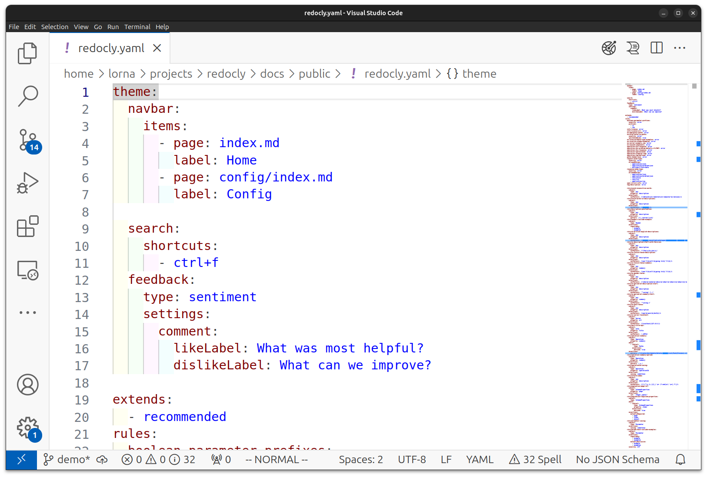

YAML is a widely-used open standard for data interchange, designed to be human-friendly as well as accurate and portable.
In technical writing projects, you might see it used for configuration, document front matter, or OpenAPI descriptions.
This article will give you the basics of the YAML format, and some tips so you can quickly get up and running.


To say it aloud, the word "YAML" rhymes with "camel".


Some other data serialization formats are difficult to work with, such as XML or JSON.
YAML aims to be more usable by people, but it still has some particular rules that we must follow to use it.
JSON and YAML are closely related, and it's usually possible to convert between the two formats.

## Keys and Values

At its simplest, YAML is a list of keys and values - that is to say, variables and the values of those variables.
The following example is from the front matter at the top of this blog post:

```yaml
---
title: YAML basics for Technical Writers
author: lorna-mitchell
image: Redocly_blog_1.jpg
---
```

Each "key" is a setting.
It is followed by a colon `:` symbol and a space, then the value.
The result is a line in `key: value` format, like `fruit: apple`.

## Tools for YAML productivity

Most modern IDEs or text editors support syntax highlighting.
Try copying the snippet from the previous example and saving it as `test.yaml`.
Once the file type is known, most tools will start showing the keys and values in different colors.
Using an editor that highlights syntax is helpful because it makes syntax errors/differences easier to spot.

When we move on to look at more advanced YAML examples, you'll see that YAML makes extensive use of indentation levels to describe structure.
A plugin that gives clear visual representation of indentation levels can be a big asset, for example VSCode users might like to try [indent-rainbow](https://marketplace.visualstudio.com/items?itemName=oderwat.indent-rainbow).

The following screenshot shows a YAML file with syntax highlighting and indentation indicators, open in VSCode:



Take some time to browse the plugins available for your preferred editor and try the ones that have support for YAML or the related formats you'll be using, such as OpenAPI.
(Redocly has a [VSCode extension](https://marketplace.visualstudio.com/items?itemName=Redocly.openapi-vs-code) that is useful for working with Redocly projects or OpenAPI files).

## Arrays and objects

Borrowing some examples from the [Museum API](https://github.com/Redocly/museum-openapi-example), the following snippet shows the `info` section of an OpenAPI description:

```yaml 
info:
  title: Redocly Museum API
  description: Imaginary, but delightful Museum API for interacting with museum services and information. Built with love by Redocly.
  version: 1.1.1
```

The `info` entry is an **object** in OpenAPI, and the keys indented below it such as `title` are **properties** of that object.
This pattern of nested elements is what allows us to represent even quite complex data structures in YAML.
You'll see a key, in this case `info`, followed by the colon `:` but then a newline and indentation before the values inside it.

The **array** syntax is similar to the object syntax, but the differences are subtle: there's an extra dash `-` character.
The following example shows the `tags` section from the Museum API, which is an array:

```yaml 
tags:
  - name: Operations
    description: Operational information about the museum.
  - name: Events
    description: Special events hosted by the museum.
  - name: Tickets
    description: Museum tickets for general entrance or special events.
```

The data nested inside `tags:` aren't named keys like the object properties are; it is an array (or list, or collection, however you like to think of it) of data where each entry has a name and description.
The dash `-` character is used to denote the start of each array item, which is different to the object syntax which doesn't use a dash.
This small but important difference can be difficult to spot when you first start working with YAML!
The good news is that the more YAML you see, the more your familiarity with the syntax naturally improves, making it easier to parse the finer points of syntax and indentation by eye.

## Tips and tricks for YAML

So far, you've seen some key basics and you're ready to begin.
Here are the tips we wished we'd known earlier ourselves!


Most values won't need quoting in a YAML file and it's recommended to omit them for readability.
If you do need to include something with special characters such as a URL, then use single quotes `'`.


### Comments for your future self

YAML does support comments, which is one feature that makes it a little more human-friendly than other formats such as JSON.
A YAML comment starts with the pound/hash `#` symbol and continues to the end of the line.

The following snippet shows two possible comment styles:

```yaml 
# List rulesets
extends:
  -  recommended
ignore:
  - .github # don't include GitHub-related files
```

Use the comment syntax on its own line, or at the end of another line.
YAML doesn't have a concept of multiline comments but you can add multiple commented-out lines together to have the same effect if you need to.

### Whitespace matters

Indentation is very important in YAML format, because the syntax doesn't use any brackets or other delimiters, so the whitespace performs that function and must be precisely correct.
To avoid spending a lot of time sorting out formatting, agree to a standard way of handling whitespace with all your collaborators.
Our preference (and the examples in this article) is to use two spaces for indentation, and to never use tabs.

A formatting tool such as [Prettier](https://github.com/prettier/prettier) can be very helpful to keep everything formatted correctly without you having to think too hard about it.
Include any formatting tools in both your local editor setup and your CI (Continuous Integration) pipeline to ensure that the file remains in good shape.

YAML allows blank lines, so you can also use vertical whitespace in your files to separate sections for readability.

### Split up long lines

Where the data in the YAML file is longer than is really comfortable for a line, it can be broken up by starting it on a new line and then wrapping it as desired.
Some tools will warn you that 80 characters is a long line, but for most modern platforms you can safely work with 120 characters.

The following example shows two ways of formatting lines; one is a standard character wrap, and the other uses a one-sentence-per-line format:

```yaml
wordy1:
  Some other data interchange formats are difficult to work with, such as XML or
  JSON.  YAML aims to be more usable by people, but it still has some particular
  rules that we must follow to use it.

wordy2:
  Some other data interchange formats are difficult to work with, such as XML or JSON.
  YAML aims to be more usable by people, but it still has some particular rules that we must follow to use it.
```

The newlines will always be "folded", meaning they won't be present when this data is used in another tool.
We can add the line breaks in our source files to make them more readable and easier to work with.

Some formats such as OpenAPI support use of other text formats within YAML.
Our article on [Markdown in OpenAPI](./markdown-in-openapi.md) will get you started.

## Further reading

You are ready to take your first steps with YAML in a documentation project, or any project.
These additional resources may help you along your way:

- Our [YAML Essentials Course](/learn/yaml/index.md) takes around 40 minutes and dives into more details on many topics.
- The [YAML specification](https://yaml.org/spec/1.2.2/) is the canonical source of information for all YAML things.
- To take your first steps with YAML in a more complex application, try the [Museum OpenAPI description](./museum-api-introduction.md).


