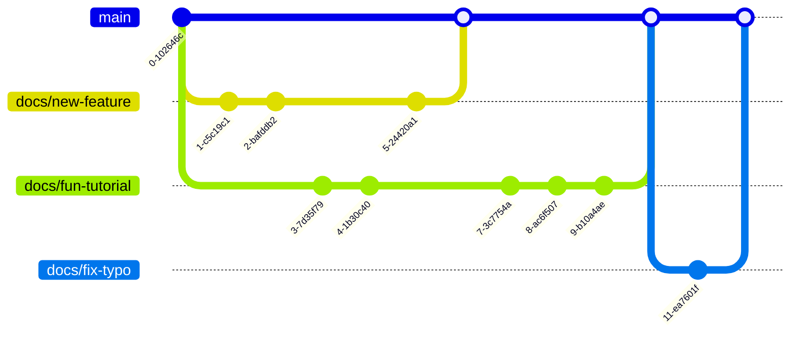
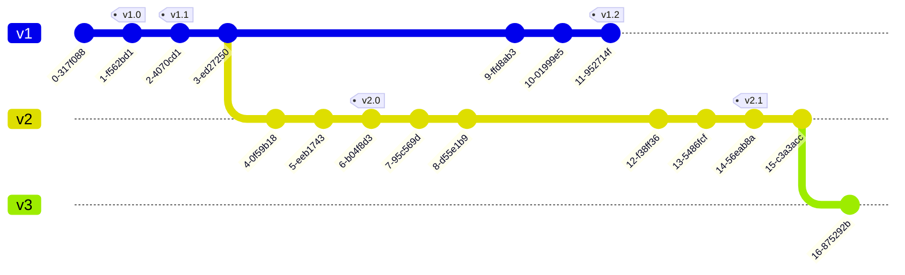

Docs-as-code is a popular and effective approach for creating and maintaining documentation, especially at scale.
The basic idea is to take the best code productivity tools and processes, and apply them to documentation projects.

Using a docs-as-code workflow requires source control as a key building block, and the most commonly used source control tool is git, which involves branching.
Choosing an appropriate branching strategy for your documentation project can make all the difference between frustration and a well-oiled workflow.
This post outlines the branching strategies we see in successful projects, describes how to use them, and gives you some advice on how to pick one for your own project.

## About git branches

If you're new to git, you can think of branches as different versions of a project - I call them "parallel universes".
Each new branch starts from your main branch, and contains only one group of changes, in a series of "commits".

If your to-do list for the day needs you to update some release notes, fix a typo in the installation instruction, and add an article explaining that cool new feature, then you'll create a new branch for each of those three things.
Once a branch is started, you can commit your work so far, switch to another one to work there, and then come back and do more on the first task.
The branches keep each set of changes separate, and mean that a team can collaborate on multiple tasks, with different changes at different stages of creation, review, and signoff.

To get the changes from a branch back into main, you "merge" the changes.


GitHub has a good round up of [learning resources](https://docs.github.com/en/get-started/start-your-journey/git-and-github-learning-resources) if you want to learn more about git.



## Trunk-based workflow

Trunk-based development is a fancy way of saying that all changes are applied to the main branch.
Committing directly to main is the simplest way to use git, and while it misses out on some of the major advantages such as having a review step, working in these many small units of work can be a good fit.

To use trunk-based development in practice, make small but complete changes, and commit each one with a meaningful message.
For more complex work, use a branch and add small changes there and merge as soon as the work can be used.

The following diagram shows a typical workflow for trunk-based development.


<details>
<summary>Diagram source for trunk-based git workflow</summary>

Diagram source for the [mermaidjs gitgraph](https://mermaid.js.org/syntax/gitgraph.html) diagram.

```text
    gitGraph
       commit
       commit
       branch docs/big-tutorial
       commit
       commit
       commit
       checkout main
       merge docs/big-tutorial
       commit
       commit
       commit
       commit
```
</details>

Most of the commits are made directly to the main branch, with one longer piece of work being developed on a branch.

For individual writers or small teams without extensive git skills or review processes, trunk-based workflow can be a good fit and a great way to get started with docs-as-code.
Since all changes get committed regularly, the trunk-based workflow means that tasks cannot hang around in "work-in-progress" state for long periods, and it's much clearer how each task is progressing.
The main disadvantage of this approach is that changes get integrated without being tested or reviewed; any additional edits or changes are added directly on to the main branch.

## GitHub flow

If there was a standard approach to branching for docs-as-code strategies, then [GitHub flow](https://docs.github.com/en/get-started/using-github/github-flow) would be it.
In GitHub flow, every change goes onto a branch and is opened as a pull request (or merge request, depending on your platform) before being accepted into the main branch.

Putting each change into its own branch and pull request brings into focus the real strengths of docs-as-code as it gives the opportunity to:

- generate a preview of the changes to share with collaborators
- run automated checks such as link checking, spell checking, and linting for the markup format used
- have others review the changes before they are published

The following diagram shows a typical workflow for GitHub flow:



<details>
<summary>Diagram source for github flow</summary>

Diagram source for the [mermaidjs gitgraph](https://mermaid.js.org/syntax/gitgraph.html) diagram.

```text
    gitGraph
       commit
       branch docs/new-feature
       commit
       commit
       checkout main
       branch docs/fun-tutorial
       commit
       commit
       checkout docs/new-feature
       commit
       checkout main
       merge docs/new-feature
       checkout docs/fun-tutorial
       commit
       commit
       commit
       checkout main
       merge docs/fun-tutorial
       branch docs/fix-typo
       commit
       checkout main
       merge docs/fix-typo

```

</details>
The only interaction with the main branch in this workflow is when branches are merged in to it; no commits are made directly.
Adopting this approach means that changes can be checked before they are applied to the project itself.


The GitHub flow pattern is a bit of a misnomer!
You can use this pattern with any git provider, so if you are working with GitLab, Azure DevOps, or another platform - this approach can work for you, too.


Many docs-as-code projects use a continuous deployment approach, updating the published documentation as soon as changes are made to the main branch.
By using a GitHub flow, the opportunity to quality check and review the changes easily slots into the process.
For teams with more specific review or signoff requirements, this can be achieved through additional workflows such as labels used with the pull/merge request.

Successful use of the GitHub flow does require git skills and the discipline to use the process for every change.
Since git is widely-used across many different industries, support and learning resources are readily available.

## Workflows for versioned documentation

Not all documentation is as simple as updating the published version of a single branch whenever there is something to share.

Many projects maintain documentation for multiple versions of a product or project and all versions may need updates over time.
Some tools offer support for managing multiple versions within one project, but if you need to maintain multiple copies of the documentation and release each one independently, then try using a versioned branches approach.

Each version of the documentation has its own "main" branch, usually named for the high-level version that it represents.
Changes are made to the branch, either directly as in trunk-based development, or using branches like GitHub flow does.

The following diagram shows a simplified workflow for working with multiple documentation versions:



<details>
<summary>Diagram source for versioned branches</summary>

Diagram source for the [mermaidjs gitgraph](https://mermaid.js.org/syntax/gitgraph.html) diagram.

```text
%%{init: {'gitGraph': {'mainBranchName': 'v1'}} }%%
    gitGraph
       commit
       commit tag: "v1.0"
       commit tag: "v1.1"
       commit
       branch v2
       commit
       commit
       commit tag: "v2.0"
       commit
       commit
       checkout v1
       commit
       commit
       commit tag: "v1.2"
       checkout v2
       commit
       commit
       commit tag: "v2.1"
       commit
       branch v3
       commit
```
</details>

This example shows the branching structure for a documentation project that maintains three versions of the documentation: `v1`, `v2`, and `v3`.
Changes are made to the branch for each version.
When it is released, the version number is indicated with a [git tag](https://git-scm.com/book/en/v2/Git-Basics-Tagging).
New major versions are branched from the previous version, but then remain independent and are never integrated.

To apply the same change to multiple versions, make the amendment to the earliest version that needs it, then use [git cherrypick](https://git-scm.com/docs/git-cherry-pick) to re-apply it to other branches as needed.

Use versioned branching when multiple versions require maintenance and ongoing updates.
The main difference between versioned branches and a single main branch is that when you branch, and when you merge, it's very important to make sure that the correct branch is used.

## Choose a branching strategy to suit

This article covered the three most-used branching strategies that we see, and they should serve as inspiration and good starting points for any project.
Once you are up and running with your project, don't be afraid to adapt these workflows and change them to meet the needs of your organization.
Branching strategies are a living thing, and they will grow and change as your projects do!

## More resources

Here are some more resources that you may find useful in your documentation projects:

- If your documentation project includes APIs, learn how to [ensure consistent APIs with Redocly and GitHub actions](./consistent-apis-redocly-github-actions.md).
- Our article [YAML for technical writers](./get-started-yaml.md) will get you started with another key docs-as-code skill.
- The diagrams in this article use [mermaid.js gitgraph](https://mermaid.js.org/syntax/gitgraph.html), and you can expand the diagram source for each.
