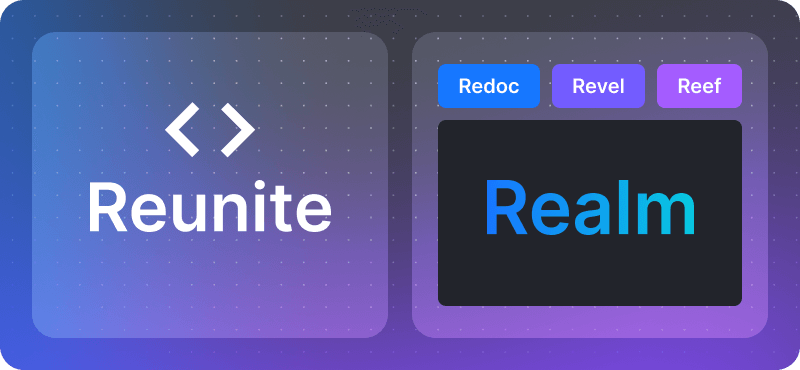

### The journey of rebuilding Redocly's core

#### The need for change

Redocly started with a solid product, Redoc, which was great for rendering OpenAPI.
We also had a Workflows product, helping many users manage developer docs.
But as time went on, we realized our system had limits.
It wasn't flexible enough for new tech and growing customer needs.

#### The big idea

Our CTO, Roman Hotsiy, noticed that our expansion to all developer docs wasn't as flexible as we wanted.
He thought we needed a new core engine.

At first, I wasn't sure.
It seemed like **too big** of a task.
But Roman, frustrated with our current setup, secretly began working on a new solution.

#### Making the decision

Roman had a breakthrough and shared it with us.
Seeing the potential of the new core, we decided to go for it.
Roman called the project "New Hope," a nod to Star Wars.

#### Facing challenges

We faced tough times, like the war in Ukraine and changing tech markets.
Hiring and growing the team was also hard.
But we pushed through.

As we developed "New Hope," we hit unexpected bumps.
We didn't plan enough for hosting and preparing the system.

#### Growing vision

Then we met an ally who became an advisor who helped us think differently.

He made us see we had more than one product.
Some products even had conflicting goals, like protecting internal IP versus promoting third-party integrations.

Time was our biggest enemy.
As we worked, our vision expanded.
We realized our tools could do more than just documentation.
They could be central to engineering teams, helping them avoid chaos.

We also realized our vision meant bringing non-developers and developers to collaborate more easily together.

Our new products became much bigger and better than before.

#### Listening to customers

With the core ready, we focused on customer feedback.
We picked a few industries like banking and travel to test our new system.
Selling was easy, but onboarding was hard.
We found big gaps in our documentation.

#### Back to basics

We wanted to go back to being a self-service company.
This meant improving our documentation and usability.
It also meant implementing a self-service billing system (we wanted an experience similar to GitHub).

#### Launching the new era

We set a launch date for our birthday week (September 22nd is Redocly's birthday).
We knew we weren't completely ready, but we couldn't wait any longer.
Our new products are ready: Redoc (new), Revel, Reef (all together known as Realm), and Reunite (our admin panel and collaboration platform).

We're excited and ready too!

You can also read my blog post about [the features I'm most excited about](./favorite-new-features.md) in this launch.

Join us on this exciting journey and [sign up for product updates](https://redocly.com/product-updates/) to get notified as soon as we launch.
