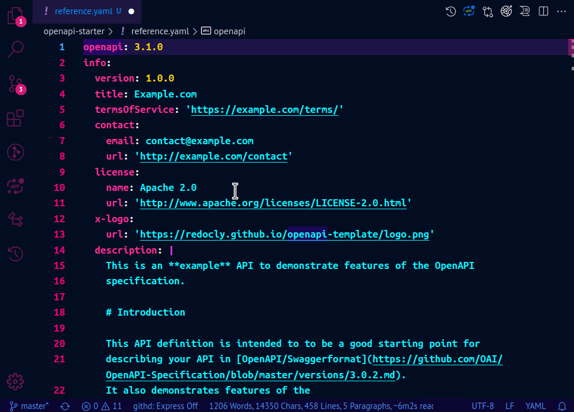
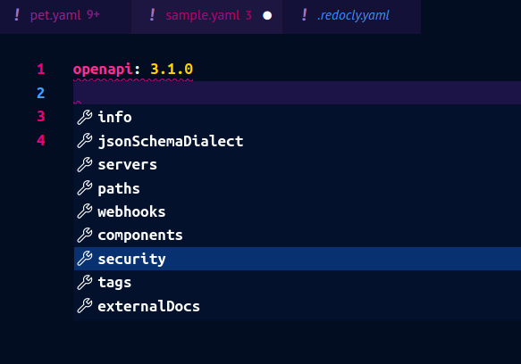
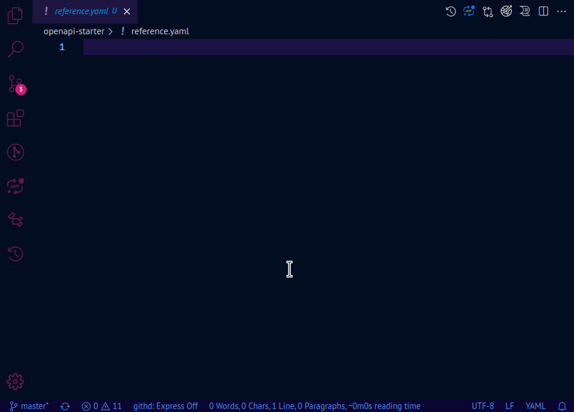
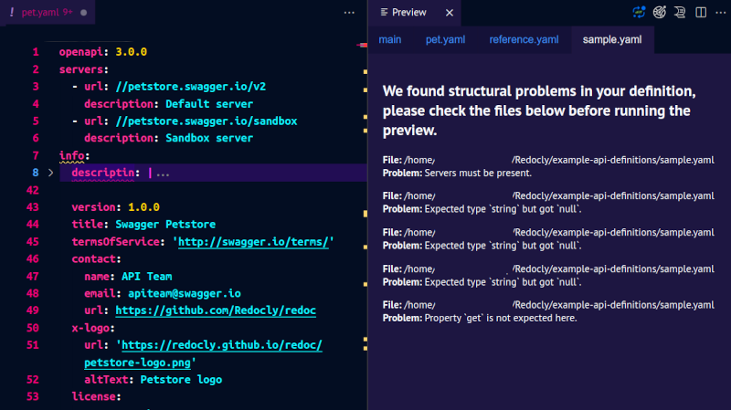

Earlier this year, we launched a new product: the **Redocly OpenAPI VS Code extension**. Knowing that many people use VS Code to create and maintain their API definitions, we wanted to support them in a familiar environment instead of having them use yet another third-party tool. Our extension brought the combined power of our API design and documentation tools to VS Code, all in one practical, free-to-use package. The feedback was great, and we were eager to implement it to make the extension even better.

**After several months of incremental improvements, we're happy to announce a new major release of the Redocly OpenAPI extension for VS Code. For this new version, we focused on improving the usability of the extension, paying special attention to first-time OpenAPI authors and those who prefer a guided approach to writing API definitions.**

If you have already used the Redocly OpenAPI VS Code extension, you'll likely notice the subtle details in the improved user experience just as well as the new features. However, if you've never worked with the extension, here are five reasons to try it today.

## 1. Visual OpenAPI editor

When we added the **Cursor context** panel, its main purpose was to provide contextual help for OpenAPI authors who are not yet familiar with all the details of the specification. When you open the panel, it gives you a brief description for the OpenAPI section and/or field where your cursor is currently placed in the editor.

For this release, we've expanded the capabilities of the *Cursor context* panel to provide **interactive controls**. When you place the cursor in the `info`, `externalDocs` or `servers` sections, the *Cursor context* panel now contains a visual OpenAPI editor in addition to the descriptions. As you modify the content in the visual editor, your changes are automatically reflected in the API definition file.

This is the just the tip of the iceberg, though. Support for interactive controls in other sections is on its way.

## 2. Live documentation preview
Similar to the *Cursor context* panel, the **Preview** panel has been a part of the Redocly OpenAPI VS Code extension for a while. After all, being able to see the API documentation side-by-side with the API definition while you're working on it is the priceless experience we aim to provide. Recently, we also made it possible to configure the appearance and functionality of the *Preview* panel by adding [any of the supported Reference docs options](../docs-legacy/api-reference-docs/configuration/functionality.md) to the `redocly.yaml` file that you use with the VS Code extension.

In this release, we optimized the performance and the stability of the live documentation preview feature. We also improved the way *Preview* panel and the editor work together to help you navigate your API definition faster. The *Preview* panel now automatically updates to show the exact section you're editing, so you can focus on what's relevant.

## 3. Powerful auto-completion

Right from the start, Redocly OpenAPI VS Code extension was equipped with handy auto-completion features that guided you through the process of writing your API definition from scratch. The goal was to help OpenAPI authors become more comfortable with the OAS structure, and the extension made that possible through dropdown menus with suggestions to choose from. All you need to do is select a suggested field or section, and the extension does the work of populating your document according to the specification.

It gets better though. The new release significantly improves this experience.

Firstly, the suggestions in the dropdown at the root level of the document are now sorted the way they're sorted in the OpenAPI specification itself.

We have improved the sorting of suggested items for the `redocly.yaml` configuration file too. Specifically, the `referenceDocs` section that lists supported configuration options now displays them in alphabetical order.

Possibly the most valuable addition in this release is the **default template** option. Sure, auto-completion is great when you know a bit about the OAS, but if you've never written an OpenAPI document before, it might not be as useful. That's why we've created a template that you can insert into your new OpenAPI document with a single click from the *Cursor context* panel.

With this template, you can experiment and learn about the OAS structure, modify its contents and build your own API definition from it, or test our VS Code extension and its capabilities.

Make sure to share the results with us!

## 4. Quick access to referenced files

By now you've probably realized that we put a lot of effort into making OpenAPI definitions not just easier to write, but also easier to navigate. Our VS Code extension already had the amazingly practical **Peek** and **Go to definition** features that let you preview files linked with `$ref` inline or open them in a new VS Code tab. As we're always advocating for the multi-file API definition approach, this perfectly complements our recommendations and helps those of you who follow the same path. With these features, your referenced components, schemas and paths no longer seem like separate entities in some distant folder, but are integrated into the whole OpenAPI editing experience and only two clicks away from your VS Code window.

The latest Redocly OpenAPI VS Code release extends this functionality to the `redocly.yaml` file (and, technically, any YAML file with references to other files). Your API definitions listed in the `apiDefinitions` section can now be opened and previewed with the same *Peek* and *Go to definition* options from the right-click menu.

The same goes for the file linked in the `referenceDocs > htmlTemplate` field, if you're using it in your configuration file. Speaking of which, that `htmlTemplate` option is actually new in this release! You can use it to override the default HTML template used in the live documentation preview panel.

## 5. On-the-fly OpenAPI validation

At the core of our VS Code extension is our open-source OpenAPI CLI tool with extensive - and extendable - linting capabilities. Validation and linting are crucial steps in the OpenAPI authoring process, so the extension makes use of this tool to help you understand why your API definition may be incorrect, and how to fix it. Of course, all this happens as you type - the extension continuously validates your OpenAPI document and warns you about different kinds of issues it detects. It is pretty clever that way!

Previously, the extension was great at the "detecting issues" part, but we felt it could do a better job at telling you what's wrong. In this release, we've improved the phrasing in warning messages displayed in the editor, and added assistive "Did you mean...?" prompts to steer you towards solving the issues more efficiently. The *Preview* panel, when opened, now also displays warning messages when any of your API definitions is not valid (and indicates the problem).

## Convinced?

We hope you're as excited to try the new Redocly OpenAPI VS Code extension as much as we are excited to share it with you. Of course, this list doesn't cover everything the extension offers. There's more to discover, so install the extension and see for yourself! You can get it from the [Visual Studio Marketplace](https://marketplace.visualstudio.com/items?itemName=Redocly.openapi-vs-code) (or search for "Redocly" directly from the Extensions panel in your VS Code editor).

As you're reading this, we're already planning and developing new features and improvements.

**If you notice any issues or want to share your ideas for improving the extension, let us know.** We've set up [the official public GitHub repository](https://github.com/Redocly/redocly-vs-code/blob/main/CONTRIBUTING.md) for the extension, and all contributions are welcome.

For news and updates on the extension and other Redocly products and activities, [follow us on Twitter](https://twitter.com/Redocly).

Happy API authoring! 🥳
