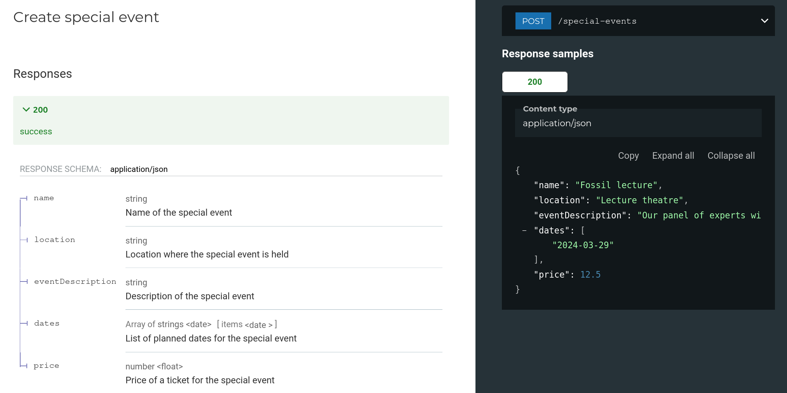

API descriptions can be rather dry and factual, producing reference documentation that is accurate but can still fail to bridge the gap between API interface and happy, productive API consumers. Adding examples to OpenAPI can go a long way to helping users understand what they can do, and how to do it. There's no replacement for quickstart guides, tutorials, and other documentation of course - but richer examples in the OpenAPI descriptions can feed documentation and other downstream tools to get users up and running fast.

The first step is to include examples for as many aspects of your OpenAPI as you can. Headers, parameters, request bodies and responses all benefit from appropriate examples. This article shows how to add examples to your API descriptions, and how to get the examples to do a little more work along the way.

## Choose data that connects

Choosing meaningful data takes time and energy, but it produces results. There are very few situations where the string `"foo"` or the string `"string"` truly help a user to reach their destination with efficiency and delight. In the example below you can see some of the common fields used in the [Museum API](https://github.com/Redocly/museum-openapi-example) and the example values used to help the user get the correct data in each field.

```yaml
    EventId:
      description: Identifier for a special event.
      type: string
      format: uuid
      example: 3be6453c-03eb-4357-ae5a-984a0e574a54
    EventPrice:
      description: Price of a ticket for the special event
      type: number
      format: float
      example: 25
    Date:
      description: ISO-formatted date value.
      type: string
      format: date
      example: 2024-02-28
    Email:
      description: Email address for ticket purchaser.
      type: string
      format: email
      example: museum-lover@example.com
```

Don't be too serious with your examples! It's good practice to use a [reserved example like `example.com`](https://www.iana.org/help/example-domains) for URLs and email addresses, but here we've used `museum-lover@example.com` and it always makes me smile!

Especially if your API has multiple similar fields, use example data as well as meaningful field descriptions to direct the user's attention. For example. we use start dates that are earlier than end dates. You could also use data such as `customer@example.com` and `accounts-department@example.com` to distinguish multiple email fields.

## Add example values for object properties

For more complex values, such as objects, a great way to start is to add an example for each property. Depending which tools consume the OpenAPI description, they may make use of these. The following example shows a `SpecialEvent` schema with multiple object properties, where each property has an example field.

```yaml
    SpecialEvent:
      description: Special museum events with ticketing.
      properties:
        name:
          description: Name of the special event
          type: string
          example: Fossil lecture
        location:
          description: Location where the special event is held
          type: string
          example: Lecture theatre
        eventDescription:
          description: Description of the special event
          type: string
          example: Our panel of experts will share their favorite fossils and explain why they are so great.
        dates:
          description: List of planned dates for the special event
          type: array
          items:
            type: string
            format: date
            example: 2024-03-29
        price:
          description: Price of a ticket for the special event
          type: number
          format: float
          example: 12.50
```

These values are combined by tools such as [Redoc](https://github.com/Redocly/redoc) to show an example to the user of how the payload looks.



## Use multiple examples for responses

We're going to skip the backstory of how it is possible that OpenAPI has both `example` and `examples` as valid keywords ([Phil's writeup is good](https://philsturgeon.com/openapi-examples/) if you are curious). Suffice to say: being able to supply multiple examples is brilliant, and especially useful when there are a few different possible responses to an endpoint.

The following example shows the Museum API returning two example payloads:

```yaml
      responses:
        "200":
          description: Success
          content:
            application/json:
              schema:
                $ref: "#/components/schemas/GetMuseumHoursResponse"
              examples:
                default:
                  summary: Museum opening hours
                  value:
                    - date: "2023-09-11"
                      timeOpen: "09:00"
                      timeClose: "18:00"
                    - date: "2023-09-12"
                      timeOpen: "09:00"
                      timeClose: "18:00"
                    - date: "2023-09-13"
                      timeOpen: "09:00"
                      timeClose: "18:00"
                    - date: "2023-09-17"
                      timeOpen: "09:00"
                      timeClose: "18:00"
                closed:
                  summary: The museum is closed
                  value: []
```

By describing the possible different payloads that the API can return, API consumers can be confident that they can test edge cases. In the example of the Museum API opening hours, if the museum is closed then there are no opening hours for a particular date entry. Adding a separate example showing an empty array if there are no opening hours in the date range specified gives users a clear message of what happens in that situation.

For more complex APIs, returning multiple response examples becomes even more useful. For example in an ecommerce system, an `order` schema might have diffferent data in it depending if the order is already paid for, delivered, and so on. Showing the examples goes beyond showing a list of optional data fields to clearly illustrate what the API consumer can expect.

## Add linting for examples

[Redocly CLI](https://github.com/Redocly/redocly-cli/) is a widely-used tool for linting OpenAPI descriptions; it has specific rules available to help check that the examples in an OpenAPI description are present and valid. Read more about [setting up your own linting rules](../docs/cli/rules/built-in-rules#rule-configuration-syntax) and try enabling these example-specific rules in your own projects:

- [no-invalid-parameter-examples](../docs/cli/rules/oas/no-invalid-parameter-examples): Parameter examples must match declared schema types.
- [scalar-property-missing-example](../docs/cli/rules/oas/scalar-property-missing-example): All required scalar (non-object) properties must have examples defined.
- [no-invalid-schema-examples](../docs/cli/rules/oas/no-invalid-schema-examples): Schema examples must match declared types.
- [no-invalid-media-type-examples](../docs/cli/rules/oas/no-invalid-media-type-examples): Example request bodies must match the declared schema.

## Examples are worth a thousand words

We're documentation fanatics, so we'd probably say that you can write the thousand words as well, but having clear examples throughout your API description takes your API user experience to the next level. This post showed how you can add examples to the various aspects of an OpenAPI file, and gave some tips for picking example values to nudge your users in the right direction.
