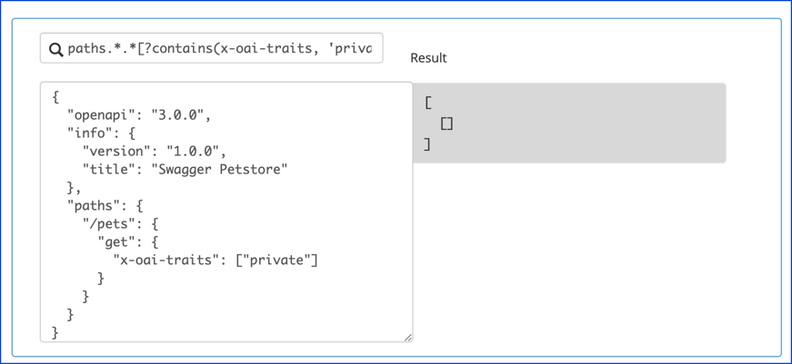
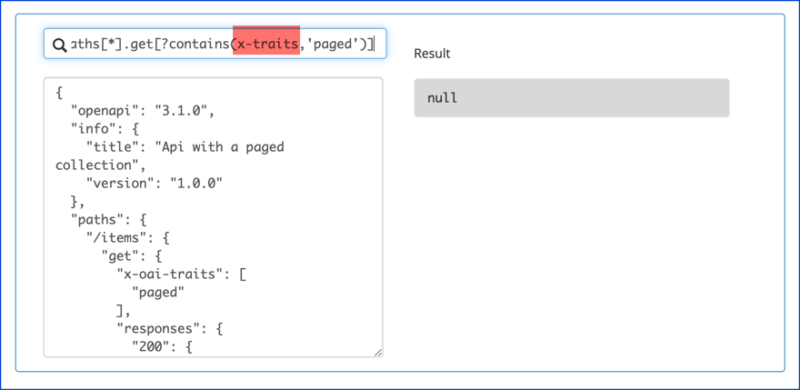
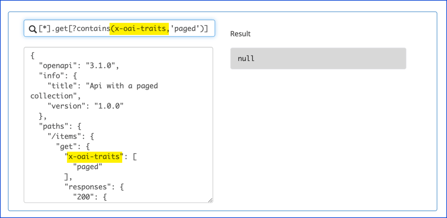

# OpenAPI overlays are not the answer

The OpenAPI Specification evolves through community proposals reviewed by the technical steering committee.

This blog post is about the overlays proposal.
The idea from early issues dates back to 2016, and the current proposal is from [2.5 years ago](https://github.com/OAI/OpenAPI-Specification/blob/main/proposals/2019-12-24-Overlays.md).

Overlays haven't been accepted into the specification yet (and I don't think they should be accepted).
Redocly probably won't implement support for overlays if the proposal is accepted as-is due to the reasons outlined in this blog post.

The idea behind overlays is to be able to generate another OpenAPI definition from an original one plus an overlay document.

I'm a formula person:
> New OpenAPI definition = Original OpenAPI definition + Overlay document + tooling

## Use cases

Periodically, a use case arises where people believe overlays are the answer.

The overlay spec proposes three use cases:
- add
- remove
- merge

I've had the pleasure of speaking with thousands of OpenAPI users since we launched, and I've only come across two of these use cases (no **merge** case):

- **add**: _"How can we add descriptions to the OpenAPI doc when our developers are auto-generating the file?"_
- **remove**: _"How can we remove our internal APIs before sharing it?"_

Both of these use cases are common enough that they warrant proper solutions.

### Removing internal info

We see removing content (usually paths, operations or properties) as the most common use case.
There is a [better solution](https://redocly.com/docs/cli/guides/hide-apis/) than overlays.

### Adding info, tag, and operation descriptions

The next most common use case is:

> The dev team generates the OpenAPI definitions from code annotations and I need to augment or fix descriptions. Who am I? I'm not (currently) a developer. My team doesn't give me access to their source code, so I cannot edit the annotations directly.

We have a solution for this use case called decorators that override descriptions.
This is something that people can use today.
See a sample repository demoing [how to override descriptions](https://github.com/redocly-demo/decorators-demo).

## Overlays are complex

This [comment](https://github.com/OAI/OpenAPI-Specification/issues/433#issuecomment-1132122476) was the impetus for this blog post.
Karl asks if overlays can solve the problem and if they are sufficient?
(The particular use case referenced is the _remove_ use case.)

My answer: No.

It is complex, more opaque, and not necessary.
It requires knowledge of two specifications: the overlays spec and the JMESPath spec which is hard for me to use (an alternative considered was JSONPath which has its own issues and is without a spec).
We have a lot to say about JSONPath but you'll need to wait for another blog post.

### Example overlay

Karl's example demonstrates the complexity perfectly.
I couldn't have done it better myself.

Karl proposed an overlay:

```json
{
  "overlay": "1.0.0",
  "info": {
    "title": "Private Endpoints Overlay",
    "version": "1.0.0"
  },
  "actions": [
    {
      "target": "info",
      "update": {
        "x-overlay-applied": "private-endpoints"
      }
    },
    {
      "description": "Remove any operation with private trait'",
      "target": "paths.*.*[?contains(x-oai-traits, 'private')]",
      "remove": true
    }
  ]
}
```

And a corresponding sample OpenAPI definition.

```json
{
  "openapi": "3.0.0",
  "info": {
    "version": "1.0.0",
    "title": "Swagger Petstore"
  },
  "paths": {
    "/pets": {
      "get": {
        "x-oai-traits": ["private"]
      }
    }
  }
}
```

Keep in mind this overlay is simplified (and still complex at the same time) compared to the true remove use-case case handling:

- It should remove an operation, but not remove the path (it actually wouldn't remove the operation for three reasons I'll explain below).
- It would not remove properties in a schema (if there are some internal properties).
- It would not remove parameters (if there are some internal parameters).
- It would not remove response headers (if there are internal response headers).
- It would not remove any components that were referenced from the internal operations yet not referenced from the remaining operations.

A lot of complexity and a lot of the use case is still unhandled.
I'm not sure it could be capable of handing the last case (removing unused components).
I also mentioned there are three reasons removing the operation wouldn't work.

#### Reason 1: The overlay doesn't match the spec

According to the [proposed spec](https://github.com/OAI/OpenAPI-Specification/blob/main/proposals/2019-12-24-Overlays.md#overlay-object
), instead of "actions" it should be "updates" and instead of "update" it's "add" or "merge".

While much smaller than OAS, this still involves learning a new Overlay specification that is not purely simple.
It's hard enough to learn OAS.
Anyone with me here?

However, it also incorporates another spec: [JMESPath](https://jmespath.org/).

### Reason 2: The JMESPath target is incorrect

I spent the bulk of my time on this blog post studying JMESPath (and I could probably use another few days).

The example target `paths.*.*[?contains(x-oai-traits, 'private')]` is incorrect. 😱



So this is reason #2 it wouldn't remove that get request even if it was reformatted to be correct with the overlays spec.

This isn't Karl's fault.
I spent 30 minutes trying to create a working JMESPath and I didn't have any luck (but the JMESPath website is great at letting you know when you got it wrong).
Yes, 30 minutes on that one line.

And then I asked our CTO to spend 30 minutes to figure it out.
He spent 45 minutes and figured it out (kind of).

> No idea why it's not working without the pipe:
>
> `paths.*[].*[] | [?contains(x-oas-traits, 'private')]`
>
> But it will crash if a node doesn't have `x-oai-traits` defined at all.
>
> `TypeError: contains() expected argument 1 to be type string,array but received type null instead.`

**JMESPath isn't easy to write.**

The traits example in the official [overlay spec proposal](https://github.com/OAI/OpenAPI-Specification/blob/main/proposals/2019-12-24-Overlays.md#traits-examples) is also incorrect at least twice (or I'm wrong at least twice).

First, the sample target doesn't match what it is searching on (`x-traits` vs `x-oai-traits`).



Second, the JMESPath also doesn't work as shown by the `null` result.



I know what you may be thinking.
Adam, how do you know it's not right if you don't know JMESPath?

And I agree.
Please let me know where I'm wrong.

### Reason 3: There is no tool to process the overlay

Reasons #1 and #2 (mostly #2) are why Redocly probably won't implement overlays if they are ever accepted into the specification because Redocly has practical solutions that work for actual use cases:
- Use `remove-x-internal` decorator to [hide internal APIs](../docs/cli/guides/hide-apis)
- Use `info-description-override`, `operation-description-override`,
and `tag-description-override` to [override descriptions](https://github.com/redocly-demo/decorators-demo).

These work today.
They are easy to target.
They can be extended to meet a variety of ancillary use cases.
No new tooling needs to be invented.
And the more we learn, the better we could help shape an overlays spec in the future.

To the OpenAPI steering committee, I urge you to reconsider the current overlays proposal.
In the case of this proposal, it's the users I'm worried about (not the tooling).
Wait and see what new information arises.
Consider that the use cases may fall outside of the boundaries of the OAS TSC.

And to Karl: thanks for inspiring this blog post. 🎉
