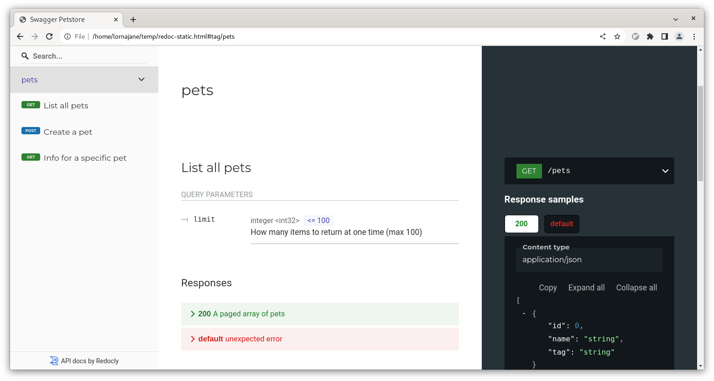
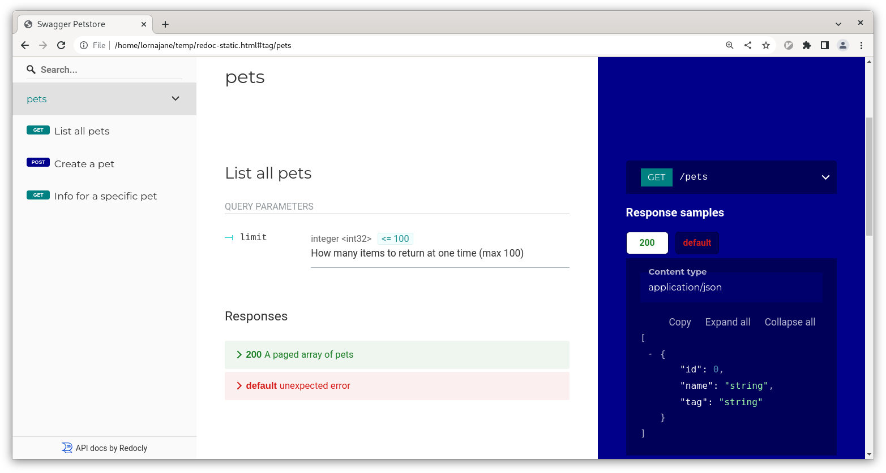

APIs are a perennially hot topic, providing integrations into and between all
sorts of systems. Most APIs are described in
[OpenAPI](https://www.openapis.org/) format, a single source of truth that can
be used to create API clients, servers, tests ... or documentation to make
working with the API a more delightful experience for all its users.

Anyone can create great-looking documentation from the OpenAPI description, and
in today's post you'll see how to do exactly that using `redocly`, the open
source [Redocly CLI](https://github.com/Redocly/redocly-cli) tool. Whether you
are publishing documentation for users of your own API, or just looking for a
nicer way to view the details of an API you're consuming, let's get started.

## Install Redocly CLI

You will need [NodeJS and the NPM package
manager](https://nodejs.org/en/download) to install `redocly` on your computer,
so install those first if you haven't already.

Install Redocly CLI as a command with `npm`:

```sh
npm install @redocly/cli -g
```

Check your install worked with the following version command:

```sh
redocly --version
```

This command is also useful to check what version you have already installed
if it's been there for a while.

> **Tip:** If you use Docker but not NodeJS, you can try the [Docker version of
Redocly CLI](https://redocly.com/docs/cli/installation/#run-commands-inside-docker) instead; the same
commands are available

## Generate docs

Redocly serves many purposes in the API lifecycle, but today I'm focused on
documentation. Start by downloading an OpenAPI description to use, for example
the [classic Petstore
API](https://github.com/OAI/OpenAPI-Specification/blob/main/examples/v3.0/petstore.yaml)
is a common demo API to use for trying API tools.

To create HTML documentation, use this command:

```sh
redocly build-docs petstore.yaml
```

By default the command will generate a file called `redoc-static.html`; this file is
a standalone web page containing your API documentation. Open the file in your
web browser, such as Google Chrome, and see the entire API formatted nicely for
humans to read.



API documentation is a great way to help your API users be successful, and
and make consuming someone else's API easier as well.

## Configure to make it yours

Sometimes you just want a human-friendly way to view your API, and the
out-of-the-box works well. But sometimes this API documentation is part of your
product platform, and tweaking the settings will make it more clearly part of an
existing brand.

By default, Redocly CLI looks for a configuration file called `redocly.yaml`, so
create that file, and try the following example configuration:

```yaml
theme:
  openapi:
    theme:
      colors:
        primary:
          main: 'teal'
        http:
          get: 'teal'
          post: 'darkblue'
      rightPanel:
        backgroundColor: 'darkblue'
```

Now if you repeat the `build-docs` command from earlier, you should see the same
documentation, but looking a little different this time.



There are plenty of settings you can change here to get something that fits your
needs. The [configuration
documentation](https://redocly.com/docs/cli/configuration/) has all the
information you need to go wild with the settings - look for options marked
**available in Redoc CE** for options available with this community edition of
our API docs.

> **Tip:** The other configuration options are available in our commercial [API
registry and documentation
platform](https://redocly.comdocs-legacy/api-registry/guides/api-registry-quickstart/);
this tutorial is just for the open source documentation tools.

## Preview as you go

While you're editing an OpenAPI description, or tweaking your Redocly
configuration, it's helpful to see the HTML documentation update as you go
along. Luckily, `redocly` has a command for that too; it starts a local server
and updates the page when anything changes. Run it like this:

```sh
redocly preview-docs --use-community-edition petstore.yaml
```

This will start a server on your computer and tell you where (by default it's at
<http://localhost:8080>). Load the page and you should see your documentation.
Test the preview by editing the OpenAPI description and watching the
documentation update when you save it.


## API tools to make the day go faster

Redocly CLI also checks your API standards, helps you handle large OpenAPI files in
smaller sections, and can even give you the tools to improve an existing API
description. Visit the [Redocly CLI docs](https://redocly.com/docs/cli) to learn
more.
