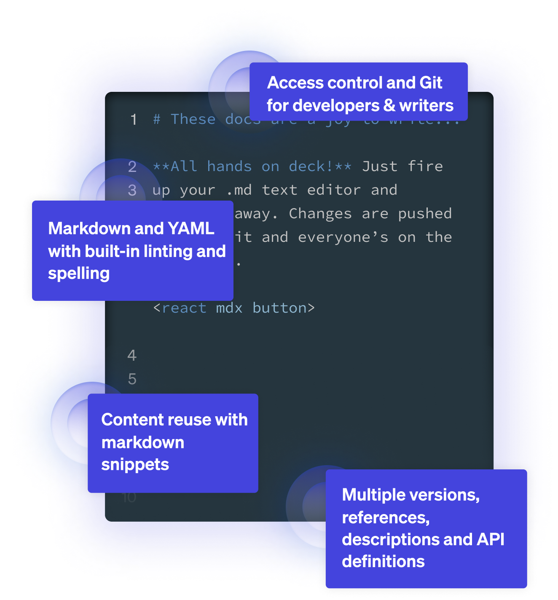
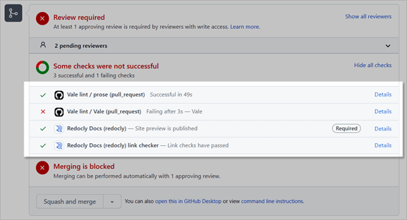
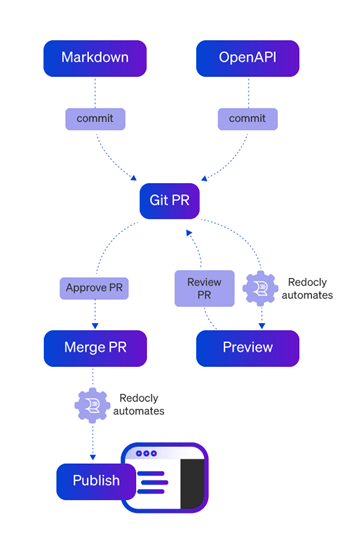

Redocly helps companies make the most of their APIs by keeping documentation current, up to date, and ready for internal and external users.

Using the suite of Redocly products, organizations can integrate their OpenAPI definitions, create crisp API reference documentation, and design a great looking developer portal that encompasses all this to build amazing developer experiences.

Over this journey, technical writers play a pivotal role, working with developers and product teams to create API reference information, user guides, contextual information, workflow diagrams, and other technical documentation for the product.

So, if you are a technical writer, what do you need to know to get the best out of Redocly?

## Know your OpenAPI

The core of everything with Redocly is your OpenAPI definition. The OpenAPI definition describes the structure and syntax of your REST APIs, and allows product teams to define API essentials such as endpoints, operations, authentication, and other meta information.

As a technical writer, you may not be directly involved in creating or designing the OpenAPI definition, but you can collaborate with the product team to assist with seeding the OpenAPI file with enough contextual information to make the OpenAPI file useful the moment you add it into Redocly.

Here's what an OpenAPI definition looks like.

```yaml
openapi: 3.1.0
info:
  title: Tic Tac Toe
  description: |
    This API allows writing down marks on a Tic Tac Toe board
    and requesting the state of the board or of individual squares.
  version: 1.0.0
paths:
  # Whole board operations
  /board:
    get:
      summary: Get the whole board
      description: Retrieves the current state of the board and the winner.
      responses:
        '200':
          description: 'OK'
          content: ...
```

For the entire API definition, refer to the [Tic Tac Toe sample API](https://oai.github.io/Documentation/examples/tictactoe.yaml).


Initially, you may only be involved with documenting the `info description`, `tag description`, `operation summary`, and the `operation description` values.


Once the OpenAPI definition has been ingested, Redocly will track any changes to the definition, so API docs are built automatically from the latest version. As technical writers, you can maintain separate documentation for separate versions.

There are a number of resources where technical writers can learn about OpenAPI:

- [The OpenAPI specification](https://spec.openapis.org/oas/v3.1.0)
- [Introduction to OpenAPI](/learn/openapi/learning-openapi.md)
- [Create your own OpenAPI repository](/docs/cli/openapi-starter)
- [OpenAPI visual reference](/learn/openapi/openapi-visual-reference/index.md)

## Getting on with Git

If you haven't encountered Git (a type of source control) before, get on to it pronto. Git is the language software product teams speak all over the world.

Everything in Redocly is closely integrated with Git, including the docs. What that means is you can track down anything you changed, updated, added and more, giving you great leverage over other doc tools.

You can learn about Git on your own fairly quickly, and sometimes even [over a month of lunches](https://www.manning.com/books/learn-git-in-a-month-of-lunches).

Resources for getting up to speed with Git:

- [Getting Git Right](https://www.atlassian.com/git)
- [Git book](https://git-scm.com/book/en/v2)
- [Learning Git branching](https://learngitbranching.js.org/)

## Get started with Redocly

Before you deep-dive into the writing part, get familiar with Redocly products and how they work together.

We have two main products and some key things about each of these products that tech writers should know.

**API registry**

- Web-based GUI tool for managing all your API definitions.
- Automatic linting for your API definitions that shows you if there are any errors.
- Starting point for integrating your API definitions with other Redocly products.

**Portal**

- Extend your OpenAPI definition with additional content (images, videos, external Markdown pages).
- Built-in Try it console to help your readers test the API directly from your docs.
- Automatic generation of code samples in a number of popular languages.
- Build and design a modern, responsive, standalone website for your documentation.
- Integrate your API reference documentation into your portal and expand it with contextual information, guides and tutorial-style documentation.
- Set up integration with a host of analytics tools to get the data on your portal usage.

To learn more about the individual products you would be working with:

- [API registry quickstart guide](../docs-legacy/api-registry/guides/api-registry-quickstart.md)
- [How our developer portals work](../docs-legacy/developer-portal/index.md)
- [Read about organizational settings](../docs-legacy/settings/index.md)

## Use docs-as-code tools

Using a [docs-as-code approach](./docs-as-code.md) allows technical writers to integrate more easily with the developer and product workflow for a quicker turnaround with reviews and collaboration.

As part of docs-as-code, technical writers will experience:

- Working with text editors like [Visual Studio Code](https://code.visualstudio.com/) or [Atom](https://atom.io/).
- Storing content in version control systems like a Git repository.
- Collaborating with other teammates using version control such as Git.
- Using validation checks for broken links (Redocly has a broken link checker), style and language tools such as [Vale](https://docs.errata.ai/).
- Using a static site generator to build documentation locally (Redocly does this for you!).
- Automating the site build process with continuous delivery mechanisms (already built into Redocly).


Redocly has a [VS Code Extension](https://marketplace.visualstudio.com/items?itemName=Redocly.openapi-vs-code) that helps you write, validate, and maintain your OpenAPI documents. It warns you about errors in OpenAPI definitions and lets you quickly access referenced schemas or open the files that contain them.


### Supercharge your docs

After you have added your OpenAPI definition into Redocly, technical writers can use their own choice of editor tools to [add new content in Markdown](../docs-legacy/developer-portal/guides/markdown.md), customize and theme the navigation, or use component-based Markdown (MDX) to add interactive elements to the documentation.

If you are creating API reference information, use our guides to customize your documentation, and [add valuable code samples](../docs-legacy/api-reference-docs/guides/generate-code-samples.md) to your docs.

If you are building a developer portal along with your API reference information, Redocly has a few nifty features for technical writers:

- Control how your docs render page table of contents, set per-page access permissions, and write SEO meta tags.
- Customize image sizes and styles.
- Create interactive content with MDX.
- Reuse content with Markdown snippets.
- Insert Mermaid diagrams straight into your docs.
- Set up redirects on a page-by-page basis or globally.
- Design step-by-step guides.



## Review and collaborate

When you are ready with your content, set it up for review and collaboration using your source control review process. What this means is, depending on the source control you use, you can create a PR (Pull Request, also called a MR (Merge Request)), and get your teammates to review the content, and collaborate on further changes.

Your subject matter experts (SMEs) can review and provide feedback directly on your PRs, improving the efficiency of the process, and cutting down time (and costs) to invest in multiple toolchains for review and collaboration. It all works seamlessly using the same workflow across product teams.

## Preview and build documentation

Any changes made to the content via the PRs are automatically pushed through Redocly across the Reference and Portal products, so you can instantly preview your changes. You can also share your previews with your team to seek approval.



Once the changes have been approved, you can merge them in and Redocly will automatically update this to your live documentation sites across Reference and Portals.

## Publish your API docs

You have put in the hard yards, built the content around your APIs, and are ready to roll them out to the world. Publishing (or deploying) your docs is a breeze!

The moment you ingest your OpenAPI definition into Redocly, you are well on your way to previewing and publishing your docs.

**Developer portal**

Redocly Developer portal is a static site generator, and access controls are managed within our app as part of our CI/CD Workflows product.
You can [present your API docs](../docs-legacy/developer-portal/guides/reference-docs-integration.md) in your developer portal.

**Control who accesses your docs**

In addition to publishing the docs, you can also control who can access the documentation associated with your API docs and developer portals. For more information, refer to the [Manage access to docs](../docs-legacy/workflows/manage-access.md) topic.



And that's that folks! You are now ready to promote and showcase your amazing API docs to the world.
