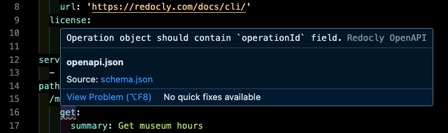
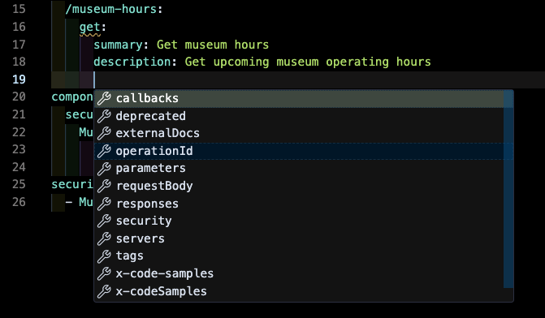
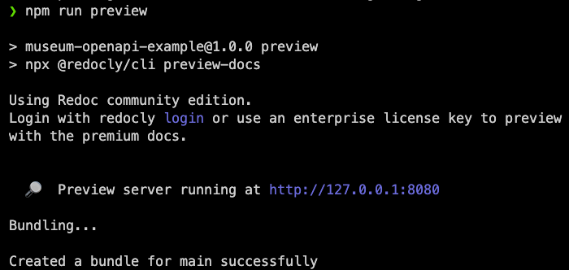
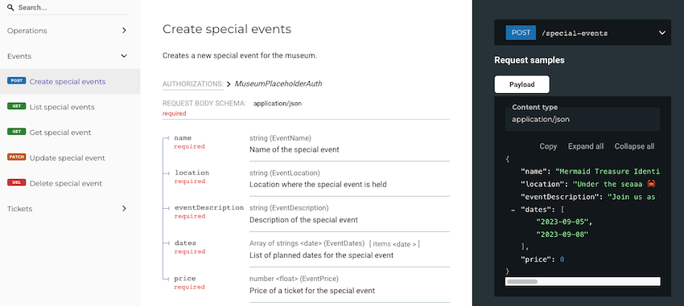
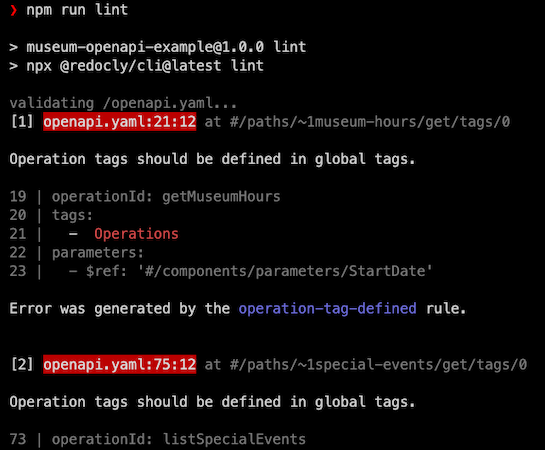
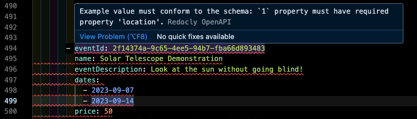
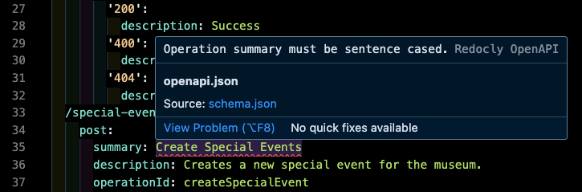

One of the hardest problems when building APIs is getting the API description started. Whether you're designing a brand new API or retrofitting an existing API into an OpenAPI description, staring at a blank canvas can feel daunting. Recently, when working on a greenfield OpenAPI project, I faced this exact problem. Thankfully, my experience has taught me to reach for tools to help me work with OpenAPI more effectively.

In this blog post, I'll introduce the Museum API and examine the impact that best-in-class developer tools can have on your OpenAPI development process. I'll share my experience building the Museum API and how Redocly's open source tools were used along the way.

## Meet the Museum OpenAPI description

This post features the "Museum API", an OpenAPI description for an imaginary Museum. The Museum API is an iterative educational tool that Redocly can use to teach people about OpenAPI. Please feel free to [explore the repo](https://github.com/Redocly/museum-openapi-example).

While building the Museum OpenAPI, two tools had an outsized impact on my development process:
1. [redocly-vs-code](https://redocly.com/docs/redocly-openapi/) → Redocly's official extension for VS Code
2. [redocly-cli](https://redocly.com/docs/cli/) → a command-line tool that grants OpenAPI superpowers

## Build the foundation with Redocly's VS Code extension

Composing the initial structure for your OpenAPI description can be challenging. It takes time and energy to context switch between your coding environment, reading about OpenAPI, and searching for examples. Redocly's official [VS Code extension](https://redocly.com/docs/redocly-openapi/) was especially useful to me during this phase of working on the Museum API.

### Real-time validation

The immediate feedback the Redocly VS Code extension provides on OpenAPI syntax helped me write operations correctly, avoid breakages, and identify quality improvements. Besides making me more productive in my IDE, this validation allowed me to focus my problem-solving on larger issues rather than syntax errors.



### Smart suggestions

Having intelliSense-like code completion allowed me to spend more time building and less time searching. After adding something to the spec, I could _assemble_ the underlying object by selecting the child properties from the suggestion modal.



## Refine and expand API descriptions with Redocly CLI

As your OpenAPI description grows in size and complexity, new challenges emerge quickly. That's why the usefulness of your OpenAPI tooling should grow with your needs. When developing the Museum API, I relied on the [Redocly CLI](https://redocly.com/docs/cli/) to ensure I was adding new, valuable features to the description as it grew in scope.

### Previewing the docs

The ability to [preview](https://redocly.com/docs/cli/commands/preview-docs/) the API reference docs the same way an end-user will experience them is essential. Great docs need to be reviewed for _more_ than just technical correctness. Previewing the API reference docs was especially useful when working with nested schemas and example payloads.




### Linting the description

The [linting](https://redocly.com/docs/cli/commands/lint/) feature enforced basic OpenAPI standards (using Redocly's [recommended ruleset](https://redocly.com/docs/cli/rules/recommended/)), but could be shaped to meet the unique needs of our project. For example, when a reviewer pointed out that I forgot to define tags, I turned on [operation-tag-defined](https://redocly.com/docs/cli/rules/operation-tag-defined/) (one of many [built-in rules](https://redocly.com/docs/cli/rules/built-in-rules/)) and the missing tags were picked up by the linter! Here's the rule:

```yaml
rules:
  operation-tag-defined: error
```


## Better tools for better developer experience

One of the best parts of OpenAPI is the improvements in developer experience it unlocks. But that benefit isn't _only_ for consumers; it's for builders, too! Reflecting on my journey building the Museum OpenAPI description, there were two standout moments where I was especially delighted by the tooling I was using: [creating payloads](#creating-example-payloads) and adding a [new linting rule](#adding-a-custom-linting-rule).

### Creating example payloads

When creating example request and response payloads, the real-time, schema-based validation felt like a superpower! Each property in the example payload is validated against the underlying schema, which made examples more accurate and easier to construct. Additionally, any changes to the schema immediately throws errors in the corresponding examples.



### Adding a custom linting rule

We wanted to enforce sentence casing on Operation summaries, so I added a [configurable rule](https://redocly.com/docs/cli/rules/configurable-rules/). Right after adding the rule, the real-time validation errors were visible in my IDE!

#### Building the rule
Redocly has an API design preference -- Operation summaries should be "sentence cased", which means there's only one capital letter.
- 🟢 **Good** Operation summaries = Create special event, Get museum hours, Buy museum tickets
- 🔴 **Bad** Operation summaries = Create Special Event, get Museum hours, buy museum tickets

I started by using [regexr](https://regexr.com/) to help build the regex: `/^[A-Z]+[^A-Z]+$/`, which matches strings that:
1. Start with an uppercase letter
2. Are followed by characters that are _not_ uppercase letters
3. End with a character that is _not_ an uppercase letter

Next, I added the following rule to the redocly configuration file:

```yaml
rules:
  rule/operation-summary-sentence-case:
    subject:
      type: Operation
      property: summary
    message: "Operation summary must be sentence cased."
    assertions:
      pattern: /^[A-Z]+[^A-Z]+$/
```

#### Example of sentence case linting
After adding the sentence casing rule, the errors were visible running the CLI linter _and_ inside my IDE.



## Redocly tooling improves OpenAPI development

For beginners and OpenAPI-experts alike, the right tools make all the difference. Redocly's open source tooling can unlock better, more productive ways of working with OpenAPI descriptions for both brand new projects or existing ones. The tools are powerful, but flexible, and often create significant value in unexpected ways -- we encourage you to experiment!

Hopefully this post inspired you to dig deeper into Redocly's OpenAPI tooling. Ready to explore? Try the following resources:
- [Museum OpenAPI spec](https://github.com/Redocly/museum-openapi-example) - The example OpenAPI description featured in this blog post.
- [Using Redocly CLI for API Management](https://nordicapis.com/using-redocly-cli-for-api-management/) - A blog post from Nordic APIs exploring the Redocly CLI.
- [Redocly CLI GitHub page](https://github.com/Redocly/redocly-cli) - See how our CLI is maintained and evolves over time.
