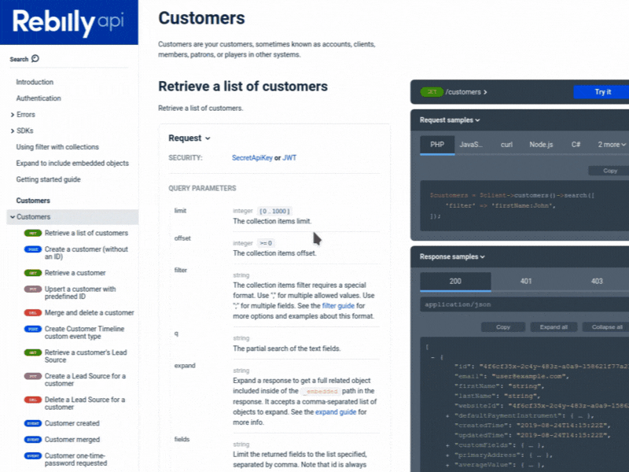
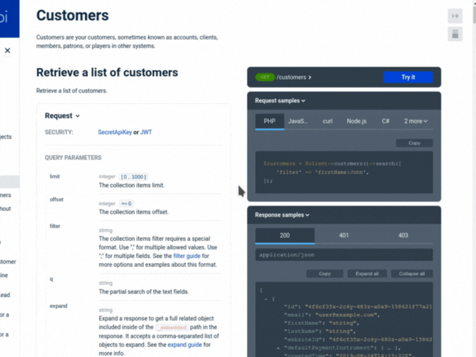
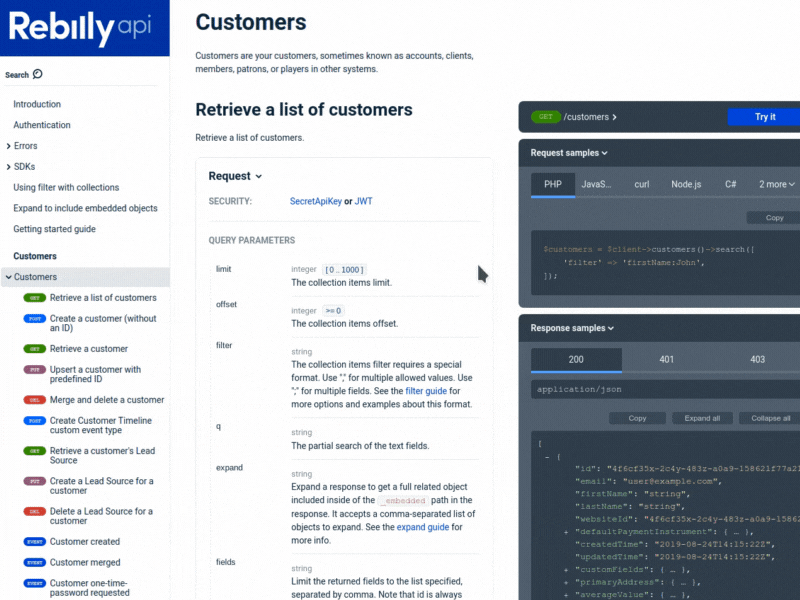

**After many months of hard work, we're ecstatic to reveal the biggest update to our Reference docs product since its launch. Get ready to take your API documentation to the next level with Reference docs 2.0!**

This announcement covers only selected highlights from the 2.0 release. Read our [migration guide](../docs-legacy/api-reference-docs/guides/migration-guide-2-0.md) for the full list of improvements, new features, and upgrade instructions.

Let's look at how Reference docs 2.0 will transform your API documentation.

---

## A whole new look

You'll immediately notice that your API documentation has been transformed into a more modern, more readable, and a generally more pleasant experience. The default font choice is smarter, tables are neater, and spacing makes more sense. The right panel seamlessly integrates with the content in the middle panel.

### Refreshed Try it console

Delving deeper into the right panel and its options, you'll find that the _Try it_ console has been refreshed too. We've improved the readability of all elements and implemented useful, instant feedback to help you send correct requests.

### Improved search experience

While the search bar itself stays in its place, the main search window has moved to the center. Run your search queries and access results from the floating search window, clear your search phrase with a single click, and close the whole window by clicking anywhere in the page.

We've enabled the browser search override by default in Reference docs 2.0, which means that pressing `Ctrl+F` (or the corresponding search shortcut in your browser) brings the floating search window right up.

We have also made many other smaller improvements in the background, and they all contribute to the enhanced usability of Reference docs 2.0.

## Winning the OpenAPI 3.1 game

Ever since OpenAPI 3.1 was announced earlier this year, API creators and documentarians have been asking the same thing: "When is my API docs tool going to support it?".

If Reference docs is not your favorite API documentation tool yet, now is the time to make it so.

Reference docs 2.0 introduces support for OpenAPI 3.1 and builds documentation from API definitions that use it. You can finally take advantage of new features in OpenAPI 3.1 and be confident that your documentation will represent them all accurately. (Of course, we still support OAS 2.0 and 3.0.)

## More power to the readers

With Reference docs 2.0, your documentation readers will feel more in control of their experience. New layout switching buttons make it easier to adjust the page to different screen sizes and reading preferences.

We've made all request and response schemas expandable, so your readers can hide what they don't need and show only what they want to see.

Other improvements worth pointing out:

- **Deep links**: Instead of explaining to colleagues where to find a particular request parameter in the API documentation, your readers can just directly link to it.
- **Sticky language selection in code samples**: Tired of selecting the "Python" code sample tab for every operation? Select it only once, and the choice will flow on to all operations in the API documentation, even after reloading the page.

## Personalized docs like never before

Reference docs 2.0 improves the experience for documentation producers too. Technical writers, content developers and developer advocates will appreciate the rich set of theming options they can use to style their API docs.

From accent colors, rounded corners on buttons and HTTP method badges to custom text and background colors in schemas and the sidebar, the possibilities to personalize your documentation and adapt it to your brand are _almost_ endless.

### Better navigation with custom sidebar links

Customization goes beyond colors and fonts, though. With Reference docs 2.0, you can enrich your API documentation by adding custom links to any other content into the sidebar.

To improve consistency and navigation, you can enable automatic sorting of tags, operations and `enum` values in alphabetical order throughout your entire documentation.

### Customizable code sample tabs

As we all know, no API documentation is complete without code samples. But what if your docs have a lot of code? By default, Reference docs 2.0 will show five code sample tabs in the right panel, and group the rest into a handy "show more" menu. If you want to show more tabs from the start, you can change the number of visible code sample tabs in your configuration file. While you're at it, you may also want to set the default code sample language that will be pre-selected in all operations when your readers access the documentation.

For documentation authors who appreciate a bit of nostalgia, we've added a theming option called `showDarkRightPanel`. When enabled, it will make the background of the entire right panel dark - just like in ancient times before Reference docs 2.0.

## What about Redoc?

Redocly's most famous open-source project, [Redoc](https://github.com/Redocly/redoc), is the free sibling of the premium Reference docs solution. You may be wondering about the difference between Redoc and Reference docs.

Although they share the same core, Reference docs offers more features and flexibility than Redoc. For documentation authors, features like autogenerated code samples, different pagination modes, and version switching make Reference docs more practical to use than Redoc. Documentation readers can benefit from enhanced search capabilities, the _Try it_ console for interacting with the API directly from the docs, and superior loading performance over Redoc.

The Reference docs 2.0 release marks the biggest departure from Redoc in terms of the overall design and visual changes. The list of features available only in Reference docs has also expanded, with deep links, customizable (and sticky!) code sample tabs, custom sidebar links, and new theming options. Redoc will continue to provide an excellent API experience to all its users, but Reference docs 2.0 puts its users several steps ahead.

## What's next for Reference docs?

Our goal is to continually raise the standard for quality API documentation and help you exceed the expectations of your audience by creating API experiences you can be proud of. We'll keep improving our Reference docs product, rising to the challenges of API documentation and the API industry in general.
