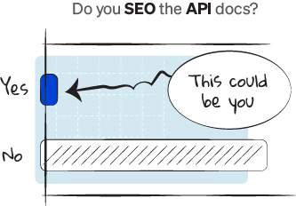
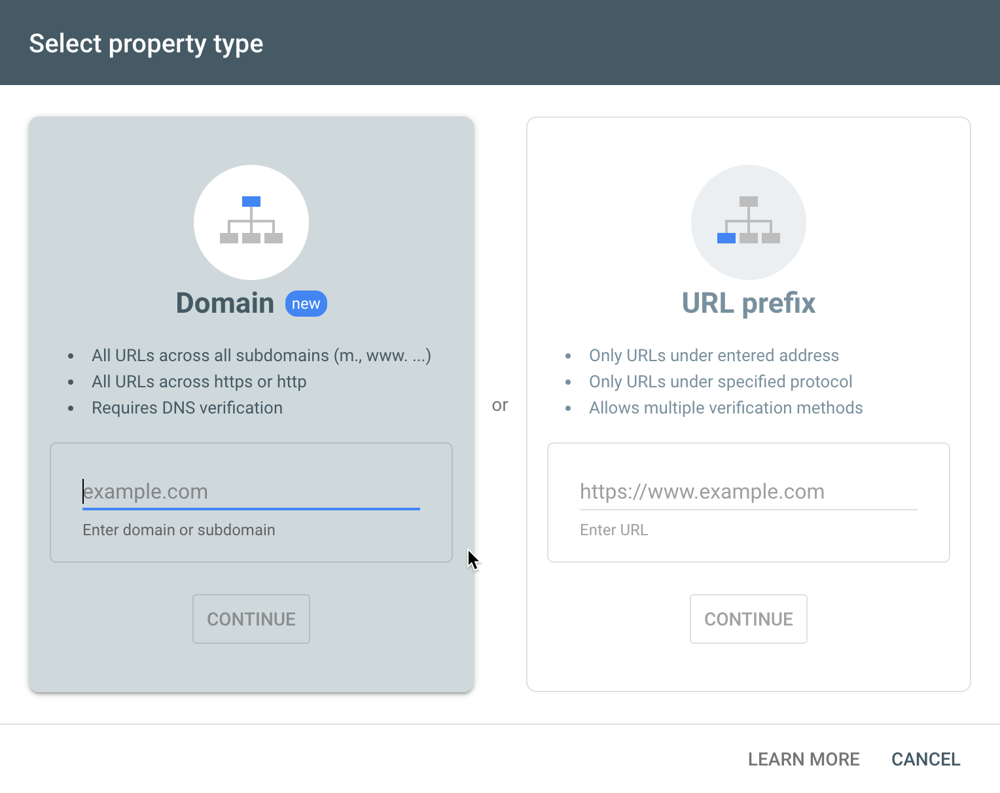
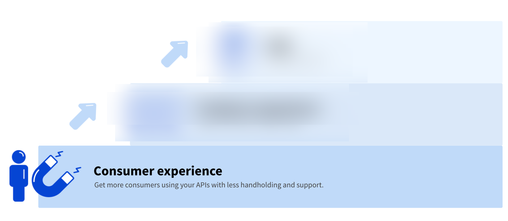

Documentation is becoming a critical asset in selling and marketing API-based products.
And when it comes to mass-marketing anything online – to, you know, qualified traffic that wants what you’re selling – few strategies come in handy like Search Engine Optimization (SEO).

Although some may claim source bias, according to [Think with Google](https://www.thinkwithgoogle.com/consumer-insights/consumer-trends/the-changing-face-b2b-marketing/) search is very important:

- 71% of commercial buyers begin their research with generic Google searches
- 90% of B2B researchers who are online use search specifically to research business purchases.

Renowned among business ops and sales teams for its high return on investment (ROI) and reasonably low maintenance, SEO is popular among B2B companies.
And yet, few of them even consider SEO when writing and publishing their API documentation.

After all, most API documentation teams need to focus on the lowest hurdles first:

- Up-to-date and accurate information
- Contains examples
- Explains errors

Issues like discoverability get punted to a later date. Don’t make this mistake for two reasons:

1. Companies derive a higher percentage of their revenue from APIs (a number that is forecasted to continue to grow over the next decade).
2. B2B buying habits are changing: 62% of B2B buyers say they can make a purchase selection based solely on digital content (sources: [Forrester](https://www.forrester.com/blogs/the-ways-and-means-of-b2b-buyer-journey-maps-were-going-deep-at-forresters-b2b-forum/) and [McKinsey](https://www.mckinsey.com/business-functions/marketing-and-sales/our-insights/omnichannel-in-b2b-sales-the-new-normal-in-a-year-that-has-been-anything-but?cid=eml-web)).

Some companies have figured out that API documentation is not only a sales conversion tool, but also a traffic generation tool.

In this article, we aim to change that. We’ll cover:

- Why search is important for docs
- How to measure search results
- The main ranking factors
- The ranking factors supported by Redocly
- Where to focus
- Looking forward

And we’ll leave you with an **SEO action item list**.

## Why is search engine ranking important for docs?

Very few organizations are spending effort on SEO for the API docs.
Search terms that may mesh well with the docs may be important because they are focused and aligned with your actual product capabilities.
Marketing is about capturing attention and communicating benefits.
Marketing content can reach a broader audience, but because the topics are broad, they may be less qualified on average, and also further out in the sales cycle.
The docs are not about broad topics --- they are about your product.
For example, what’s more valuable to Redocly --- someone looking to make a website?
Or someone looking to make a developer portal which includes OpenAPI-powered API reference docs?
With 90% of people using search in the buying process, we want to make sure we’re found by the right audience.

### How to measure **API documentation** search results

It’s easier to manage what we can measure… So how do we measure search results?

[Google Search Console](https://search.google.com/search-console/about) is a great tool which will measure Google search activity (impressions, clicks by query, region, device type, and more) related to your verified website.

Start by adding your domain (or subdomain) to the Google search console.

Google gives you a few options to verify ownership of the domain.
Then, you’ll be able to report impressions, clicks, and average rank for actual search queries.

### Main _search_ ranking factors in documentation

Ranking in search is about having relevant web pages match the search engine query. Search engines want to serve relevant and quality pages to satisfy their customers. That’s why we keep going back to the major search engines.

We think about SEO in terms of eight ranking factors:

**Redocly-supported ranking factors that require little to no effort on your part**

- **Page speed**: Redocly is fast. Sinch migrated their [developer portal](https://developers.sinch.com) to Redocly and went from a “D” to an “A” on page speed. You don’t have much to do here. If you disable our image optimization, make sure you don’t use too many heavy image assets.
- **Technical**: Correct usage of meta tags, headings, sitemap.xml, robots.txt, “301” or “302” redirects for moved content, page accessibility, and avoiding broken links and broken images.  Redocly offers a broken link checker to help you avoid broken links and images that degrade the user experience (and the search engines will penalize you for that too).

**Redocly-supported ranking factors that need your magic touch**

- **Content**: Write your relevant page content and control your content length, readability, JSON LD and meta tags.
- **Internal links**: Name internal links to let users know where they're headed, and to generate a consistent message for your company's terminology. Don’t use links with anchor text like “this” or “that”. Be descriptive to be understood. The algorithms aren’t far behind humans, so use your target audience as your barometer.
- **Usage**: Do your users stay or bounce? This is a quality signal about your content quality, which search engines can collect through browsers, plugins, and similar sources. Redocly supports analytics integrations and feedback integrations that can enable you to collect the information you need to make your docs better. We use feedback on our docs as part of a cycle where we measure:
  - The engagement rate (any feedback divided by unique page views)
  - The positive feedback rate (positive feedback divided by total feedback)
  - The negative feedback also collects concrete feedback. We review it carefully and often adjust the content. We’re looking at these metrics over time...

**Independent ranking factors**

- **Authority**: This factor is mainly about external links to your website domain and page. It also concerns offline brand awareness and mentions in the press.
- **Social metrics**: Are people sharing and liking your content?
- **Domain-level keywords**: This is about keywords inside of your domain name. While we allow custom domains, we don’t do anything special, nor would we advocate for changing your domain name to try to gain an SEO edge.

### Ranking factors supported by Redocly

Redocly’s docs publishing products are Redoc (community edition), Reference, and Portals. Redocly Portals have the widest range of SEO features.

Redocly Portals have the following technical SEO features:

- **Page speed**: Redocly is fast out of the box. Sinch migrated their [developer portal](https://developers.sinch.com) to Redocly and went from a “D” to an “A” on page speed. You don’t have much to do here. If you disable our image optimization, make sure you don’t use too many heavy image assets.
- **Headings** **on pages**: a good heading hooks the reader (Advertising 101). It can be cute, dry, witty, dull, but all that matters is if it is effective. Does it resonate with your audience? Does it have any words they would be searching for? David Ogilvy, famous advertising legend, is most proud of this one: _At 60 Miles an Hour, the Loudest Noise in This New Rolls-Royce Comes From the Electric Clock_. This ad was entirely fact-based and that statement came from an engineer. Who says engineers can’t sell? 🤣
- **Internal linking**: Name internal links to let users know where they're headed, and to generate a consistent message for your company's terminology. Don’t use links with anchor text like “this” or “that”. Be descriptive to be understood. The algorithms aren’t far behind humans, so use your target audience as your barometer.
- **Meta tags**: Write your title, description, keywords, language, and image meta tags. Keep in mind this information might be displayed in the search results, so don’t focus on stuffing it with keywords, and don’t make it shine like snakeoil… a happy medium is what you’re aiming for there. Redocly created the first OpenAPI SEO spec extension, **[x-meta](../docs-legacy/api-reference-docs/specification-extensions/x-meta.md),** to facilitate describing meta titles, keywords, and descriptions for API operations.
- **JSON-LD**: Google [recommends using JSON-LD for structured data](https://developers.google.com/search/docs/advanced/structured-data/intro-structured-data).
Add JSON-LD in the [seo for siteConfig.yaml or in individual page front matter](../docs-legacy/developer-portal/configuration/siteconfig/seo.md).
- **sitemap.xml**: Redocly will publish a sitemap automatically. Search engines use this information spider more efficiently. The sitemap can be fine tuned, but typically requires little to no effort on your part.
- **robots.txt**: Redocly will publish a **robots.txt** file automatically, which includes the reference to the **sitemap.xml** so that the search engines can find the **sitemap** and you won’t need to register it manually with the search engines.
- Publishing a **sitemap.xml** (to make it easy for search engines to index all of your content)
- Publishing a **robots.txt**
- Comprehensive **redirects** functionality (301 and 302 support for the redirect nerds) which is very important when you’re moving content around.
- **Automated link checker** to avoid  search engine penalties for broken links and images.
- **Pagination:** According to an [extensive Ahrefs “also rank for” study](https://ahrefs.com/blog/also-rank-for-study/), 84% of pages rank for only one high-volume keyword. This means that having your API docs on a single page (without pagination) may not be a good idea if you are trying to rank for multiple high-volume keywords. Using other pagination options, such as a section or item-based pagination, results in more pages of content which can be indexed and ranked for separate keyword clusters. While companies like Stripe have really popularized single page API docs, companies like Twilio benefit from separating APIs into separate logical categories.

## Where to focus to improve your documentation’s ranking

In our experience, focusing on these areas will go a long way in improving your API docs’ SEO potential:

1. Measurement
2. Usage
3. Content
4. Internal links
5. Technical
6. Promotion

<a href="../../downloads/seo-checklist.pdf" download>Download the Redocly SEO checklist</a> to accompany this blog post.

**Measurement - one-time setup**

If you’re not doing this already, measurement is essentially a prerequisite for SEO activity.

Action items:

- Set up Google search console
- Install your preferred analytics provider

**Usage ranking factor - 40% of time**

While search engines may be using usage-related signals they can measure, like time-on-site and bounce rates, we find it much better to use a different mindset when approaching usage.
We think about it in terms of satisfaction.
For example, if a person queried Google for “developer portals” and found our [developer portals landing page](../pages/realm/realm.page.tsx), would this page satisfy them? What would make the page better?
What’s missing?

We use a similar strategy across our entire organization.
Here is a screenshot of something I share at every weekly all-hands meeting.

As a company, we’re mainly focused on improving usage of APIs (by building tools to allow developers to consume APIs with less handholding and support).
Apply that similar strategy to your API docs: Improve the usage of the content and you will solve the SEO usage ranking factor.

Building on our example about the developer portals query, we think there are some important things missing from the page:

- Examples of developer portals (so visitors can see the product in action)
- Links to the docs (so visitors can read about making a portal)
- Customer stories about building developer portals

Action items:

- Measure (unique) page views
- Positive feedback
- Negative feedback
- Regularly improve content based on negative feedback comments.

**Content ranking factor - 30% of time**

Content is actually a critical component of usage (in a way, usage could be called content quality).
They are intertwined and mostly inseparable.
People may wonder – what about content length? Images? Headings?
We think about it differently.
We think about it in terms of identifying what content would satisfy the user -- regardless of the length it takes to explain it.
Part of that requires understanding the user.
A user with zero domain knowledge will require different content than a seasoned user.

Action items:

- Interview audience
- Create a content map
- Produce content (draft, revise, publish)

**Internal links - 20% of time**

The internal links concept is connected to your information architecture.
How do you connect pages to each other?
How do you group pages together?
This is an additional signal about the content of a page, even when some text may be explicitly missing from the page.
However, if we think about this again from the consumer experience perspective, we can see that internal links are an important part of usage too.
Sometimes a query leads to another question -- how easily can someone navigate to that next page to answer the questions that come up?

Action items:

- Check link anchor text
- Do tree testing on your navigation with your audience (or some surrogate volunteers)

**Technical factors - 5% of time**

While you can review your content for headings, technical factors include adding meta tags such as descriptions, titles, and keywords that are appropriate for the page.
You can also add a meta image, which may be useful as social sharing platforms may show the page preview image.

Action items:

- Paste a URL into Slack. Observe the link, description, and image (hint: this stuff is coming from the meta tags). Would your audience want to click on it?
- Enable the broken link checker.
- Add JSON-LD where appropriate.

**Promotion - 15% of time**

Spend time sharing the information.
Authority (links from external domains), social links, and even offline press mentions impact your SEO.
These are all career focus areas.
If you’re at an organization that has dedicated staff in these areas, leverage their help.
If not, focus on small tasks you can execute.

Action items:

- Research influencers.
- Contact them. Don’t be intimidated.  Be earnest and honest and reciprocal. I get a “your article would be even better with my link on there” email every day. I am a few days away from setting up an automated filter to send those straight to spam. Don’t be that person. But don’t be that person who never reaches out.
- Build your network. We all do this differently.

**Know your weakness**

Some people operate better in smaller circles.
Others need masses to thrive.
I’m a small town person at heart (born and raised in Los Angeles -- go figure).
I thrived in small classes at school.
I enjoyed small group activities.
I went to a small college.
My network is… small.
Know your strengths and weaknesses.
I can stretch my boundaries but I am who I am at my core.
Knowing my weakness allows me to find others that thrive in those areas, so I can focus on my lane.

**A look forward...**

APIs are responsible for an increasing percentage of revenues compared to a decade ago.
Like the personal computer revolution, we’ll see APIs continue to grow quickly.
Documentation is the most important factor of the API consumer experience.
As such, sales teams rely on documentation to assist the sales process.
The API consumers are the buyers, or at a minimum influence the buyers decisions.
Are you using SEO to drive demand in your APIs? We’d love to chat - get in touch on [Twitter](https://twitter.com/Redocly) or send us [an email](../pages/contact-us/contact-us.page.tsx).
