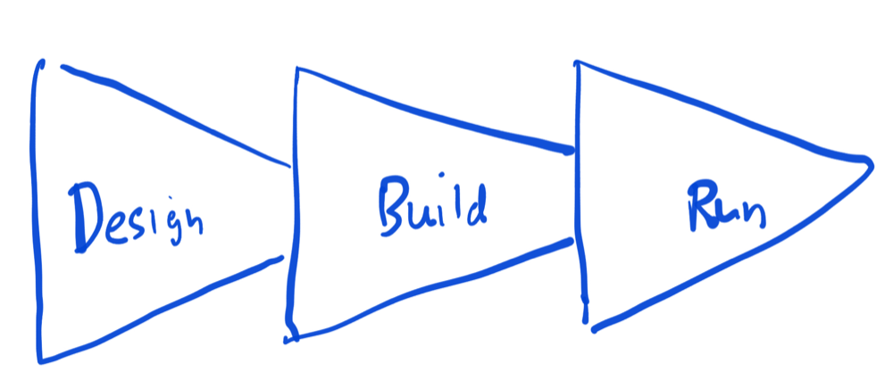
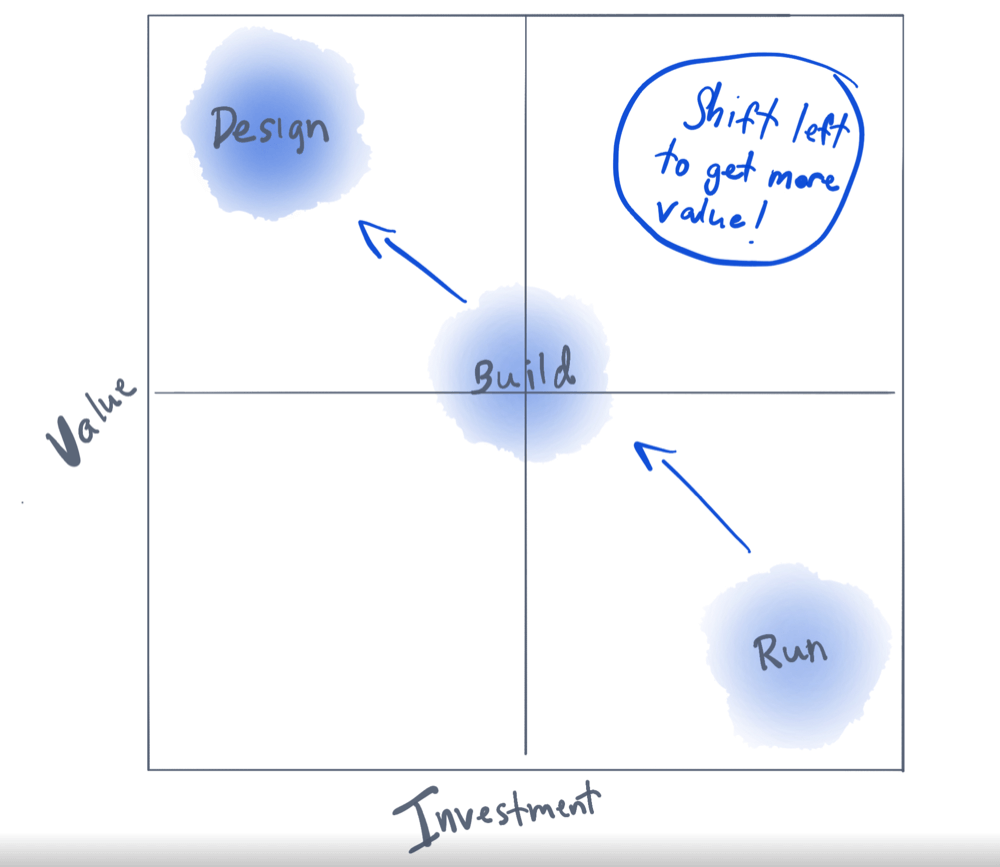

APIs are the building blocks of the digital world.
But like any construction project, you've got to have a good plan.
A lot of people put most of their effort into the final stage—when the API is up and running.
That's like decorating a cake before you've baked it.
Sure, it'll look good, but will it hold up?

That's where "Shift-Left" comes in.
Instead of waiting until the end to make sure everything's okay, why not start strong from the get-go?
This approach means you focus more on the early stages of creating your API—the "Design" and "Build" parts.
Trust me; it'll save you a ton of time, money, and headaches later on.

In this guide, I'll walk you through why shifting left is the way to go when it comes to API governance and how to actually do it.
Whether you're a coding pro or new to the game, there's something here for everyone.


## The typical API lifecycle: more than just coding

Creating an API isn't a one-and-done deal; it's a journey with different stages.
Let's break it down.


### Simplified API lifecycle

The API lifecycle can be boiled down to three main phases:

* **Design**: This is the blueprint phase, where you sketch out what your API will look like and what it'll do.
* **Build**: Now it's time to bring that blueprint to life. This is where the coding happens.
* **Run**: Once built, your API is up and running, ready to be used, maintained, and scaled.

Check out this hand-drawn diagram for a visual representation:



### The value of early detection: A deeper look

Here's where things get interesting.
It's not just about progressing through the lifecycle from Design to Build to Run;
it's about where you invest your time and resources.

* **Customer feedback** (Run): The most expensive way to find out something's wrong is to hear it from a customer (or maybe an ex-customer as they are on the way out). You've got to fix the issue, manage the customer relationship, and maybe even deal with bad press.
* **Monitoring** (Run): Catching a problem once your API is live is still costly. Fixing live code is like trying to change the tires on a moving car.
* **Automated tests** (Build): This happens during the Build phase. It's like having a spell-check for your code, catching errors before they go live.
* **Lint & design review** (Design): The cheapest and most effective way to catch problems is before you even start coding. This is where tools like Redocly CLI come in handy.


Here's another hand-drawn diagram to show the value vs. investment by stage:



## Investment and value: An ounce of prevention

When we talk about investment, we're not just talking about money spent on tools like Redocly.
We're also talking about the time you and your team invest in each stage.
Time is money, after all.
Or maybe it's more valuable than money, because you can't buy time.

Here's the kicker: the value you get isn't proportional to the investment you make.
It's often exponentially greater.
Just like the old saying goes, "An ounce of prevention is worth a pound of cure."

Say you invest a little time and money into automated testing during the build stage.
That investment could save you hours, if not days, of debugging later on.
Not to mention, it spares you the potential fallout from unhappy customers or bad press if something goes wrong after launch.

So, while it might seem like you're spending more time and resources upfront by focusing on the design and build phases, the value you get out of it is immense.
You're setting yourself up for a smoother run stage, fewer headaches, and a better end product.

By shifting your focus to the early stages of the API lifecycle, you're not just saving money; you're also improving the quality of your API. And improving its chances of being a breakthrough API – an API that is integrated by many third parties or internally reused by multiple teams. It's a win-win.


## The pitfalls of focusing on the run phase: Watch out for these traps

A lot of folks spend most of their energy on the run phase of the API lifecycle.
It's like practicing your victory dance before you've even won the game.
Sure, keeping your API up and running is super important, but there are some big downsides to putting all your eggs in this basket.

1. **It gets pricey**: Fixing mistakes in live code is expensive. Imagine finding out your car has a problem after you've started a cross-country road trip. The repairs are going to cost you a lot more than if you'd caught the issue while still in your driveway.

2. **You're playing catch-up**: When you're always focused on keeping things running smoothly, you don't have much time to add new features. Your competitors could end up leaving you in the dust.

3. **It's stressful**: Constantly putting out fires is exhausting. When you're always in crisis mode, you don't have the mental space to be creative or strategic.

4. **Quality takes a hit**: When you're rushing to fix issues, you're more likely to make new mistakes. It's a vicious cycle that can really mess with the quality of your API leading to dissatisfaction and churn.

By shifting your focus left, you can avoid these pitfalls.
You'll not only save money and time but also make your API—and your life—a whole lot better.


## The shift-left philosophy

"Shift-Left" is a strategy of focusing efforts earlier in the lifecycle, primarily in the "Design" and "Build" phases.
We're applying that philosophy to API governance.
This approach offers several advantages:

* **Cost savings**: Addressing issues earlier is significantly cheaper. A well-designed API from the outset reduces the need for expensive overhauls later.
* **Faster time-to-market**: A smoother "Run" phase means your API gets to market quicker, giving you a competitive edge.
* **Improved quality**: Attention to detail early on results in more robust, efficient, and scalable APIs.


### A real-world example from Redocly

At Redocly, we're on the cusp of launching a new product suite, with a new set of APIs slated for May 2024.
One of our developers, Ivan, says that our ruleset allows him to "think less about naming things" and "speeds up development."
This is shift-left in action—investing in the design phase to streamline the subsequent phases.


## ROI of shifting left

### The numbers game

Consider this: fixing a minor architectural issue during the "Run" phase can cost upwards of $10,000, given the dependencies, downtime, and labor involved.
Now, imagine resolving the same issue during the "Design" phase for just $500.
That's a 20-fold ROI for the same problem solved.


### Anecdotal evidence from Rebilly

Rebilly, like many organizations, evolves its rules as it uncovers design flaws.
The cost of correcting even a small design flaw, like a mistyped property, once the API is in production is staggering.

It's not just the labor but the whole workflow—identifying clients, contacting them, ensuring forward and backward compatibility—that takes one to two months.
Contrast this with catching the flaw in the design phase, where a minute's work could save over 86,000 minutes in a two-month period.


## How to do shift-left right: A detailed guide

Want to make Shift-Left a reality?
Awesome!
Here's a step-by-step guide to help you out.
We'll break it down into two parts: what to shift to the "Build" stage and what to move to the "Design" stage.


### What to shift to the build stage

#### Be your own critic: Automated testing

Before you finish building, use automated tests to find mistakes.
It's like proofreading an essay before turning it in.
These tests can run in the background, catching errors before they become big headaches.


#### Teamwork makes the dream work: Peer reviews

Don't just rely on automated tests.
Have your teammates take a look too.
It's like having a buddy double-check your homework; they might catch something you missed.


### What to shift to the design stage

#### Start with a team huddle: Design thinking

First things first, get everyone on the same page.
Talk about what you want the API to do and how it fits into the bigger picture.
It's your game plan, and everyone needs to know it.


#### The right tools for the job: Redocly CLI

Use tools that make your life easier.
Redocly CLI is one of those.
It has a [`lint` command](../docs/cli/commands/lint) that helps you stick to good design rules.

##### Example: Learn from the pros

Here’s an example rule from Rebilly that keeps their property name casing consistent:

```yaml
rule/schema-properties-camelCase:
  where:
    - subject:
        type: SchemaProperties
        property: credentials
      assertions:
        defined: false
    - subject:
        type: SchemaProperties
      assertions:
        notPattern: ^(_embedded|_links|q|25th|50th|75th|3ds)$
  subject:
    type: SchemaProperties
  assertions:
    casing: camelCase
```

Redocly CLI supports [configurable rules](../docs/cli/rules/configurable-rules), and you can craft rules to enforce design choices.

#### Stay sharp: Education and training

Keep everyone up-to-date with the latest and greatest ways to make awesome APIs.
It's like a coach giving the team new plays; it keeps you ahead of the game.

#### Design reviews

Like code reviews, your design proposals need human review too.
Don’t get me wrong.
I love automated tools (that’s why we made one).
But we made one so that humans can focus on the less mundane.


## Conclusion: Shift-left, the new North Star

So there you have it—the lowdown on why and how to shift your focus left in the API lifecycle.
It's not just about cutting costs or speeding things up—although those are great perks.
It's about building smarter, not harder.
By focusing on the "Design" and "Build" stages, you're setting yourself up for easier and more effective "Run" stages.
You're also creating a healthier work environment where people can focus on problem-solving and creativity rather than damage control.

But remember, shifting left doesn't mean you forget about the "Run" stage.
It's still important.
It's just that by doing your homework early on—whether it's through team huddles, automated testing, peer reviews, or tools like Redocly CLI—you're making the "Run" stage a whole lot smoother.

It's like prepping for a big game.
The more you practice, the better you play.
And the more you plan and test early on, the more you can enjoy the fruits of your labor down the line.
So why wait?
Start shifting left today and set a new standard for API governance.


## Ready to take the next step? We've got you covered

If you're excited to start shifting left in your API governance, why not give Redocly CLI a try?
It's a game-changer for enforcing design rules and making your API project smoother from start to finish.

Even better, we've made it super easy to get started with a quick questionnaire.
Fill it out, and we'll auto-generate rules based on your answers.
It's like having a personalized roadmap for your API journey.

👉 Check out Redocly CLI and [get your personalized governance rules today](../pages/api-governance/index.md)!

Don't miss this chance to make your API—and your life—a whole lot better.
