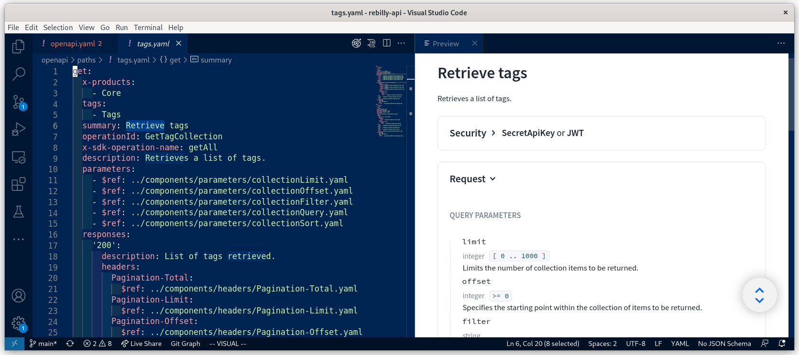

OpenAPI is a widely-used open format for describing HTTP APIs; you'll find most modern APIs use OpenAPI both as part of the development workflow and as part of the user experience. Every API and description will be different, but one challenge is that for non-trivial APIs, the description files can be many thousands of lines long.

Working with extensive files presents logistical difficulties; some tools may not be able to handle them at all. Overall navigation becomes difficult at that size, which can mean it takes longer to make changes. Reviewing changes is also more complicated because the size of the file can make it easy to miss where a change is needed.

In this post, I'll share some tips for taming your OpenAPI descriptions and improving your API development workflow.

## Get the right tools

It's common to use some graphical helper tools, but many writers and coders are most productive in the tools the use every day: their IDEs. Optimizing the experience within the IDE can make a big difference. For example, I'm a VSCode user and I use a couple of vital plugins, plus a documentation preview of the OpenAPI description while I'm working on it.

- [Indent rainbow extension](https://marketplace.visualstudio.com/items?itemName=oderwat.indent-rainbow) gives a subtle but visible background difference to different levels of indent.
- [Redocly extension](https://redocly.com/docs/redocly-openapi/) is yaml-aware and openapi-aware, and generally keeps me on the right track by checking I'm writing valid formats, and identifying problems.
- A **documentation preview**, also a feature of the Redocly extension, shows the documentation for the OpenAPI description I'm currently editing and updates as I go along. Sometimes, seeing what another tool does with what I've written is the easiest way to realize I might want to revise my ideas!



Taking time to find the tools that fit your preferred way to work is an investment in efficiency, and will pay you back many times over.

## Keep things bite-sized

For really large descriptions, breaking things up into smaller pieces that are easier to reason about can be helpful. Luckily, the OpenAPI standard itself is designed for scale. The [`$ref` syntax](https://spec.openapis.org/oas/latest.html#reference-object) encourages dividing up an OpenAPI description into multiple sections and referring to them as needed. Using references within a document promotes re-use within an API description, and supporting references to other files makes it easier to re-use the same conventions and data structures between multiple API descriptions.

Different organizations divide up their API descriptions in different ways. Some move the `components` section to an external file, sometimes used by multiple APIs. Others take a more granular approach and split each path and component out into its own file, creating a cleaner and more readable parent OpenAPI file, supported by well-organized supplementary files.

> OpenAPI is designed to work with these external references as part of it. If some of the tools in your workflow don't support this setup, there are plenty of tools that will "bundle" it back into a single file.

[Redocly CLI](https://redocly.com/docs/cli/) has a command ,`redocly split`, that refactors any OpenAPI description into the many-files structure. Proposing, reviewing and implementing changes to an OpenAPI becomes more manageable with changes only in the affected files, and this refactoring makes it clearer which parts of the API are changing.

Use it like this:

```sh
redocly split openapi.yaml --outDir api
```

The `api/` directory will contain:

- `openapi.yaml`: this is the main OpenAPI description and the root file
- `paths/`: each endpoint has a file, and all the operations for that endpoint are described there
- `components/`: all elements from the components sections are here, organized into subdirectories such as `schemas/` and `responses/`, depending on the original structure

A good example is available in the [OpenAPI starter GitHub project](https://github.com/Redocly/openapi-starter) where you can see this command in action.

With the description organized in many files like this, it's easier see what's happening and focus on one part at a time. Many teams we work with use this approach and find it helpful. And when a single-file version of the OpenAPI is required for another tool that doesn't support multiple files, Redocly CLI has a `bundle` command:

```sh
redocly bundle api/openapi.yaml -o all-in-one.yaml
```

This setup provides the best of both worlds. A clear structure to work with during the design and development stages, for efficient collaboration. Then a clear one-line command to publish a single file to be used by another tool in the pipeline if it doesn't support multiple files with references.

## Master the APIs

Take inspiration from today's post and revisit the tools and processes of your OpenAPI workflow. Is there something here that you'd like to try? We'd love to [hear about it](https://twitter.com/redocly) if you do!

- Check out the [VSCode extension](https://redocly.com/docs/redocly-openapi/)
- Take [Redocly CLI](https://redocly.com/docs/cli/) for a spin
- Learn more about [Redocly](https://redocly.com) and it's products; we make API tooling, documentation platforms, and everything else you need to work with APIs
