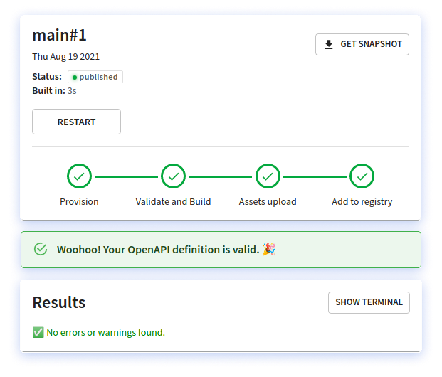

# (Don't) build your Redocly

**Here's what it would take to build Redocly-style docs and collaboration on your own.
Spoilers: a TON of tools, DevOps, and an obsession for all things docs.**

## So, what does it take to build Redocly?

Find out with this short overview. This “guide” assumes you are building on top of our open source products, Redoc and OpenAPI CLI. In reality, you would only build parts of what is presented here, but with a bunch of significant trade-offs.

For context: we did it in 5+ years with a team of 20 and seed investment, $0 of which was spent on sales & marketing.

Oh well. Here comes nothing…

### We’re building 4 components

For the purposes of this guide, we’ve organized rebuilding Redocly into four components:

- API registry
- Hosting
- Reference docs
- Developer portal

We explain the main use cases you would ideally support.

## Component 1: API registry

The API registry is the heart of the matter. It tracks changes in API definitions, making sure docs can be auto-built from the latest version.

### Ingest new changes to OpenAPI definitions

To make API definition tracking a thing of beauty you’d need to enable this process:

1. Subscribe to change events
1. Lint
1. Bundle
1. Send bundle + metadata to snapshot storage
1. Trigger and record event

It also helps to have an interface to troubleshoot problems (see "Handling OpenAPI definition problems").

**A few considerations here:**

- You will probably “buy” (reuse) a CI/CD tool to subscribe to the repo events and run the scripts you write.
- You will probably use a storage service like AWS S3 to store the snapshots.
- You will need to create a database to store the snapshot events and some corresponding metadata. For example, we need to know which “branch” and “commit” the snapshot is associated with for other subscribers to use that information.
- Change events may come not only from changes to the repository, but also from changes to other dependent APIs (for example, if you reuse error schema across all API definitions).

### Handling OpenAPI definition problems

This requires building a user interface to present the problems with API definitions to the users so that they can understand and fix the problems.

### Register/remove subscribers to events

This is the equivalent of saying, “Hello! I’m interested in changes to XYZ API. Please notify me when there are any changes.”

Some considerations:

- You will need a database to store the subscribers (or hardcode them and increase maintenance costs for each change to subscribers).
- You will need to build an API to register new subscribers (when we detect a usage of an API registry in another project – Reference docs or Developer portals – we register a subscriber).
- You will also need to build an API to delete or remove subscribers.
- Subscribers need to be prioritized to prevent circular build pipelines.

### Event bus

Next, you’ll need the event bus to process the events and distribute them to the appropriate subscribers.


The event bus needs to distribute events in the appropriate order to prevent circular build pipelines, because a dependency may be used in another API which may also be a dependency of a developer portal (for example).


### Subscribers will start more build pipelines

In addition to the “Ingest new changes to OpenAPI definitions” use case above, you will also require “build reference docs” and “build developer portal” production and preview pipelines.


These build pipelines may feed more events back into the event bus. The complexity of priority and sequence become important to prevent circular build pipelines.


You’re doing great!

Now we “just” have to build the actual documentation. With hosting, access control, security. If only there was a product with all this…

## Component 2: Hosting

### Environment variables

You may need to create a UI to allow people to assign environment variables for specific projects or API versions. Be sure to handle the environment variables in the build.

### Build a database

You will need to create a record of each build and the path to the corresponding output bundle. This database must be online and available to be able to support instant rollbacks and a visual display of logs.

#### Build reference docs static bundle

You would build the static bundle of files and record it in the database.

- If you use our open source Redoc (with fewer features than our Reference docs product), you would use `redoc-cli`
- If you use our Reference docs product, you would use our `@redocly/reference-docs` npm package

#### Build developer portals

If you use Redocly’s Developer portal product, you would use our `@redocly/developer-portal` npm package. This use case only considers the build step. The actual Developer portal is covered as a separate component.

If you need access controls for production or previews, you will need to decide which types of access controls you need. Redocly has full SSO support with third-party identity providers via SAML2 and OIDC.

### Static hosting

The API bundle snapshot, reference docs, and developer portals produce static assets which can be hosted with a global CDN. To do that, you will need to point your CDN to the appropriate origin for the snapshot (for production). You can purchase a similar service through other third parties including Netlify (starts at $3,000/month for enterprises).

Note: If you are building a preview, you would use a different domain and path than a production build. Be aware of absolute vs. relative path differences.

### Instant cache invalidations

For instant deployment with a CDN, you need to remove the cache of all of the edge locations so that it seeks the origin for the next load.

### Remove website/previews

In order to conserve resources, you would need the ability to remove a preview from being hosted.

### Instant rollbacks

You will need a user interface or mechanism where users with the appropriate permissions can trigger a rollback to a prior snapshot in production. This will also rely on instant cache invalidation.

### Domains/DNS

Your product would need to handle automating domain/DNS changes.
Additionally, you will need to handle security certificates management.

We have automated this with Let’s Encrypt and OpenResty, but it requires running additional servers to do that.

### Server-side search

If you need server-side search, you would also deploy your search index to a server-side search service. You would need to run a service (or serverless) to handle each search request.

### Basic visitor access control

If you need to restrict access to your entire docs, you need to implement either HTTP basic auth (which is not recommended for anything besides keeping spiders out) or do an identity provider integration. You will need to integrate with your identity provider(s) typically via SAML2 or OIDC. This is not a trivial effort to protect static content.

### Advanced visitor access control (RBAC)

If you need to restrict access to specific content within a developer portal, you have to be able to define the access criteria. We call this role-based access control (RBAC).

This essentially multiplies the work above by 10-100x. Keep in mind, this means parts of your static generated site will now need to be served dynamically (such as the navbar, sidebar, API catalog) because partial page content may vary based on role. How will you do that? Build static assets for every combination of roles and serve it based on the appropriate identity? Or will you take a different approach?

### Monitoring

You’ll need to monitor your website for issues. There is a whole category of products for monitoring uptime, including some that use Redocly for their own APIs.

We use two services, because we believe in a backup. A monitor is only as good as there is a person to receive the alert when something happens. So you’ll need an “on-call” team (3-5 people to get 24/7/365 coverage).

Fortunately, this is where interns would really shine… until an alarm goes off and the Support Ticket Apocalypse descends upon us all.

### Logging

You’ll need a centralized logging facility, a tool to analyze the logs for security events, and a human to review these. Although the content is predominantly static, and the risk category is low, you’ll need to do this anyway to comply with security best practices like SOC 2, ISO 27001, PCI DSS, and more.

### Patching

You’ll need a regular patch management program to apply, test, and roll out patches to underlying OS and packages. As part of that, you’ll need to know if there is a critical severity security patch – you may not want to wait for monthly patching in that case. To that effect, see the next section.

### Security scanning

You’ll need to check your OS and packages for security issues. You can subscribe to security services to receive alerts about CVE issues. However, you may want to use a service that scans and checks for you (we use AWS Elastic Container Registry to conduct daily scans).

## Component 3: Reference docs

Next up, you will need to decide which of our features you want from our reference docs product that are not in our open source product Redoc:

- Pagination for performance
- Routing for SEO-friendly URLs
- Code sample generation
- Try-it console
- Support for security schemes competitors do not support, including OIDC token flow
- CORS proxy to handle requests from the browser and modern browser security
- Enhanced search index and performance
- Support for components in Markdown including pull right (custom text in the right panel), security definitions, and response embedding (useful for an “errors” section)
- Multiple versions with version switcher
- More sidebar options
- Collapsible right panel
- Hooks to add extra content
- Dozens more theme knobs

If you fork Redoc, you’ll need to decide if your fork will be a permanent deviation, or if (and how) you will incorporate changes to Redoc back into your fork. Will you need to support the next spec version?

## Component 4: Developer portal

Finally you will need to build or choose a static site generator. We use a modified version of Gatsby. You’ll need to determine how pages will be built – for example, based on Markdown files in directory structures. This is a pattern the developers and technical writers grok, so we adopted it. Here is an idea of some of the things you’ll need to consider:

- Navbar
- Sidebar
- Footer
- Regular page content
- Diagrams. For example, Mermaid diagrams – can you use a plugin out of the box? Yes. Does it work well? No. It requires installing a heavy set of dependencies that do not work well cross-platform. We built a microservice API to render the diagrams and improve build times
- Integrate reference docs content
- User identity tied into the “Try it” feature
- Cohesive search index flexible for either server-side or client-side search
- Role-based access control (mentioned in the "Hosting" component) – there would need to be the corresponding client-side features
- UI component library for common documentation website requirements (tiles, jumbotron, alerts)
- UI component library for API-specific needs such as OpenAPIResponse, OpenAPIRequest

And all this is just a slice of what’s in the developer portal and what’s to come…

## Still want to build?

**It took us 5 years to build the Redocly product.** Let’s say you’re optimistic and you believe you can build this in 1 year. We’ve recently raised capital and accelerated our development, so you would need to add 60,000 development hours to the project to catch back up to our offering one year from now.

You probably wouldn’t need all of the features we are building. However, you would likely gain value from many of them.

### Don’t forget about the cost to run what you’ve built

Let’s say instead of building a GitHub app to subscribe to webhooks, you used GitHub Actions to run the API registry and build pipelines.

On the high end, we have organizations doing over 200k build minutes per month. At GitHub’s current pricing of $0.008 per minute, that’s $1,600 in build minutes alone. Those build minutes would cost about $2,800 on Netlify (not including the other non-build-minute pricing) or $1,200 on CircleCI.

And don’t forget the hosting, patching, updates, security/compliance, and the continuous flow of new feature requests…

**We offer all this for less than the cost of an intern. Or of a single senior DevOps engineer, even on the most beefed-up enterprise package.**
