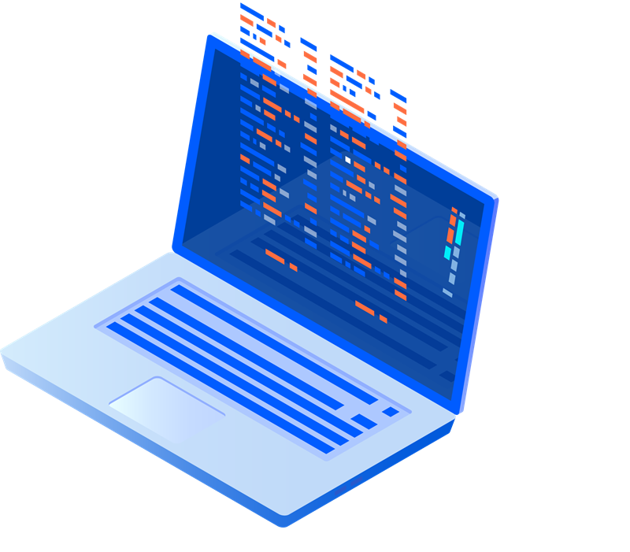

_Starting 2021, Redocly will periodically publish a list of new features and enhancements we have delivered across our API products during our development cycles._

This post highlights some of our recent product updates, new features and enhancements from January 2021.

## Workflows

**Redesigned flow for inviting members to an organization**
We have improved the process flow when you invite new members to your Workflows organization. The new invitation email they receive is now more informative and has been given a bit of a facelift.
Here's a link to the [Workflows changelog](../docs-legacy/workflows/changelog.md).

## Developer portal

**Single sourcing and content reuse with snippets**
_Supported from version beta.103 of the Developer portal_

You can now reuse Markdown snippets across your content, effectively eliminating content copy and paste, and redundancy of content. Make your changes in one place and these will propagate through all other places where you have embedded them.

To start using this, read our [Reusing content with Markdown snippets](../docs-legacy/developer-portal/guides/reusing-content.md) guide.

**Customizable search components**
- You can now customize `SearchInput` and `SearchResults` components to suit your specific requirements.
- When you add `excludeFromSearch` to the front matter of your Markdown pages, the page will be excluded from the search index and will not be accessible from the search results.

**C# and Python code samples**

Developer portal now supports auto-generated C# and Python code samples in embedded API reference documentation. To configure this for your docs, see our [Generating code samples automatically](../docs-legacy/api-reference-docs/guides/generate-code-samples.md) guide.

**Customizable header and sidebar menu**

You can now customize the entire sidebar menu, including styles. See the [the developer portal starter](https://github.com/Redocly/developer-portal-starter/pull/48/commits/1d01b62ca63eb6616157cdf63c52d987516d19b8) repository for an example of how to change the sidebar style. For more examples on how to customize the sidebar, contact Redocly.

We've also added the ability to add custom icons to the links in the navigation bar. Check out our [Navbars and footers configuration](../docs-legacy/developer-portal/guides/navbars-footers.md) guide for more information on how to customize the navigation bar.

Here's a link to the [Developer portal changelog](../docs-legacy/developer-portal/changelog.md).

## OpenAPI CLI

**Upload API definitions and set up CI pipeline**
Redocly now supports a new command called `push` by OpenAPI CLI. With this command, you can upload your API definitions and associated files, and set up your own CI pipeline for updating API definitions without granting Redocly Workflows access to your repositories.

**Resolve JSON references**
Starting with version `beta-30`, OpenAPI CLI automatically resolves all $refs by default, even in places where they are not allowed by the specification. This includes primitive values like `string` (e.g. in `description` fields) and examples.

Here's a link to the [OpenAPI CLI changelog](../docs/cli/changelog).
