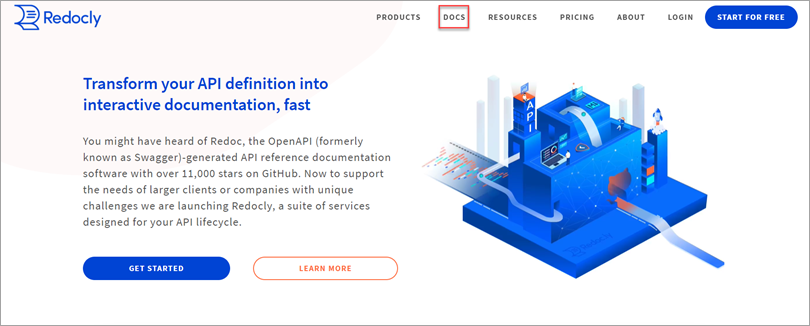
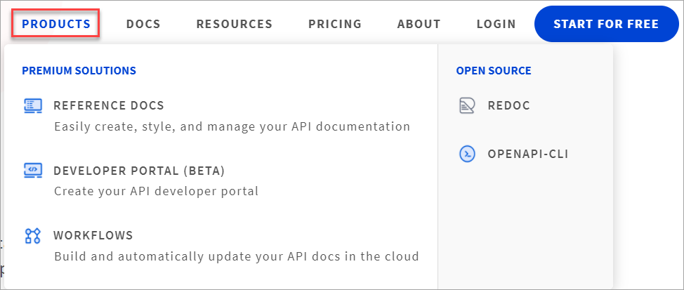

What a super month March has been at Redocly!

To say we have been busy would be an understatement. Along with our regular fixes and tweaking our products to perform optimally, our product team also delivered a ton of new features.

This post is a round up of our product updates, new features and enhancements from March 2021.

## Workflows

**Support for HTTP 301 redirects**

Implemented support for HTTP 301 redirects in Developer portals hosted in Workflows.

**Support for pagination types**

We have simplified pagination settings for Reference docs hosted in Workflows. Redocly now supports the following pagination settings:
- `none` (all content on a single long page),
- `section` (each tag with a set of associated operations as a separate page),
- `item` (each tag and operation items on separate pages).

**Upload from CI/CD**

Redocly now supports upload from CI/CD as a new source for your API definitions. Configure it in Workflows, then use our OpenAPI-CLI `push` command to upload new and updated API definitions from your CI pipeline.

Check out our [OpenAPI-CLI `push` command](https://www.youtube.com/watch?v=key2NGkcR5g) video tutorial.

**Support for JDK 8 and JDK 11 in code samples**

You can now enable Java (JDK 11) and Java Apache (JDK 8) auto-generated code samples directly from Workflows.

**Docs previews and support for mono repos**

We have slightly tweaked the way docs previews work. If the source branch is deleted, the corresponding previews will no longer display.

For large repos (or mono-repos), customers can now specify a folder path to limit the files that are fetched from their Git repository.

**Workflows changelog**
Find out about other fixes and enhancements by visiting the [Workflows changelog](../docs-legacy/workflows/changelog.md).

***
## Reference docs

**Version switcher**

Do you have customized documentation across different API versions? Redocly now comes with the version switcher element for quick navigation between multiple API documentation versions in the Developer portal.

To enable it for integrated Reference docs in your portal, list the versions you want to display in the `.page.yaml` file(s).

You can also read our [Version switcher guide](../docs-legacy/api-reference-docs/guides/on-premise-version-selection.md) to find out how to enable this for your on-premise Reference docs.

**Simplified pagination settings**

Simplified pagination settings are now supported in Reference docs.

We have deprecated a few configuration options for Reference docs, with the new pagination option superseding their functionality. These options are still supported in `redocly.yaml` configuration file(s), but the build logs will show warnings if you continue using them.

To read more about these options, see the [Reference docs changelog](../docs-legacy/api-reference-docs/changelog.md).

Here's a short video on [how pagination works](https://www.youtube.com/watch?v=7dMPPFVJx7A) in the Reference docs.

**Improved user experience (UX) for Try it console**

We've made some improvements to the Try it API console user experience. Users can now send requests even if the payload is invalid. Additionally, payloads with `$refs` schemas are now properly supported in the Try it console.

**Reference docs changelog**
Here's a link to the entire [Reference docs changelog](../docs-legacy/api-reference-docs/changelog.md).

***
## Developer portal

**Fresh look sidebar**

Redocly's Developer portal now sports a redesigned sidebar. Not only does it look fresher and modern, we've added a few nifty sidebar theming and configuration options.

- You can add a custom icon and custom description text to sidebar groups when using the drilldown sidebar style.
- A new type of separator - horizontal divider line, is also supported, and can be added to the sidebar as `separatorLine: true`.
- Added options to change the sidebar background color, font family and size, separator color, and control the spacing of items.
- Multiple theming options for your sidebar
Read more on [how to customize the portal sidebar](../docs-legacy/developer-portal/configuration/sidebar-nav.md) in the documentation.

**Link your content any way you want**

You now have the freedom to use either relative or absolute links in your Developer portal.

In addition to previously supported relative links `(../guides/example.md)`, your links to MD(X) files can now be absolute `(/guides/example.md)` from the root of the Developer portal.

**Simplified pagination settings**

Redocly now supports simplified pagination settings for Reference docs within the Developer portal. Use the [Migration guide](../docs-legacy/developer-portal/changelog.md#migration-guide) to find out how to adjust default behaviour.

**Improved admonition syntax**

Markdown files now support simpler, more convenient syntax for admonitions (warnings, notes, tips...). You can use these admonition types: `info`, `success`, `warning`, `danger`, `attention`.

You can customize all types of alerts directly in the developer portal theme. New theming options cover font and color changes, including the option to set custom icons for alert boxes.
To find out how to use the new syntax, read our [admonitions](../docs-legacy/developer-portal/guides/markdown.md) docs.

**More customization and styling options**
- You can change the default icon used in the search bar (when search is enabled in your portal).
- Blockquotes now support additional styling options.

**Redirects**

Developer portal now supports a new front matter option `redirectFrom` in MD(X) pages.

Use this option to define a list of one or more URLs. This will create 301 redirects from all listed URLs to your page when building the portal.

**Disable image optimization**

You can now disable Sharp-based image optimization for your developer portal by setting `disableImagesOptimization: true` in the `siteConfig.yaml` file.

**Configurable `Next to` navigation**

We've added more options to customize your navigation. You can now hide the `Next to` navigation button visible at the bottom right of portal pages, either by:

- Disabling it for the entire developer portal by setting `showNextButton` to `false` in the `siteConfig.yaml` file, or
- Hiding it for each individual page by setting `showNextButton: false` in the front matter of your MD(X) files.

**Support for canonical URLs**

Canonical URLs are now supported in the developer portal.

**Developer portal changelog**

Read the entire list of features and fixes on the [Developer portal changelog](../docs-legacy/developer-portal/changelog.md).

***
## OpenAPI-CLI

**`File` source type is now `CI/CD`**

We've changed `FILE` source type to `CI/CD` to support integration with the new CI/CD source in Workflows.

**Tab completion for global installations**

OpenAPI-CLI now has tab completion for global installations. Run `openapi completion` for instructions to set it up in your environment.

**OpenAPI-CLI now has an official Docker image!**

You can get the official Docker image from [Docker Hub](https://hub.docker.com/repository/docker/redocly/openapi-cli).

**Detailed error tracing**

You can now use the `--verbose` parameter with the `login` command to show a detailed error trace (if any). Detailed error output is no longer be displayed by default for this command.

***

## Documentation improvements

While the product team has been busy delivering superb features, the technical writing team at Redocly has been quietly ticking off a few things from their list as well.

**Docs is now a top navigation item**

Our customers gave us feedback that they have had a little trouble (not much, just a little) finding documentation for our products, so we have now moved it to the top navigation for easy access.

While we were improving the top navigation, we have also restructured our product pages in line with our offerings. All of our products (premium solutions and open-source) now live under Products.

**Adding search to our docs**

Admittedly, we flicked this on a few weeks back, but the docs now have a very handy search feature to quickly find something in the documentation. It's lightning fast too, and enhances the user experience.

**Improved sidebar**

At Redocly, we are strong believers in eating our own dog-food. Before we delivered the improved sidebar features for our customers, we toggled it on our own docs site, so you will instantly see what the sidebar looks like before you push these changes to your own Reference docs or Developer portal.

Lastly, the technical writing team has a few more goodies up their sleeve and are looking forward to share it with the customers and the community soon.

***

**Redocly at Write the Docs Portland 2021**

Our Technical Writer Advocate will be presenting a talk on _Putting the "tech" in technical writer_ at the Write the Docs Portland 2021, to be held online on Apr 25-27.

You can find more information about the talk and tickets on the [Write the Docs Portland](https://www.writethedocs.org/conf/portland/2021) site.
