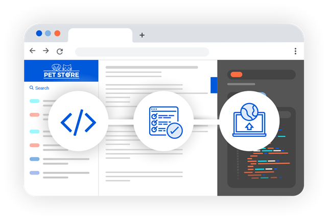
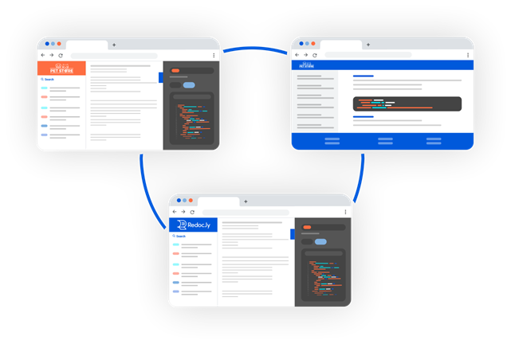

There was so much to be excited about at Redocly and our superlative developer experience goal in the month of July. Not only did we give one of our most popular products a huge update, we also published a separate [blog post](reference-docs-redesign.md) about this!

But, this wasn't all we worked on in July. While our developers were polishing our products, our documentation team was busy keeping pace with our new features, and enhancing our documentation experience for our customers and their users as well.

This post is a round up of our product updates (including the big one in Reference docs 2.0), enhancements and documentation-related news from July 2021.

***

## Workflows

**Support for configuring custom headers**

You can add custom headers to response header objects for your Reference docs and Developer portals by creating a `customHeaders.yaml` file in the root directory of the project.

When building the project, Workflows reads the patterns from the file in top-to-bottom order and starts with the first matched pattern, so make sure to always place the general glob pattern (**/*) at the end of the file.

To find out how to do this, see our [Configuring custom headers](../docs-legacy/developer-portal/guides/configure-custom-response-headers.md) topic.

**Improved access control for project types**

Workflows now supports advanced access controls for all project types (API versions, Reference docs, Developer portals).

You can:

- streamline collaboration by controlling people access at the project level,
- invite external collaborators more easily, and
- create teams to manage different groups of collaborators with different levels of access.

To read more, refer to our [Managing access](../docs-legacy/workflows/manage-access.md) guide.

**HSTS header for security**

Implemented HTTP Strict-Transport-Security (HSTS) header to enhance the security of our services.

**Workflows changelog**
Find out about other fixes and enhancements by visiting the [Workflows changelog](../docs-legacy/workflows/changelog.md).


***
## Reference docs

This is the biggest visual overhaul to Reference docs in 12 months. Not only is Reference docs sporting a new, clean look - it also has tons of usability and performance improvements.

Some of the more salient features include:
- Sticky language selection in code sample tabs
- Support for deep links
- Support for OpenAPI 3.1
- Improved search experience
- Huge uplift in visual layout and Try it experience

You can read more about these changes in our [Announcing Reference docs 2.0](reference-docs-redesign.md) blog post.

For the full list of changes and upgrade instructions, refer to our [migration guide](../docs-legacy/api-reference-docs/guides/migration-guide-2-0.md).

**Redoc vs Reference docs**

So, what does that mean for our famous open-source project, Redoc?

The Reference docs 2.0 release marks the biggest departure from Redoc in terms of the overall design and visual changes.

- The list of features available only in Reference docs has also expanded, with deep links, customizable (and sticky!) code sample tabs, custom sidebar links, and new theming options.
- Redoc will continue to provide an excellent API experience to all its users, but Reference docs 2.0 puts its users several steps ahead.

**Reference docs changelog**
Here's a link to the entire [Reference docs changelog](../docs-legacy/api-reference-docs/changelog.md).



***
## Developer portal

**Import raw code samples into MDX pages**

You can now import raw code samples from standalone files into MDX pages, similar to how you would import a React component.

To do this:

- Save your code sample as a file in your portal project with the `.sample.ext` extension, where `ext` matches the code language extension (`py`, `js`...).
- Import it at the beginning of your MDX page and insert it in the page body. For example:

```jsx
import codeSample from './code-samples/code.sample.js';

# Page title

Page text

## Example section with code sample

<pre><code>{codeSample}</code></pre>
```

**Developer portal changelog**
Read the entire list of fixes and enhancements on the [Developer portal changelog](../docs-legacy/developer-portal/changelog.md).



***

## OpenAPI CLI

**OpenAPI CLI documentation is now open-source!**

Our [official OpenAPI CLI documentation](https://redocly.com/docs/cli/) is now open-source! You can find the source of all pages published on our website in the `docs` folder of the [openapi-cli repository](https://github.com/Redocly/openapi-cli/tree/master/docs).

Help us improve the documentation and make it more usable for everyone. Please make sure to always follow our [Code of conduct](../pages/code-of-conduct/code-of-conduct.md) in all your contributions.

**OpenAPI CLI changelog**
Read more about other fixes and enhancements by visiting the [OpenAPI CLI changelog](../docs-legacy/workflows/changelog.md).


***

## Documentation updates

The technical writing team has been busy adding new content and updating existing content to ensure we are leaving little to no gaps between our product features and docs.

In July, we have added:
- **Reference docs 2.0 migration guide**: We had a major release with Reference docs 2.0, and this [migration guide](../docs-legacy/api-reference-docs/guides/migration-guide-2-0.md) highlights the changes that will impact the appearance and behavior of your docs, and provides upgrade instructions for your Reference docs deployments.
- **Guides**: Keeping in pace with our feature releases on Bitbucket Cloud as a source, managing access at project levels, teams, people and updated project level roles and permissions, we added these new guides:
  - [Using Bitbucket Cloud as a source](../docs-legacy/workflows/sources/bitbucket-cloud.md)
  - [Managing access at organization and project level](../docs-legacy/workflows/manage-access.md)
  - [Setting up identity providers](../docs-legacy/settings/identity-providers.md), and
  - [Managing team mapping to identity providers](../docs-legacy/teams/manage-team-mapping.md)
- **New Administration section (under Workflows)**: We've started documenting and grouping all administrative tasks (Settings at Organization level) under the Administration section in Workflows.
  - [Managing people](../docs-legacy/people/index.md)
  - [Managing teams](../docs-legacy/teams/index.md)

***

## Legal updates

In July, we converted from a Texas limited liability company to a Delaware c-corporation.

Our corporate name has changed from Redocly LLC to Redocly Inc.
We do have a new tax ID and corresponding [W-9](../pages/billing/w-9.md) for your records.
