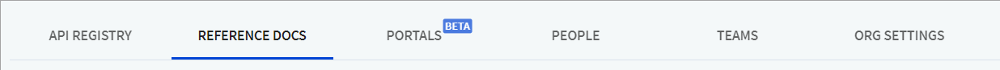
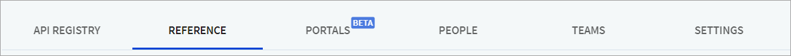

It has been another huge month at Redocly. Continuing on from our major update to Reference docs last month, we now have version 1.1 of our Developer portal that uses the revamped Reference docs.

While our product team has been blazing through fortifying our products, our documentation team is busy keeping pace with our new features, and enhancing our documentation experience for our customers and their users as well.

This post is a round up of our product updates, enhancements and documentation-related news from August 2021.

***

## Introducing Redocly OpenAPI, our VSCode extension

So, you've always wanted to work with the OpenAPI documents, but were not sure how to write these or ensure they were valid? Say hello to the Redocly OpenAPI VSCode extension.

_Redocly OpenAPI is a Visual Studio Code extension that helps you write, validate, and maintain your OpenAPI documents._

To find out more, hop over to the [Redocly OpenAPI VSCode](https://marketplace.visualstudio.com/items?itemName=Redocly.openapi-vs-code) page and give it a try. Make sure you leave your feedback so that we can keep improving this incredible utility.

## Workflows

**Updated product/tab names**

We've recently introduced some new UI changes to our core Workflows product.

- Reference docs is now `Reference`
- Org Settings is now `Settings`

**Upload multiple assets to your API registry**

The API registry serves as a single-source of truth for your OpenAPI definitions.

Now, you can also use the API registry to store other types of data such as images, or additional html pages (alongside your OpenAPI definitions).

Here's a **bonus** tip: Not only can you upload assets to the registry, you can also view any uploaded assets (if you have the appropriate permissions), and download them for easy collaboration.

**Improved OIDC error messaging**

Instead of displaying a generic error on a blank page and leaving you clueless, the portal now displays a styled error page with the exact error as received from the OIDC provider.

This allows you to specify your own error messages on the Identity provider side.

**User accounts and licenses information**

Workflows organization owners can now see how many user accounts are available on their current pricing plan, and how many of those available licenses are already in use. To find this information, navigate to the _Settings > Billing_ page for your organization.

**Filters on People page**

You can now filter users on the _People_ page by their account source, and look them up by name or email address.

**Workflows changelog**
Find out about other fixes and enhancements by visiting the [Workflows changelog](../docs-legacy/workflows/changelog.md).

***
## Reference docs

**`x-enumDescriptions` Markdown support**

The `x-enumDescriptions` specification extension now supports Markdown formatting inside the `description` field.

**Support for new theming options**

Reference docs now supports two new theming options, allowing you to control the width of buttons in the `Try it` console. The options are:

- `components.tryItButton.fullWidth` and
- `components.tryItSendButton.fullWidth`

By default, both are set to false (disabled), which means the buttons are not set to their full width.

**Revamped Live configuration editor**
We have revamped the **Live configuration** editor on the _Reference > Settings > Features_ page.
 It now works with all Reference docs projects regardless of their version (2.x or older). For more information on supported settings, refer to the [Configuration options](../docs-legacy/api-reference-docs/configuration/functionality.md) topic.

**`Go` and `PHP`language code samples**
Reference docs can now automatically generate code samples in `Go` and `PHP` languages. To configure this, refer to the [Generating code samples](../docs-legacy/api-reference-docs/guides/generate-code-samples.md) topic.

**Improved support for OpenAPI 3.1**

Support for OpenAPI 3.1 has been further improved by changes related to `contentEncoding` and `contentMediaType`.

**Reference docs changelog**
Here's a link to the entire [Reference docs changelog](../docs-legacy/api-reference-docs/changelog.md).

***
## Developer portal

This **exciting** Developer portal release (v1.1) introduces support for [Reference docs 2.0](https://redocly.com/blog/reference-docs-redesign/) and brings a complete visual overhaul to your integrated API reference docs.


This version of Developer portal is now synchronized with all the changes described in the [Reference docs changelog](../docs-legacy/api-reference-docs/changelog.md).


It also introduces:

- unification of the `Button` React component with the Reference usage
- the latest version of the `openapi-cli` package

For the full list of changes and upgrade instructions, refer to the [migration guide](https://redocly.com/docs-legacy/developer-portal/guides/migration-guide-1-1-0/).

**Automated link checker**

We've introduced an automated link checker that scans the portal content at build time and displays detected issues on the _Broken link checker_ tab. You can configure the link checker severity value to either `warning` or `error`.

For more information on how to set this up, refer to the [Link checker](../docs-legacy/developer-portal/configuration/siteconfig/link-checker.md) topic.

**Support for Git submodules**

If you use GitHub as a source for your Developer portal, we now support [Git submodules](https://git-scm.com/docs/gitsubmodules). This ensures you have other repositories linked to your main repository as `dependencies`, allowing you to:
- Pull content from external repositories,
- Integrate it into your portal, and
- Reuse it more effectively across different documentation projects.

It's all about being able to reuse content across our products!


Before creating your Developer portal project, make sure that all repositories added as submodules are in the same GitHub organization, and that the Redocly GitHub app has access to all of the repositories.


**Improvements to search**

If you use Developer portals hosted in Workflows, you will find vast improvements to the search results.

Pages with titles that match the search query now appear higher in the list of results than the pages that only match the query in the text body.

**Custom overrides**

You can use the `LoginMenu` component in custom overrides; for example, when you want to override the navbar but still use the default login menu.

**New pagination hook**

A new hook called `OnPagination` is now supported for integrated Reference docs, and runs on pagination between Reference docs pages.

**Control meta tags for each reference page**

Implemented basic support for the `x-meta` specification extension for integrated Reference docs.

Before you add it to your API definition on the operation level to control meta tags for each page (operation), make sure you have configured the `pagination: item` in Reference docs.

**Set language for your content**

You can now set the `lang` property for your portal to indicate the language of your content.

- To set it globally for the entire portal, add it to [the meta section](https://redocly.com/docs-legacy/developer-portal/configuration/siteconfig/meta/) of the `siteConfig.yaml` file.
- To set it for individual pages (and override the global setting), set it in the page front matter.

**Additional options for customizing logo**

- The developer portal theme now supports a new `margin` option in the `logo` section. The values must follow [the standard CSS margin property syntax](https://developer.mozilla.org/en-US/docs/Web/CSS/margin).

- You can now add custom alt text for the logo image displayed in the portal navbar, using the `logoAltText` option [in the meta section](https://redocly.com/docs-legacy/developer-portal/configuration/siteconfig/meta/).

**Developer portal changelog**

Read the entire list of fixes and enhancements on the [Developer portal changelog](../docs-legacy/developer-portal/changelog.md).

***

## OpenAPI CLI and Redoc

**OpenAPI CLI and Redoc documentation is now open-source!**

Our [official OpenAPI CLI documentation](https://redocly.com/docs/cli/) and [official Redoc CLI documentation](https://redocly.com/docs/redoc/quickstart/intro/) is now open-source!

You can find the source of all pages published on our website in the `docs` folder of the:

- [OpenAPI-cli repository](https://github.com/Redocly/openapi-cli/tree/master/docs).
- [Redoc repository](https://github.com/Redocly/redoc/tree/master/docs).

Help us improve the documentation and make it more usable for everyone. Please make sure to always follow our [Code of conduct](../pages/code-of-conduct/code-of-conduct.md) in all your contributions.

**OpenAPI CLI changelog**
Read more about other fixes and enhancements by visiting the [OpenAPI CLI changelog](../docs/cli/changelog).

***

## Documentation updates

The technical writing team has been busy adding new content and updating existing content to ensure we are constantly adding new content, and filling in the gaps between our product features and docs.
- **Developer portal 1.1.0 migration guide**: We released v1.1.0 of the Developer portal to ensure we are in sync with Reference docs 2.0, and this [migration guide](../docs-legacy/developer-portal/guides/migration-guide-1-1-0.md) describes what you need to know before you start using v1.1.0.
- Added a [Redoc](../docs/redoc/deployment/intro.md) section to our docs. This section will now house all topics related to our **Redoc** product, including installation, configuration, and guides.
- A brand new **information architecture** across our [docs](../docs/index.md). We've given our docs a new look that closely mirrors our product UI, making it easier to search for relevant topics.
  - Docs are now broadly grouped by **Workflows** (and our premium products), **Open source**, and an **Education** section for learning about OpenAPI.
  - Within these groups, we have stuck to our information sub-grouping `Guides`, `Configuration`, `Settings`, and `Resources`.

***

## Google Season of Docs - Update

Along with our core technical writing team, our Google Season of Docs technical writers have also been contributing to our open source product documentation actively.

In the last month, we have:
- Updated and improved the [introductory content](../docs/cli) and [installation instructions](../docs/cli/installation) for OpenAPI CLI.
- A new [OpenAPI CLI quickstart guide](../docs/cli/quickstart) to get you up and running with using the open source product.
- Added an [Redoc quickstart guide](../docs/redoc/deployment/intro.md), which includes step-by-step instructions on how to get started using Redoc to render your OpenAPI definition.

***

## Legal updates: Reminder

In July, we converted from a Texas limited liability company to a Delaware c-corporation.

Our corporate name has changed from Redocly LLC to Redocly Inc.
We do have a new tax ID and corresponding [W-9](../pages/billing/w-9.md) for your records.
