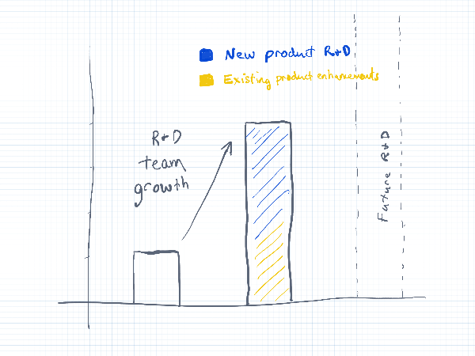

My August in a word or two: "covid" and "rebound".
I'm recovered, and had some beautiful visions of the future as well as time for reflection.

I have to come clean about something.
Last month I mentioned that our developers are continuing to work on several new features behind the scenes.
I feel bad now, because that's not really accurate.
We're working on a new product.
And we started to use it ourselves for our intranet about a week ago. 🥳 🎉

Our R&D team is over triple the size compared to the start of last year.
And, with the exception of February and part of March (the [start of the war in Ukraine](./ukraine-war.md)), our productivity has been at an all-time-high.
And you may be thinking... yes, you are shipping new features and fixes all the time.
However, there is a lot of R&D we haven't shipped.
This ties into this new product we've been building.

I'll share more on that in my next update.

On to the things we did ship that you can use today.

***


Petra, from viesure, said: “Everybody on the team uses Redocly regularly and the fact that it’s all in one git repo makes it much easier to access and use [...] Updates and bug fixes are live within a few minutes - who wouldn’t like that? 😉”
”

[Read their story](https://redocly.com/customers/viesure/).



***

## Workflows

On the Workflows side, besides some bug and performance fixes, there is one new feature we didn't ship yet.
We're going to ship it in another week due to vacation schedules.
It is an improvement to the file editor which enables multiple file editing as well as our some features of our lint tool and language processor inside of the editor.

***

## API docs

A reminder from the last update: we renamed **Reference docs** to **API docs** because it is more clear to new users.

Visual and theme changes:
- Added a new custom hook `AfterApiTitle` to inject additional HTML or a React component after the API title. The API title is set inside of the [info object](/learn/openapi/openapi-visual-reference/info.md).
- Added visual view for `deprecated` in `oneOf` + `discriminator`.
- Added `nestedAlternativeBackground` for customization background color alternative for nested schemas which have a zebra-stripe-like pattern.
- Added theming options for the titles and subtitles in the middle panel.

We made more improvements to the try it feature:

- Added [`client_secret_basic` support](https://datatracker.ietf.org/doc/html/rfc7591#section-2) for token endpoint authentication.
- The Target server field in the Try it console was moved to the top.
- Save state of the **Request Body** in the Try it console.

We also fixed a bunch of bugs and made other minor enhancements.
Read more at the [API docs changelog](../docs-legacy/api-reference-docs/changelog.md).

***

## Developer portal

**Features in the developer portal?**

Yes, we've added features into the developer portal.
While I want to mostly freeze development there, so that we can focus on our new product, we couldn't resist shipping some features this past month:
- Added support for wildcard (`*`) redirects. You can get more familiar with [redirects feature here](../docs-legacy/developer-portal/guides/redirects.md).
- Added export of the `Footer` component, so it can be wrapped in some container and extended.
- Added `disableAutoApiDocs` config option to disable automatic API docs pages creation from OpenAPI files (without explicit `.page.yaml`).
- Added possibility to customize external link icon with a new theme `externalIconUrl` option.
- Added a `disableLinkPrefetching` config option. If it is set to true, the developer portal will do data prefetching only for hovered links.

**Developer portal changelog**
Read about all the latest fixes and enhancements in the [Developer portal changelog](../docs-legacy/developer-portal/changelog.md).

***

## Redocly CLI

Reminder: **OpenAPI CLI** was renamed to **Redocly CLI** and we announced that in our last month's blog post.

**Rules, rule!**
A few updates about rules:
- We are interviewing power users and novices so that we can make our powerful  [assertions](../docs/cli/rules/configurable-rules) rule (renamed to custom rules in 1.0.0-beta.112 based on this feedback) easier to use. If you're interested in helping, let us know.
- Renamed `no-servers-empty-enum` to `no-server-variables-empty-enum` and fixed incorrect docs of `no-empty-enum-servers`.
- Fixed docs for `no-server-example.com`.
- We merged (and will release it this week) a new rule that enforces [RFC 7807 problem details format](../docs/cli/rules/oas/operation-4xx-problem-details-rfc7807).

**Redocly CLI changelog**
The full list of fixes and enhancements is available in the [Redocly CLI changelog](../docs/cli/changelog).

## Redoc

We're working hard towards a general availability release of Redoc 2.0.

That was to give you context for the massive changes if you go check out that changelog on our GitHub repo.

A few more bugs to fix, and maybe a surprise feature before the big 2.0 release.

**Redoc changelog**

You can find more fixes and enhancements in the [Redoc changelog](https://github.com/Redocly/redoc/blob/master/CHANGELOG.md).

***

## Write the docs at Redocly!

Want to do your part to accelerate API ubiquity?

We're looking for a [full-time Technical Writer](https://redocly.com/careers/#technical-writer) to work on product documentation and training materials (including, but not limited to videos) for our premium and open source products.

If you'd prefer to write different kinds of content (or even code), create product demos, and interact with developers, we have a role for that, too. Take a look at our [Developer Advocate](https://redocly.com/careers/#developer-advocate) position, and get in touch if you're interested.
