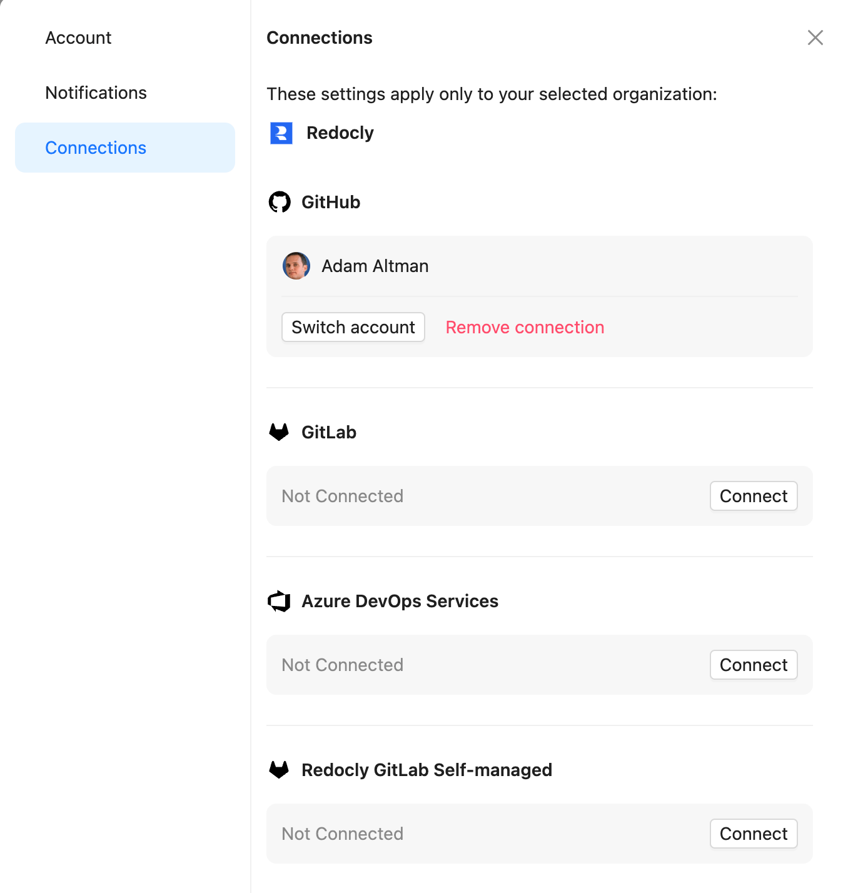
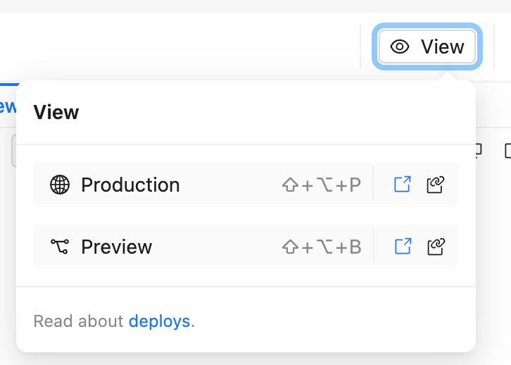
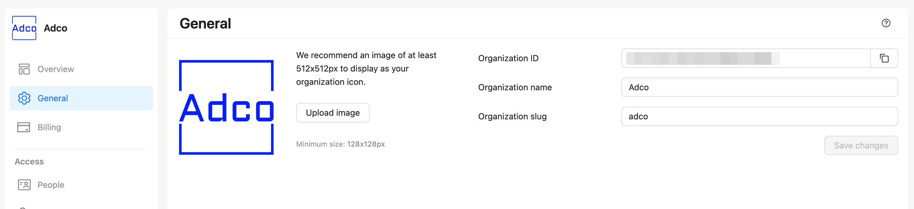

October was an exciting month at Redocly.
We launched a suite of products aimed at making API development and management faster, more flexible, and ultimately more accessible to teams of all sizes.
If you haven’t signed up yet, you can [start a free trial](https://auth.cloud.redocly.com/registration) and explore these tools firsthand.

As always, we keep our [changelog](https://redocly.com/docs/changelog) up to date with every release.
Here’s a quick roundup of October’s key features and enhancements.

---

## Connection settings

> Added Connections settings to the user profile modal, allowing users to view, switch, and remove their OAuth2 accounts connected to their organization.

Users can now manage their OAuth2 connected accounts directly from their profile.
This enhancement enables you to customize access and enhance security on an individual level without needing admin support.

---

## View projects UX improvements

> Improved the user experience of the View project drop-down navigation menu by updating the design and button labels.

The revamped project navigation is designed to simplify switching between projects and improve usability—especially helpful for those managing multiple projects within Redocly.

---

## Edit your organization slug

> Added the Organization slug field to organization **General** settings allowing the users to customize the URL of the the organization.

Admins can now personalize their organization’s URL by editing the organization slug in the **General** settings.
This feature lets you create a more branded and memorable URL for your team, making it easier to share and recognize.

---

## Conditional feedback reasons

> Added value-specific configuration to feedback reasons settings.

Teams can now configure feedback settings based on specific values, enabling more targeted insights into user behavior and preferences.
This is a step toward making feedback more actionable and tailored to your users' experiences.

---

## Finer-grained scorecard targets

> Extended the `target` object in scorecard configuration by adding the `rules` option. This enables users to override rules for specific targets.

With this update, teams gain more control over scorecard metrics by setting unique targets at the rule level.
It’s perfect for managing complex projects where different endpoints or features require distinct standards.

---

## RBAC on API operations

> Added `x-rbac` support to OpenAPI definitions. This enables role-based access control to OpenAPI objects.

You can now define role-based access control within your OpenAPI files using `x-rbac`.
This update empowers teams to enforce specific access permissions directly in their API definitions, enhancing security and control.
[Read more about implementing x-rbac in OpenAPI](../docs/realm/author/reference/openapi-extensions/x-rbac.md).

---

## More autogenerated code samples

> Added autogenerated code samples for `multipart/form-data` content types in Java and Python.

We’ve expanded our library of autogenerated code samples to include `multipart/form-data` types for Java and Python.
This addition saves development time and ensures users have the samples they need to get started quickly with complex content types.

---

## Project templates

> Added the functionality where users can select a project template by clicking on a template card.

Project setup just got faster. Users can now select from a range of templates to jumpstart new projects, each designed to suit different use cases and speed up your onboarding process.

---

## Write the docs at Redocly!

Want to help accelerate API ubiquity? We’re looking for a [full-time Technical Writer](https://redocly.com/careers/#tech-writer) to work on documentation, tutorials, and training materials across our premium and open-source products. This role offers the chance to make a real impact on the API community through well-crafted content.

If technical writing isn’t your thing but you’re interested in working with developers to create demos, write code, and build community, take a look at our [Developer Advocate](https://redocly.com/careers/#developer-advocate) position. Let’s push the API ecosystem forward—together!
