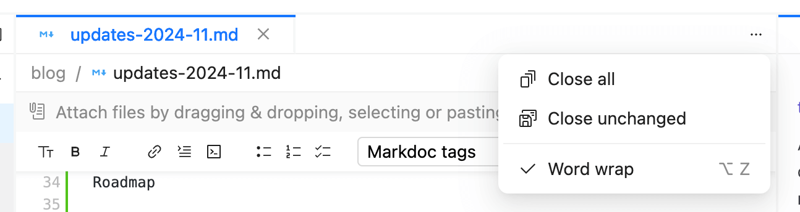
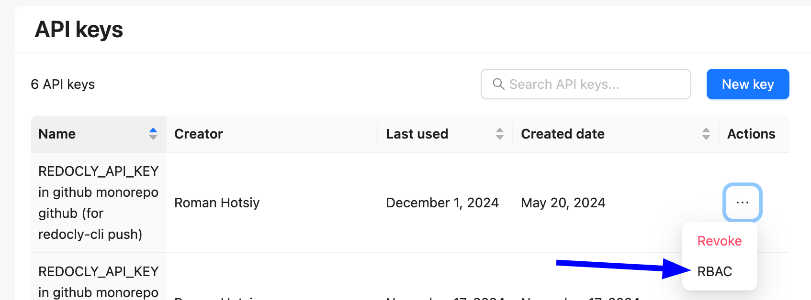
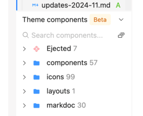

In November, we’ve made key updates to enhance usability and flexibility, including word wrap in the editor, XML code sample support, and RBAC for API keys. Plus, we’re sharing a sneak peek of exciting features on the horizon.

After a little rest and relaxation over Thanksgiving, we’re thankful for the feedback you’ve provided during your trials of our new product suite.
Thanks to you, we shipped 46 bug fixes in November and rolled out exciting new features.

As we mentioned in our October update, we launched a suite of products aimed at making API development and management faster, more flexible, and ultimately more accessible to teams of all sizes.
If you haven’t signed up yet, you can [start a free trial](https://auth.cloud.redocly.com/registration) and explore these tools firsthand.

As always, we keep our [changelog](https://redocly.com/docs/changelog) up to date with every release.
Here’s a quick roundup of November's key features and enhancements.

---
## Word wrap

For those who prefer tidy lines in their editor, we’ve added a word wrap option. It’s a small addition that makes a big difference in writing efficiency. (I’ve already turned it on for this blog!)

---
## XML code samples

We added support for generated XML code samples in Redoc (premium edition).

While most folks don't develop new XML APIs, they may have existing ones that they're trying to improve the docs for, and this helps.

---
## API keys

Enterprise users can now attach RBAC roles to API keys, providing more granular control over who can push content to specific folders.

People use our API keys for our [CICD remote content integration](../docs/realm/setup/how-to/remote-content/index.md).

This enables someone to restrict pushing content to any folders they shouldn't have permissions to otherwise.

At the same time, we added a "created date" and "last used" date to the API keys table in Reunite so that you can better manage API key rotation.

---

## Support for `src` and `srcset` properties in HTML tags

This update allows users to use HTML markup directly in documentation, reducing the need for complex transformations and improving compatibility with our link checker.

---

## Roadmap sneak peak

We have a number of features nearing completion.
The more time it takes to use a feature, the more effort we put into usability pre-launch.

Usability can mean a bunch of different things to different people.
And I'll expand on that in a separate blog post.

Without further ado, here is some of what is upcoming:

- Eject components from within Reunite \
  
- Change code highlighter to [Shiki](https://shiki.style/) giving additional controls
- **AI search**
- Advanced search filters and more facets
- Alternative search engine (Typesense)
- **Code walkthrough**
- Performance enhancements

From the list above, the "performance enhancements" don't directly impact usability and we can ship it once completed faster than other features.

A feature like AI search is going to have minimal configuration (like turning it on and off), but it will carry an extra cost at the margin. That requires a little usability testing.

A feature like a code walkthrough requires both marking up "integration code" that you want to generate the walkthrough for, and then also generating a corresponding Markdown file with the corresponding references and Markdoc tags.
This process can take authors a significant amount of time and effort.
Therefore, code walkthroughs requires a lot of usability testing, and we'll spend at least 600 hours on internal usability testing it before rolling it out.

## Write the docs at Redocly!

With so many exciting features in the works, we’re looking for talented Technical Writers to help us craft impactful documentation and training materials. [Apply now](https://redocly.com/careers/#tech-writer) and be part of Redocly’s journey toward API ubiquity!
