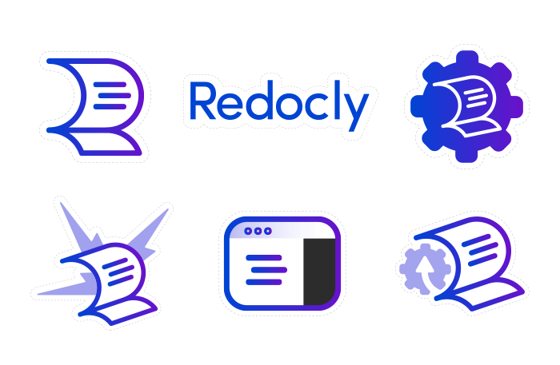

This is a tale of a laptop sticker, an envelope, and a postage stamp.

And by the time we're finished, you'll understand APIs.

An API is the way computer programs communicate with each other (or themselves). The acronym API stands for "application programming interface."

> An application program is a computer program designed to carry out a specific task…
> - Wikipedia

I think of interfaces as mailboxes in good ole snail mail.

A person puts an addressed and stamped envelope into the mailbox. The mailbox expects envelopes with a delivery address, return address, and a postage stamp. The mailbox and the set of predefined how-to rules make it an "interface."

What’s in the envelope? A laptop sticker! Mailed, say, to Lviv from Austin (just keeping things Redocky here).

And what happens once the envelope is put into the mailbox? It sits there until the postal worker unlocks the mailbox and collects the mail. From there, a whole series of complex processing occurs until the letter reaches its destination (or it’s returned to the sender in case of a problem… or, in the case of a worse problem, lost).

## Translating this to API-speak


* In the world
* In API land
---
* I want to mail an envelope because it's a lot cheaper than delivering it myself.
* An API produces value by automating a task.
---
* I'm a postal service customer.
* An API has a consumer.
---
* I buy a postage stamp.
* An API may have a monetization aspect.
---
* I address and stamp the envelope.
* The consumer forms a request based on the API definition.
---
* I place the envelope in the collection box.
* The consumer sends the request to the API.
---
* I receive a proof of delivery.
* The API sends webhook notifications to subscribers.


## Value proposition

The API value proposition is related to the specific task it completes. Let’s follow our example of delivering a laptop sticker from Austin to Lviv.

***Is it possible to do the task myself?***

Yes, I could deliver the envelope myself. I would need to book flights, transportation to and from the airports, and at least one night in a hotel to recover from the trip. (Fun fact, I could book these through APIs published by Redocly customers).

***Is it cheaper to do the task myself?***

No. It will cost over $1,000 to deliver the laptop sticker myself.

Not to mention about two days of my time. And jet lag.

***Are there risks to doing the task myself?***

Yes, but they are relatively low risks.

***What is the value proposition?***

For a $1.30 postage stamp, the USPS will deliver the laptop sticker to Lviv. Compared to the alternatives, this seems like great value.

Flying to Lviv is equivalent to programming and launching a service internally (say, a full payment processor) instead of using an API that someone else built (e.g. Stripe or [Rebilly](https://www.rebilly.com), the startup that created Redocly).

## Consumers

A **consumer**, also known as a **client**, usually makes the request. This is the party that placed the envelope into the outgoing mailbox. An **API**, also known as a **service** or **server** or **producer**, usually produces the response. This is the mail service.

## API definition

Interfaces are all around us. All of our senses are interfaces: touch, sight, hearing, smell and taste. Applications have interfaces too – a common set of message templates through which they can talk to one another.

Back to delivering our laptop sticker. We’re working with the following limitations:

- Envelope has a delivery address that meets a specific format;
- Envelope has a return address that meets a specific format;
- Envelope has a postage stamp with the right amount of postage;
- Envelope is within a weight limit;
- Envelope is between a minimum and maximum size.

All of these requirements make up the “contract” that ensures dropping the envelope in the mailbox will result in delivery.

Not enough postage? It may be returned to the sender address.

Envelope too small? It might be lost.

Did everything correctly? There is still a small chance it might be lost.

APIs work the same way. They have some expectation of the format and types of messages they will receive. The “application” will carry out the specific task. Part of that may be replying with a particular kind of response to the client who requested the task. If for some reason the client didn’t follow the "contract," the application may respond with an error message to indicate a problem. Also, sometimes applications have problems, too – even when the requests are formed correctly.

Interfaces are all around us. Right now, this web page is interfacing with your brain through your eyes or ears. Did the message help you understand the work of APIs better?

## Webhooks

The mail service delivers the envelope to another **consumer’s** mailbox designated by the delivery address. This is like a **webhook**, when the roles are reversed – in this case, when a subscriber receives notifications from the service. Even though my friend in Lviv didn’t request the laptop sticker, he’ll be getting it anyway. In fact, he can get mail from all over the world simply by having a mailbox. By having a mailbox, we are "subscribed" to these "**webhook**" notifications. A **webhook** could be sent back to the original consumer too – this could be a proof-of-delivery receipt, a return-to-sender type of notification, or whatever the creators of the service can imagine.

## Runtime considerations

APIs also have runtime considerations. These are things that cover:

- *Authentication and authorization.* Who is allowed to do what? I can place stuff in and out of my mailbox, but not other people’s mailboxes;
- *Rate limits.* How many letters can I fit in my mailbox?
- *SLA.* How many letters make it to the destination within a certain time period?

These considerations are important because you’ll want the APIs you use to be reliable and secure.

## APIs, APIs everywhere

There are a lot of different kinds of APIs and different ways to define them.

Some APIs are for internal use only. Some are for partners or customers. And some are for the general public. All of them need orderly and "talkative" interfaces, so that more applications can talk to one another and do things to improve our lives.
The postal services themselves have APIs. In fact, some are our customers, including Australia Post (here’s [their story](../pages/australia-post/australia-post.page.tsx)) and the UN’s Universal Postal Union. But not the USPS. (Hey USPS, if you’re reading this, [contact sales](../pages//contact-sales/contact-sales.page.tsx) to get started!)

Anyway, all this talk about laptop stickers made me want one. You too?

[Contact us](../pages/contact-us/contact-us.page.tsx) to get some Redocly laptop stickers delivered to your mailbox.
