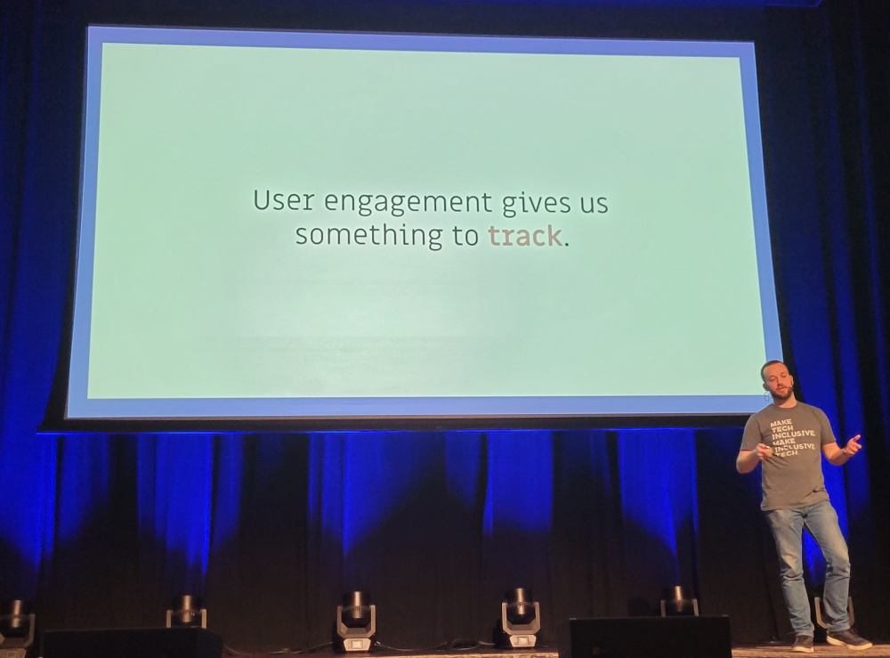

Recently my colleague, Taylor Krusen, and I traveled to Portland, Oregon to attend the [Write the Docs](https://www.writethedocs.org/conf/portland/2024/) conference.
I am lucky enough to have attended this conference one other time the year before with Redocly's CEO, Adam Altman, and CTO, Roman Hotsiy and this year did not disappoint.
The talks were excellent as was the general camaraderie and enthusiasm for all things software documentation-related.
I was also able to participate in the pre-conference hike and writing day, unique additions to this conference.

In this blog, I discuss a prevailing theme from the conference which was the importance in using research and metrics in creating value for our readers and demonstrating our value as writers, as well as some highlights from the talks.

## Use research and metrics to create value

The Write the Docs Portland conference starts with an informal hike the Saturday before the conference begins, followed by a writing day on Sunday and two days of conference talk sessions and "Unconference" sessions sprinkled in between.

The predominant theme I noticed in discussions on the hike, at the tables during writing day, and eloquently expressed during the talks was the importance in using research and metrics in creating value for our readers and demonstrating our value as writers.

For instance, in Dennis Dawson's talk, ["Graphic Relief"](https://youtu.be/Ss43qc7hdW8?feature=shared), he discussed how his team decided to make some navigational and visual enhancements to the documentation.
Afterwards, they ran some user testing on their docs to gather metrics to be sure the changes were generating positive results.
While the testing mostly validated their efforts, they did find some issues that they hadn't considered, like "users not finding the triangle in the navigation bar."

Similarly, Steven Hicks, who helps maintain the documentation site for Camunda, discussed in his talk, ["Misadventures in SEO"](https://youtu.be/pQJBFn4tomA?feature=shared), how his team's switch to a new documentation platform and attempt to gracefully retire the old platform ended up causing issues with the site's SEO.
To address these search issues, he and his team methodically experimented using metrics to determine the cause and apply a solution.

And last, but certainly not least, Taylor Krusen's talk, ["Code in Content"](https://youtu.be/jsv8eYNRCKw?feature=shared), described the evolving role of interactivity and using it as a tool that not only improves the reader's experience but also allows you to track the user's engagement, giving you new metrics that can be used to communicate documentation's business value.

## Use research and metrics to demonstrate value

Other talks focused more on how research and metrics help us as writers to establish the importance and value documentation brings to the business.

While it seems self-serving, without writers documentation suffers, which means users suffer, so if you care about users getting value from a product or developers being productive in your company, you care about demonstrating the value writers bring.

In Michelle Irvine's talk, ["Quantifying the impact of documentation"](https://youtu.be/90gaMmYseFY?feature=shared) she discussed the [DORA research program's findings](https://dora.dev/), particularly around the effect high-quality documentation can have on developer performance.
Her team found that documentation quality was foundational to every technical practice they studied, and helped to produce less burnout and higher job satisfaction in developers.
While her research primarily focused on internal documentation, these affects demonstrate the significance in general of having solid documentation when it comes to developer productivity.

In his talk, ["Sociological considerations in designing an internal documentation platform"](https://youtu.be/DxbXKLl-URo?feature=shared), Alistair Gray also addressed the importance of developer productivity regarding internal documentation.
After some negative comments about internal documentation in a developer survey, his team at Stripe was given the task of improving the search, reliability, and consistency in the internal documentation developers relied on to do their jobs.
They created an internal docs platform that brought together the fragmented and stale documentation from various sources and assigned responsible parties to keep content fresh.

And finally, Tom Edmonds' talk, ["The vibes were off"](https://youtu.be/6MvwJ1u01nE?feature=shared), focused on his efforts to create a way to quantitatively track and highlight the work his team of technical writers accomplishes, demonstrating to stakeholders their velocity in a meaningful way before having a less than ideal metric forced upon them.
He shared a rubric he created to help his writers determine how much time a task might take and then having them keep record of the actual time as well to determine if the original metric needed to be adjusted.

While in general it can be difficult to quantify documentation quality and writers' efforts, these numbers can help teams to ensure their relevance to the business as a whole.

## Key takeaways: why you should go to WTD Portland 2025

In both instances when I attended [Write the Docs](https://www.writethedocs.org/conf/) Portland, I walked away with valuable information and inspiration.
I also got to meet some amazing people who value documentation that I hope to remain in contact with and perhaps even see again next year.
Dennis Dawson, who spoke this year and did the [sketchnotes](https://twitter.com/hashtag/writethedocs?src=hashtag_click) for the talks, got so much value from the talks last year that he was able to apply the principles and return with insights of his own.
Consider attending yourself, maybe even submit a talk proposal, if you are looking for inspiration or just to meet some wonderful folks.

If you'd like to stay in touch with us, [subscribe to our newsletter](https://redocly.com/product-updates) for all our updates.
