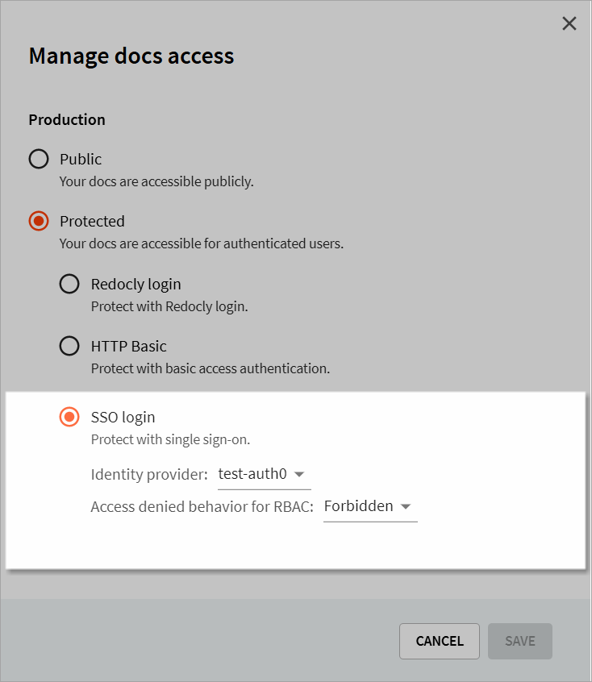

### Manage docs access


Pro and Enterprise customers can use SSO with either an OIDC or SAML2 connected identity provider.
Using SSO enables anyone with an account on their identity provider to read the docs.
You can control access to both the production and the preview environments separately.

Before you can set access control for your docs, you need to set up your identity providers.
For more information on how to do this, refer to the [Configuring multiple identity providers (IdPs)](../settings/identity-providers.md) topic.


To set docs access (for either Production or Previews),

- Select **Manage** (for either Production or Previews). The _Manage docs access_ dialog displays.
- Select **Protected** and tick **SSO login**.
- From the identity provider dropdown, select the identity provider you have set up to protect your Production docs.
    
- Select **Save** to save your settings.

### Manage project access

Using the project access section, you can manage base role or direct access to Reference projects.

To set up the base role, under the **Base role**, select **Manage**. The _Settings > Access control_ page displays.

For more information, refer to the [Access control](../settings/access-control.md) topic.

### Use HTTP Basic authentication

Instead of using the Redocly login or the SSO login, you can use HTTP Basic auth to set up basic username and passwords to restrict access to the docs. This is only available on docs projects (not snapshots). It is recommended to prevent spiders, or when you need to share a preview with someone outside of your organization.


Basic auth is not secure, so we recommend choosing the SSO login for the most secure access control.

