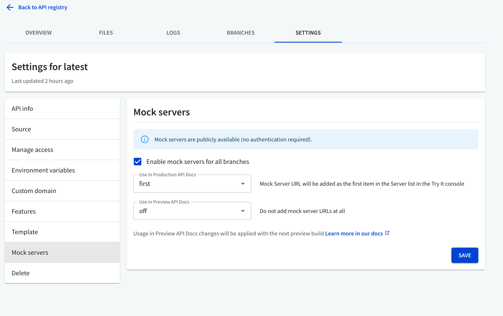

The **mock server** feature is disabled by default.

To enable the mock server:

1. On the API registry page, select the API for which you want to enable mock server feature. The API Overview page displays.
2. From the top, navigate to **Settings > Mock servers**.
3. Check the **Enable mock servers for all branches** box and click `Save` button.
4. Optionally enable the mock server in your production or preview API docs by selecting your desired option.
    - `off`: Doesn't add the mock server URL to the servers list.
    - `first`: Adds the mock server URL as the first item in the servers list in the *Try It* console.
    - `last`: Adds the mock server URL as the last item in the servers list in the *Try It* console.
    - `replace`: Replaces the servers list with the mock server URL.

Select `Save`.
Redocly generates mock servers for your primary and preview branches.
If you enable the mock server in your product API docs, the primary branch rebuilds.
Preview API docs aren't rebuilt automatically, and changes are applied with the next build.
You can trigger a [preview branch rebuild manually](../api-registry/guides/restart-preview-branch-builds.md).

