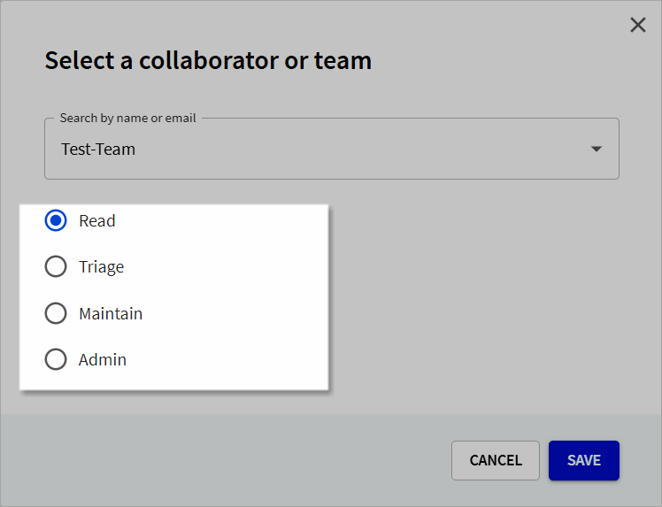
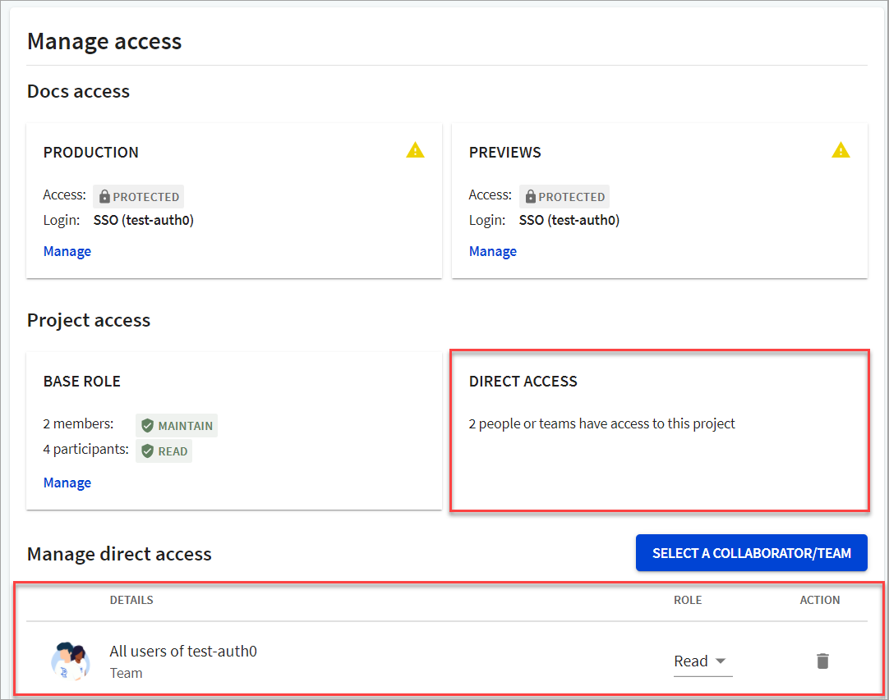

## Manage collaborators

People with the `Owner` role for an organization (or `Admin` role on a project) can add outside collaborators to a project, unless an organization `Owner` has restricted the ability to invite collaborators. For more information, refer to the [Roles and permissions](../people/roles-permissions.md) topic.

When you select a collaborator or a team, they get direct access to the selected project (either Reference or Portals).


When you select a team for collaboration, all users that are part of the team automatically become collaborators on the selected project unless they have a lower role such as `Read` or `Triage`. A person's base role overrides any team roles.


1. Under the **Manage access** section, select **Select a Collaborator/Team**.
  
2. From the dropdown, search by name or email to select a collaborator/team.

  
  If a member or team does not display in the dropdown, you can add a new member or team from this dialog. You are redirected to the **Users** or **Teams** page as selected.
  

3. Select the project-level role you want to assign to the collaborator/team, and select **Save**.
  

For more information, refer to our [Project-level roles](/docs-legacy/people/roles-permissions.md#project-level-roles) topic.

- The member details are now displayed in the **Manage access** section.
- The **Direct access** tile is updated to display the number of people who have direct access to the selected project.

  

### Add a collaborator not currently in your organization

If you want to add a collaborator who is not currently a part of your organization, you need to **add/invite a new member to your organization**. Once they have accepted your invitation and logged in using the invitation link, you can add them as a collaborator, and assign them a relevant project-level role.

To invite a new member to your organization, see the [Managing access to Workflows](../settings/access-control.md) topic.

### Update collaborator role

People with the `Owner` role for an organization (or `Admin` role on a project) can update a collaborator's role on a project in the **Manage access** section.

Under the **Manage direct access** section, select the collaborator whose role you want to update, and under Role, select the role you want to assign to the collaborator.

The collaborator role and permissions are immediately updated for the selected project.

### Delete collaborators from projects

People with the `Owner` role for an organization (or `Admin` role on a project) can delete collaborators to a project in the **Manage access** section.

1. Under the **Manage direct access** section, select the collaborator you want to delete, and select the **Delete** icon.
A confirmation dialog displays.
2. In the _Remove collaborator_ dialog, select **Delete**.
   - The collaborator details are removed from the **Manage access** section.
   - The **Direct access** tile is updated to display the number of people who have direct access to the version project.
