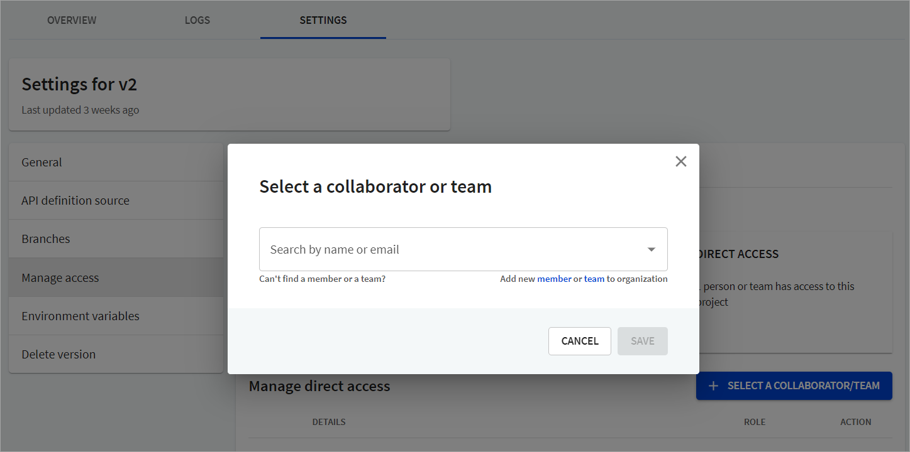

1. Under the **Manage access** section, select **Select a Collaborator/Team**.
   
2. From the dropdown, search by name or email to select a collaborator/team.


If a member or team does not display in the dropdown, you can add a new member or team from this dialog. You are redirected to the **Users** or **Teams** page as selected.


3. Select the project-level role you want to assign to the collaborator/team, and select **Save**.
   

For more information, refer to our [Project-level roles](../people/roles-permissions.md#project-level-roles) topic.
