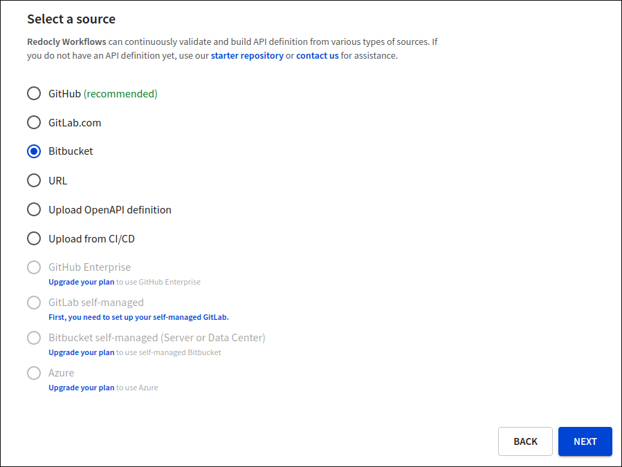
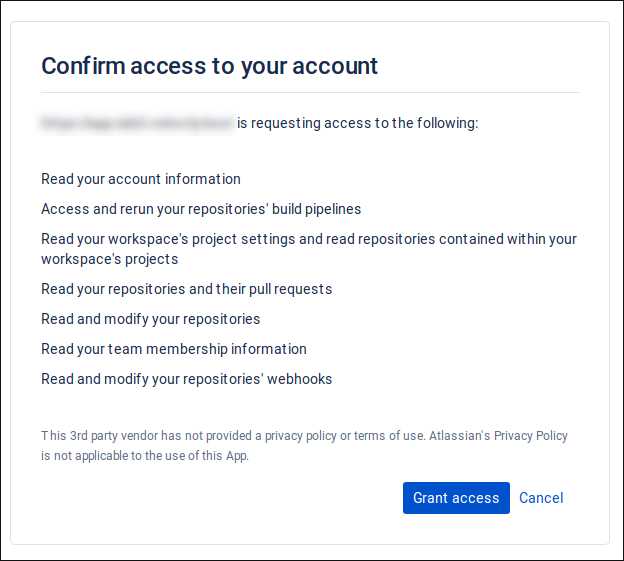

## Connect Bitbucket Cloud to Redocly

When adding a new API definition or Developer portal to Workflows, select **Bitbucket** as the source provider in the **Choose source** step.
Select **Next** to proceed to the next step.

If Bitbucket Cloud has not been previously configured for your Workflows user account, you will be redirected to Bitbucket.
In this step, you must grant Redocly access to your Bitbucket repositories.

Your Bitbucket Cloud account is now connected to Redocly.

Next, In the **Source settings** step, configure the source details for your API definition or developer portal project.

- First, select a workspace under **Bitbucket workspaces**.
- Under **Repositories**, select a repository for the project that you want to add to Workflows.
- Lastly, under **Source settings**, select the branch to use for your production deployment. For API definition projects, you must also provide the path to your root file in this step.

