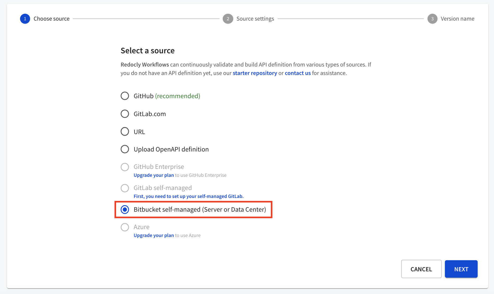
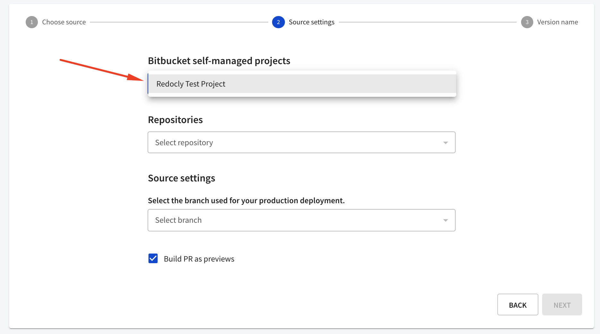
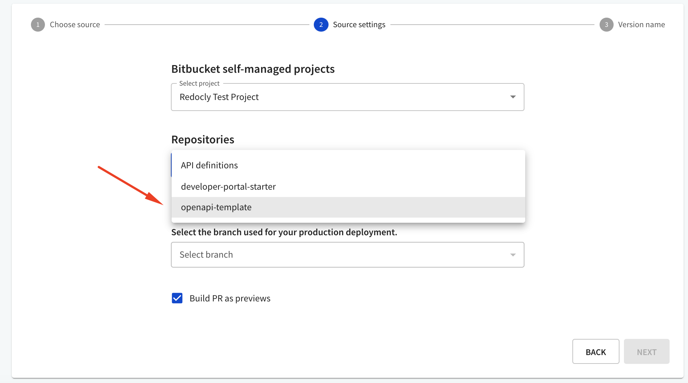
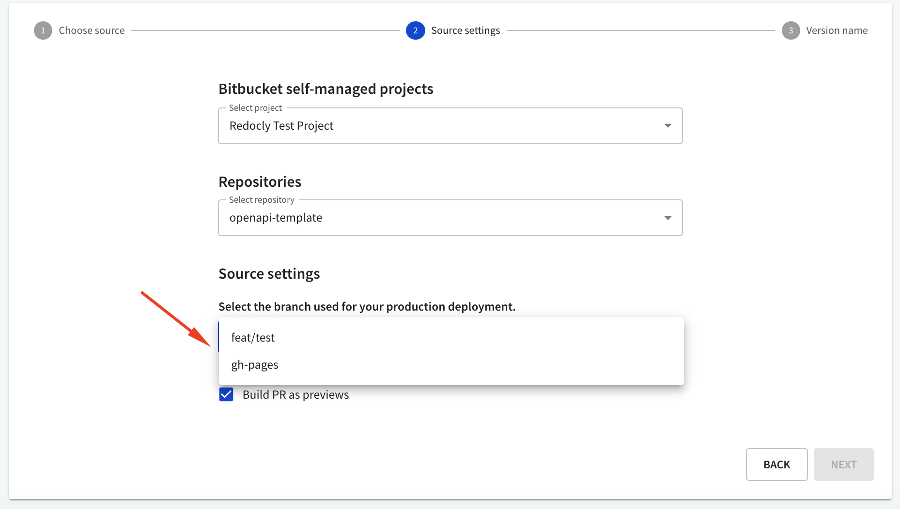
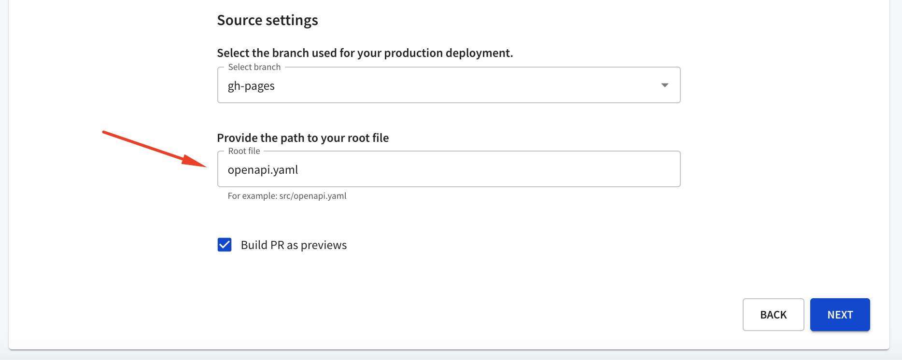
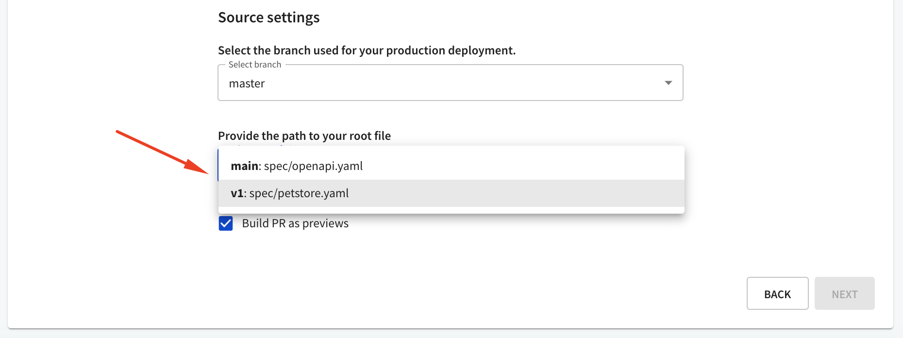
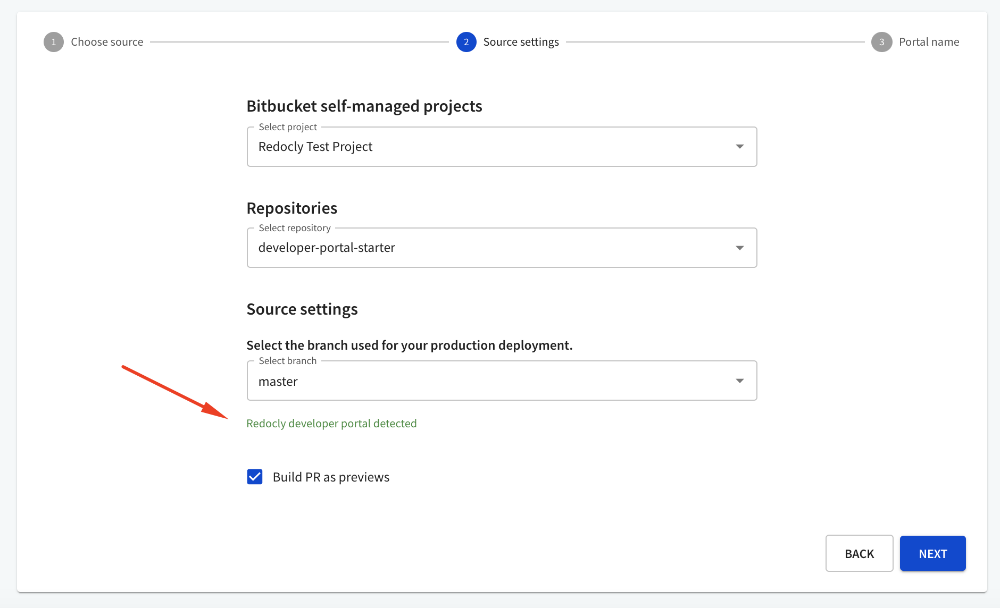

## Choose Bitbucket as source

Choose the __Bitbucket self-managed__ option from the list and select "Next".

## Configure source details

Select a project from the list.

Repositories are grouped by project.
When you select a project, the list of repositories is populated with those available to you.

When you select a repository, the list of available branches is populated.

Provide the path to your root API definition file, e.g. `openapi.yaml`.

If you have provided the path to a `redocly.yaml` file, additional options to select the root file are available in the drop-down menu. These options are based on the `apis` configuration within the selected `redocly.yaml` file.

If your project is a Redocly Developer portal, it will be detected automatically, displaying appropriate feedback.

