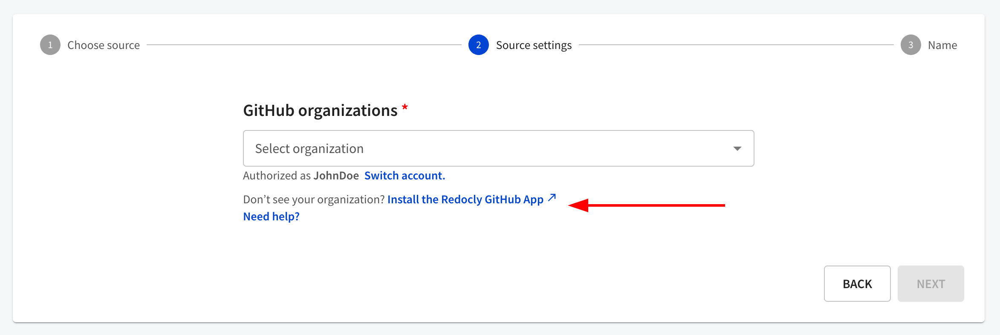
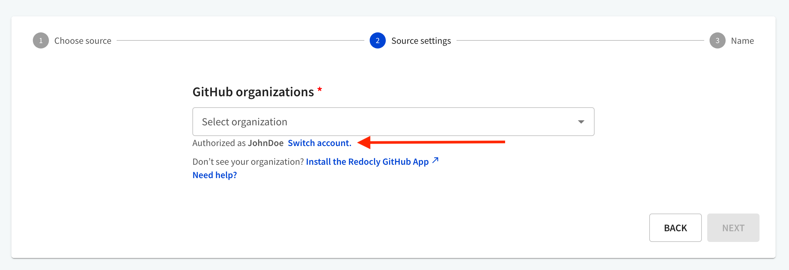
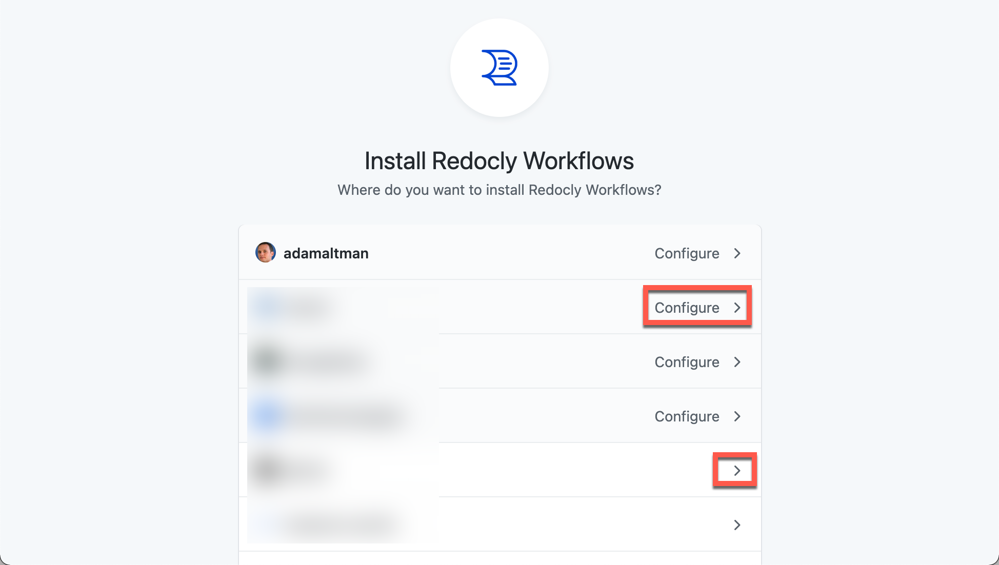
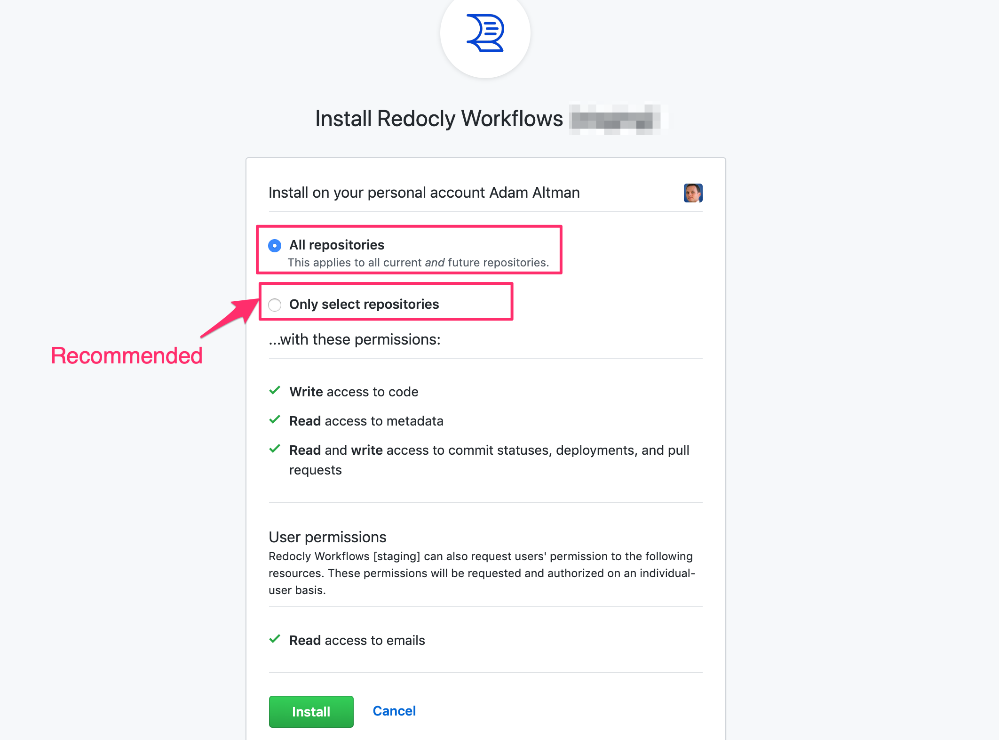
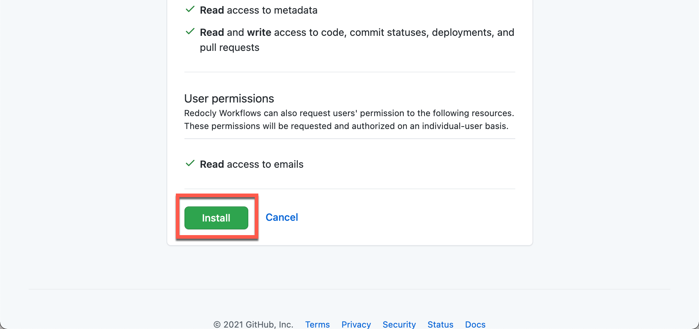
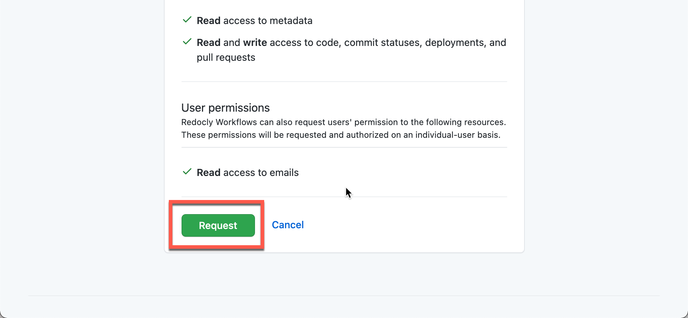
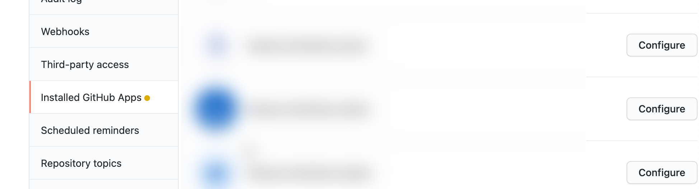
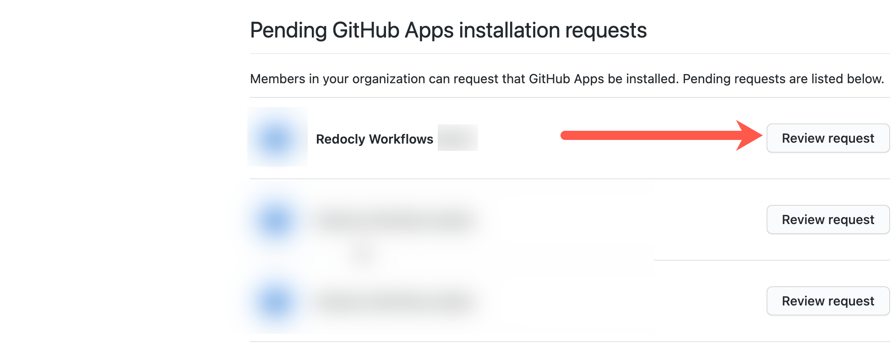

## Connect to GitHub


Complete this process once for your organization.


### Select install link

Select the link to install the Redocly GitHub app.

#### Connected to the wrong GitHub account?

1. Go to GitHub and log in with the correct account.
1. Go back to the **Source Settings** page and select "Switch account" to authorize the Redocly GitHub app.
    
1. After you've authorized with the correct account, you need to install the Redocly GitHub app.

### Select organization in GitHub


It requires GitHub admin privileges to install an app.


Select the organization.
If you notice "Configure" in the link, it means the Redocly Workflows app is already installed, and you may adjust repositories granted access.

### Select repositories to grant access

We recommend you grant access to specific repositories (the repositories with your API definitions and developer portals).

Redocly Workflows app does not create repositories (and if it did access would also be given to those).

Not an admin? You will see a "Request" button

If you are not an admin, you will see a "Request" button.

Your admin will need to approve the app by navigating to the "Installed GitHub Apps" within your organization's GitHub settings.

Then, your admin will scroll down the page to find the section with "Pending GitHub Apps installation requests" and select "Review request".

Once the app is installed and authorized by an admin of your GitHub account, you can use it.

