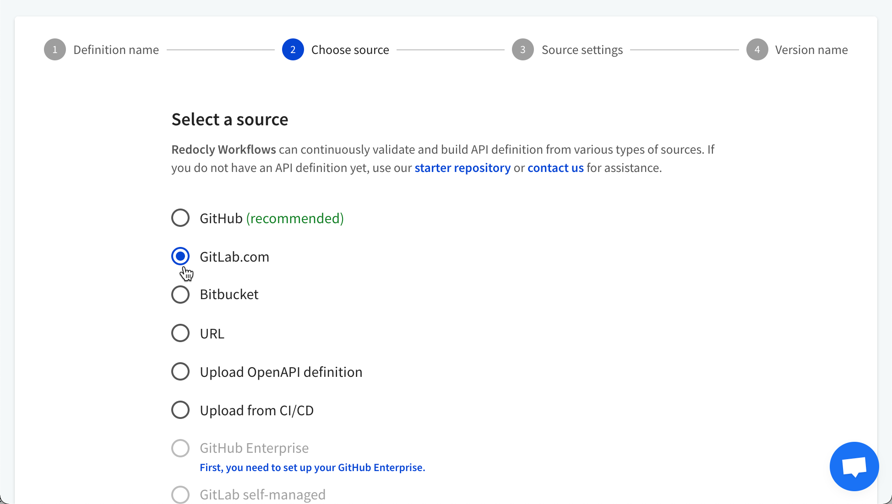
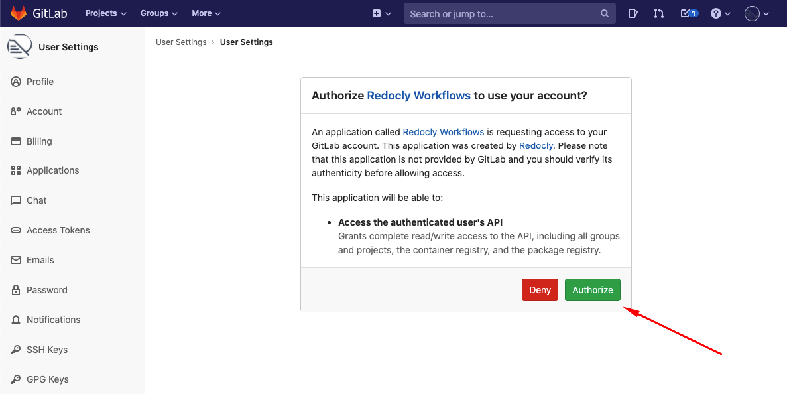
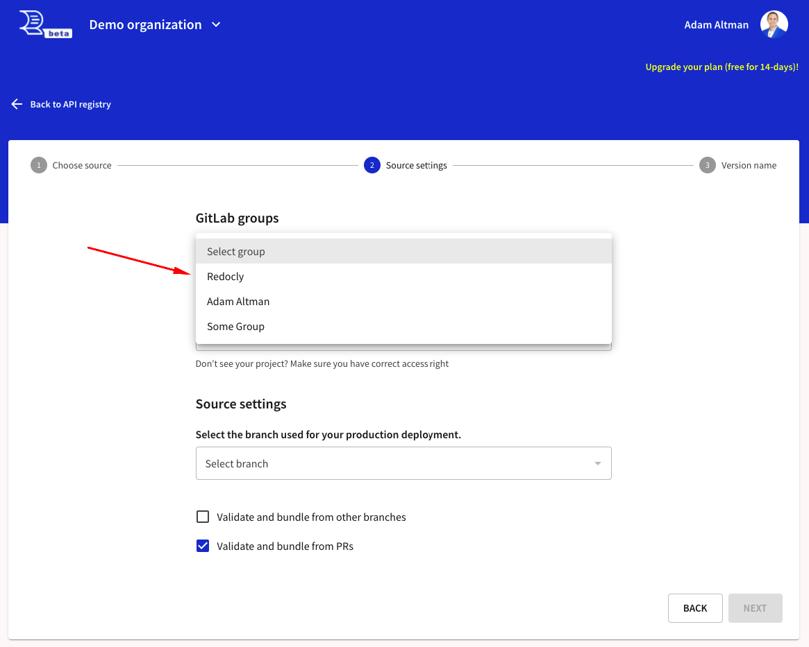
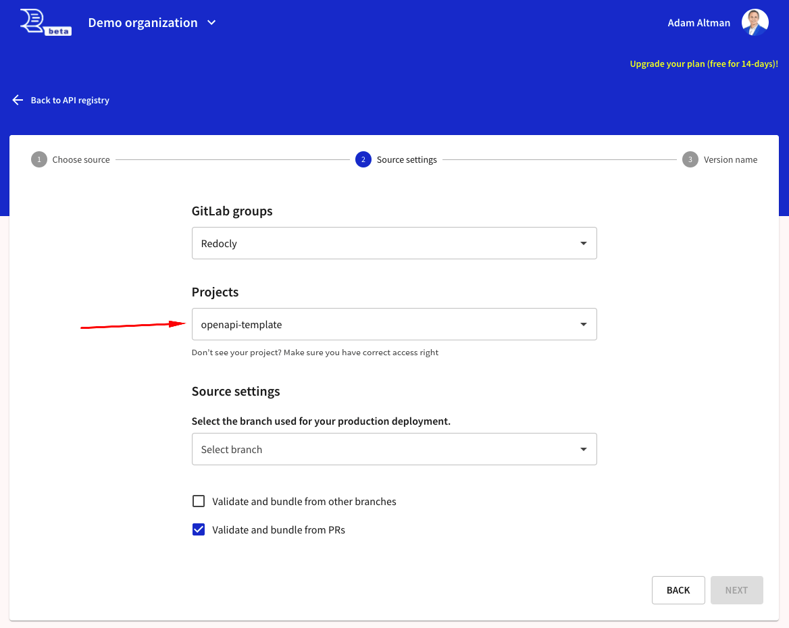
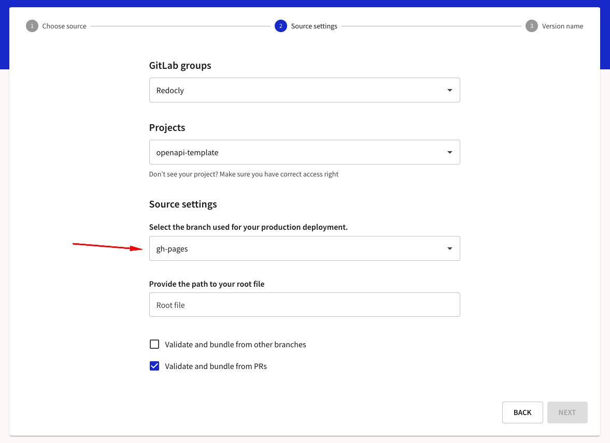

## Connect GitLab.com to Redocly

### Select GitLab.com as source provider

Select the "GitLab.com" option from the list and select "Next".

### Authorize Redocly

Sign in to GitLab.com and authorize the `Redocly Workflows` application.


Users need to complete the authorization once.


## Configure source details

You've connected GitLab to Redocly.

### Select group

Select group from the list.

Repositories are grouped by the top-level group name or user profile name.
In the list of GitLab groups you'll see:

- Name of the top-level group of your organization (in case you have developer access to at least one repository in the group or subgroup of this organization).
- The group with the name of any other GitLab user (in case you have developer access to at least one repository of this user)
- The group with your profile full name (this group holds all your own repositories if they are not in any group).

When you select the group, the list of repositories (projects in GitLab) will be populated with those available to you.

### Select project repo

Select your project repository. Be sure that you have at least `Maintainer` (`access_level=40`) rights to the project. `Maintainer` level is required for [the GitLab webhooks access](https://docs.gitlab.com/ee/user/permissions.html).

### Select branch

When you select the repository, the list of branches available will be populated.

