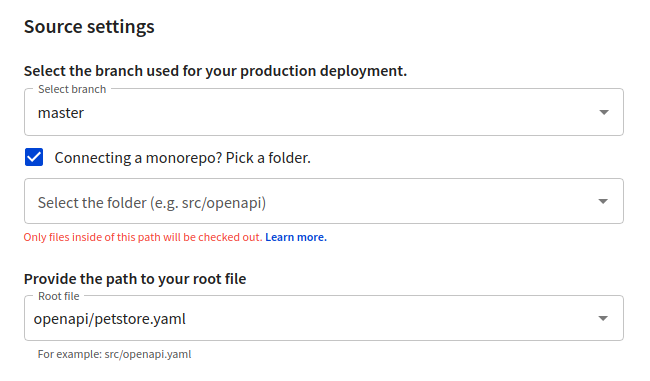
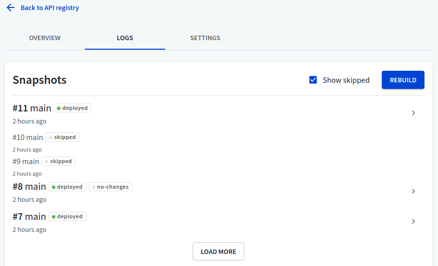

## Connect a monorepo

When connecting a monorepo or a large project where the API definitions and documentation are maintained together with the code and other resources, you can choose to limit the amount of files Workflows will check out and include in builds. This is useful for preventing build timeout issues and reduces the risk of exceeding build limits.

In the GitHub source configuration dialog, select your organization and the repository. Then, choose the production branch, and select the **Connecting a monorepo? Pick a folder** checkbox under **Source settings**. When this checkbox is selected, the **Select the folder** input field becomes available. Here you must either manually specify a folder in your repository (without the initial forward slash), or select a folder from the dropdown list.

The selected folder must contain at least one API definition file in YAML or JSON format. The API definition files from the selected folder are displayed in the **Provide the path to your root file** dropdown list. Choose one file from the list as your root API definition.

To use custom settings for your API registry and Reference docs builds, you must place your `redocly.yaml` configuration files into the selected folder. Once you have restricted your project to a folder in the repository, Workflows will not be able to use the `redocly.yaml` file(s) from the root of the repository or from any other folders.

Workflows will build and validate files only from the selected folder instead of checking out the entire repository. Any changes made outside of the selected folder will not trigger builds in your API registry or Reference docs project, and will be skipped. The GitHub interface will show all checks as passed, but validation and bundling as skipped.

To display such changes in Workflows, select the **Show skipped** checkbox on the **Logs** page.

The **Logs** page shows the `no-changes` tag for registry builds where the API definition file has not changed since the previous build.

Skipped jobs or builds do not count towards monthly usage limits.
