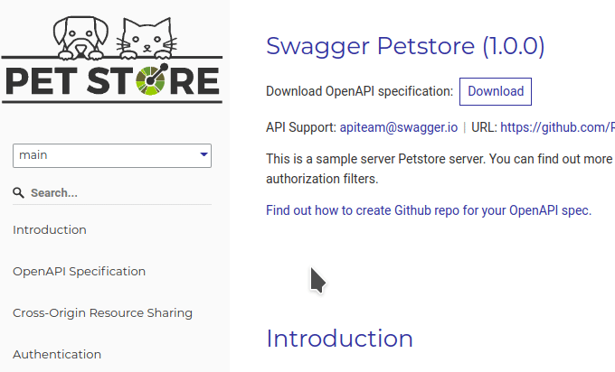

---
seo:
  title: Enable the version switcher in on-premise Reference docs
---

# Enable the version switcher in on-premise Reference docs

With Redocly, you can manage multiple versions of the same API definition and create API documentation for each of those versions. The version switcher drop-down in the generated API documentation lets you select a particular version to view associated documentation.



When using Reference docs on-premise, multiple versions of an API definition are not automatically detected when generating API documentation. As a result, you don't see the version switcher by default in your documentation.

This guide explains how to enable the version switcher by specifying the source file for each API version you want to display.

## Prerequisites

- API definition file(s) for each version

- Redocly Enterprise license key for using Reference docs on-premise. You must [provide your Enterprise license key](./on-premise.md#cli) to the CLI tool.

## Enable the version switcher

1. **Specify the source files for each version in the `options.json` file.**

If you don't already have the `options.json` file, create a new one with the following contents:

```json
{
  "definitions": {
    "versions": [
      { "title": "Version 3.1", "id": "v3.1", "url": "definition-v3.1.yaml" },
      { "title": "Version 2.1", "id": "v2.1", "url": "definition-v2.1.yaml" }
    ]
  },
  // examples of additional options
  "requiredPropsFirst": "true"
}
```

The value of the `"title"` field is displayed in the version switcher drop-down as the name of each version. The version switcher displays the versions in the same order as they are listed in the `options.json` file.

To ensure that the documentation for a specific version is always loaded first, you can set that version as the default. Add `"isDefault": true` to the version like in the following example:

```json
{ "title": "Version 3.1", "id": "v3.1", "url": "definition-v3.1.yaml", "isDefault": true },
{ "title": "Version 2.1", "id": "v2.1", "url": "definition-v2.1.yaml" }
```

2. **Pass the `options.json` file to the Redocly CLI tool.**

The CLI tool collects the API definitions from the file, so you don't have to provide the path to any of the API definition files when running the command.

Before you run the command, replace `VERSION` with the number of the latest available Reference docs version.

```bash
npx @redocly/reference-docs@VERSION build --options options.json
```

3. **Confirm that the version switcher is enabled and functioning in your API documentation.**

Access the documentation you've generated with Reference docs on-premise. By default, the version switcher is located in the upper left section of the page, above the navigation sidebar. Select an API documentation version in the drop-down and verify that it's correctly loaded.
