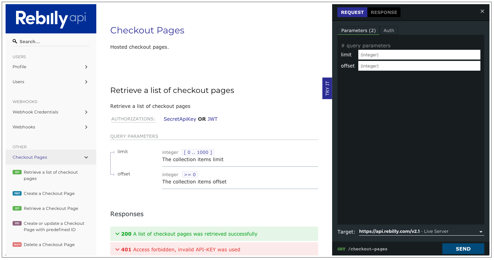
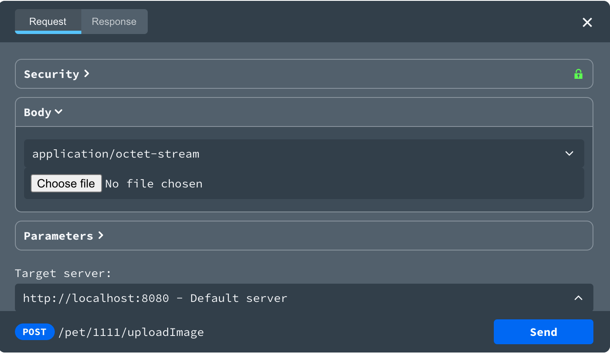

---
seo:
  title: Configure the Try it console
---

# Configure the **Try it** API console

## Overview

The **Try it** console allows your users to make API calls directly from the API docs.




The _Try it_ feature is not available in Redoc. You need access to Redocly API docs or Developer portal products to use the Try it feature.


## Requirements

In order to implement the _Try it_ feature (either for API docs or within the Developer portal), you must configure security schemes and servers in your OpenAPI definition. Your server must also support CORS requests (or you can use our CORS proxy).

### Security schemes and authentication

The _Try it_ console supports the security schemes that are [supported by OpenAPI 3.0 and 3.1](https://github.com/OAI/OpenAPI-Specification/blob/master/versions/3.0.3.md#security-scheme-object).

This section lists the authentication configurations supported for each security schema in the _Try it_ console.

| Legend              |
| ------------------- |
| ✔️: full support    |
| ⚠️: partial support |
| ❌: unsupported     |

| Type          | Variation           | Status | Notes                                                                                                                                                                                                                                    |
| ------------- | ------------------- | :----: | ---------------------------------------------------------------------------------------------------------------------------------------------------------------------------------------------------------------------------------------- |
| apiKey        | cookie              |   ✔️   |                                                                                                                                                                                                                                          |
| apiKey        | header              |   ✔️   |                                                                                                                                                                                                                                          |
| apiKey        | query               |   ✔️   |                                                                                                                                                                                                                                          |
| http          | basic               |   ✔️   |                                                                                                                                                                                                                                          |
| http          | bearer              |   ✔️   |                                                                                                                                                                                                                                          |
| oauth2        | implicit            |   ✔️   | Add our callback URL to your app.                                                                                                                                                                                                        |
| oauth2        | clientCredentials   |   ✔️   | Add our callback URL to your app.                                                                                                                                                                                                        |
| oauth2        | password            |   ⚠️   | Enter access token in form.                                                                                                                                                                                                              |
| oauth2        | authorizationCode   |   ✔️   | Add our callback URL to your app. This flow supports Proof Key for Code Exchange (PKCE) through the custom property `x-usePkce` in the **authorizationCode OAuth Flow Object**.                                                          |
| openIdConnect | token               |   ✔️   | Add our callback URL to your app. This flow maps to the oauth2 implicit flow. Supported by most identity providers. Hint: find the values your provider supports inside of the `response_types_supported` at the discovery URL.          |
| openIdConnect | code                |   ✔️   | Add our callback URL to your app. This flow maps to the oauth2 authorizationCode flow. Supported by most identity providers. Hint: find the values your provider supports inside of the `response_types_supported` at the discovery URL. |
| openIdConnect | id_token            |   ❌   | User message: "Unsupported flow".                                                                                                                                                                                                        |
| openIdConnect | id_token token      |   ❌   | User message: "Unsupported flow".                                                                                                                                                                                                        |
| openIdConnect | code id_token       |   ❌   | User message: "Unsupported flow".                                                                                                                                                                                                        |
| openIdConnect | code token          |   ❌   | User message: "Unsupported flow".                                                                                                                                                                                                        |
| openIdConnect | code id_token token |   ❌   | User message: "Unsupported flow".                                                                                                                                                                                                        |
| openIdConnect | none                |   ❌   | User message: "Unsupported flow".                                                                                                                                                                                                        |
| mutualTLS     | -                   |   ❌   | User message: "Unsupported flow" (this was added in OpenAPI 3.1).                                                                                                                                                                        |

The _Try it_ authentication only works for your active browser session. When users enter their credentials, these are saved in the session storage and removed after the session ends. If you open a new session, users need to provide their authentication details to access the _Try it_ feature.

Depending on the authentication scheme, Redocly displays the following:

- `http basic` - Username and password inputs
- `http bearer` - Input for the auth token
- `apiKey` - Input for the API Key
- `oauth2`
  - `implicit` - Inputs for `client_id` and `scopes` and Authorize button which redirects user to an identity provider:
    
  - `clientCredentials` - Inputs for `client_id`, `client_secret` and Request Token button:
    
  - `authorizationCode` - Input for the access token directly.
  - `password` - Input for the access token directly.
- `openIdConnect` - OAuth2 implicit flow UI (it works only for OpenID servers that support the `token` `response_type`). Redocly will support `code` once we add support for `authorizationCode` oauth2 flow.

### Servers

OpenAPI 3 allows you to [define the servers](https://github.com/OAI/OpenAPI-Specification/blob/master/versions/3.0.3.md#serverObject), including optional [server variable objects](https://github.com/OAI/OpenAPI-Specification/blob/master/versions/3.0.3.md#server-variable-object).

| Property    | Required for Try it | Description                                                                        |
| ----------- | ------------------- | ---------------------------------------------------------------------------------- |
| url         | Yes                 | API requests are sent to this URL directly from the browser or via the CORS proxy. |
| description | -                   | If provided, the description is displayed with the URL.                            |
| variables   | -                   | If provided, fields are added to supply values for each server variable defined.   |

### Request handling

You can use one of these options to handle requests:

- Directly from the browser (server requires CORS configuration)
- With a CORS proxy (server does not require CORS configuration)

#### Directly from the browser

The CORS [(Cross-Origin Resource Sharing)](https://developer.mozilla.org/en-US/docs/Web/HTTP/CORS) protocol allows scripts running in a browser to access resources from a different origin (e.g. a different domain or port). Preventing scripts from accessing external resources is a reasonable security policy.

However in some cases, scripts must be able to access cross-origin resources to successfully complete a request, for example the _Try it_ API console. For users to interact with your APIs through the API console, you must configure your server(s) to accept requests from a URL where your API reference docs are hosted.

Your server(s) must allow cross-origin resource sharing, and respond to the OPTIONS requests sent by the browser when the user works with the API console. The `Access-Control-Allow-Origin` header configured on the server tells the browser whether any origins are allowed to access a resource.

#### With a CORS proxy

If you cannot configure your server(s) to allow CORS, you can use Redocly's **CORS Proxy** feature to prevent issues with unsuccessful requests from the API console. When you enable the CORS Proxy feature, all requests sent from the API console are routed through the CORS proxy server. The URL in each request is automatically prepended by the CORS proxy URL.

The URL of the Redocly CORS proxy server is `https://cors.redoc.ly`.

_Customers who host Redocly products on-premises can use their own CORS proxy server, by setting the `corsProxyUrl` value to their own CORS proxy server URL in the Redocly configuration file._

Authentication-related URLs are not proxied. You can prepend our CORS proxy URL to your `authorizationUrl`, `tokenUrl`, `refreshUrl` or `openIdConnectUrl` if required.

In Redocly Workflows, the CORS Proxy feature is enabled by default in projects created after March 2021, and disabled in pre-existing projects.

You can configure CORS Proxy for the following products:

**API docs**

- [in configuration file](../configuration/functionality.md): Modify the value of the `corsProxyUrl` option in the Redocly configuration file. The value can be the Redocly CORS proxy URL (https://cors.redoc.ly) or the URL of a custom CORS proxy server. To disable the CORS proxy, set `corsProxyUrl: false`.
- [in Redocly Workflows](/docs-legacy/workflows/docs/#docs-settings): Navigate to **API version > Settings > Features** and (de)select the **Disable CORS Proxy** checkbox in the _Try it settings_ section.

**Portals**

- [in configuration file](../../developer-portal/guides/reference-docs-integration.md): Modify the value of the `settings: corsProxyUrl` option in the `.page.yaml` configuration file. Set the value to either the Redocly CORS proxy URL (https://cors.redoc.ly) or the URL of a custom CORS proxy server.

_To maximize the security and privacy of our clients and their users, Redocly does not collect or store any logs of traffic routed through the CORS proxy server._

**About Redocly's CORS Proxy**

The CORS proxy server is hosted on Heroku, and as a result, its IP addresses are highly dynamic. For more information, refer to the official AWS documentation for [currently published IP ranges](https://docs.aws.amazon.com/general/latest/gr/aws-ip-ranges.html).

We do not recommend adding entire IP ranges to your allowlist.

## Enable the file upload helper

Starting with version `2.1.12` of Redocly API docs, the _Try it_ console supports the file upload helper, making it easier to add files to a request. This feature is supported for OpenAPI 3.0 and OpenAPI 3.1.

The `requestBody` schema in the API definition must have valid properties according to the [OAS 3.0](https://github.com/OAI/OpenAPI-Specification/blob/main/versions/3.0.3.md#considerations-for-file-uploads) and [OAS 3.1](https://github.com/OAI/OpenAPI-Specification/blob/main/versions/3.1.0.md#considerations-for-file-uploads) specification, respectively.

When the `requestBody` schema in the API definition is recognized as valid, the **Choose file** button is visible in the request body section of the _Try it_ console. Select the button to open the file picker dialog and add one or more files to your request.



The following examples illustrate different types of request body schemas that can be used with the file upload helper.

**Examples for multipart/form-data**


```yaml
requestBody:
  content:
    multipart/form-data:
      schema:
        type: object
        properties:
          fileBase64:
            description: file to upload
            type: array
            items:
              type: string
              format: binary
          fileBinary:
            description: file to upload
            type: array
            items:
              type: string
              format: binary
```


```yaml
requestBody:
  description: Example description
  required: true
  content:
    multipart/form-data:
      schema:
        type: object
        properties:
          fileBase64:
            description: Example description
            type: array
            items:
              type: string
              format: base64
          fileBinary:
            description: Example description
            type: array
            items:
              type: string
              contentMediaType: application/octet-stream
```


**Examples for application/octet-stream**


```yaml
requestBody:
  content:
    application/octet-stream:
      schema:
        type: string
        format: base64
```


```yaml OpenAPI 3.1
requestBody:
  description: Example description
  required: true
  content:
    application/octet-stream: {}
```


**Examples for binary image file (JPG, PNG)**


```yaml
requestBody:
  content:
    'image/jpeg':
      schema:
        type: string
        format: binary
    'image/png':
      schema:
        type: string
        format: base64
```


```yaml OpenAPI 3.1
requestBody:
  description: Example description
  required: true
  content:
    'image/jpeg': {}
    'image/png':
      schema:
        type: string
        contentEncoding: base64
```


## Disable the _Try it_ console

To disable the _Try it_ panel, set the `hideTryItPanel` to `true`.

```yaml
theme:
  openapi:
    hideTryItPanel: true # Disable the _Try it_ console.
```


You can also use the Redocly configuration file to set other feature options. Learn more about [docs-related configuration options](../configuration/functionality.md).

Keep the configuration file in the root of your repository with your OpenAPI definitions, or upload it to Workflows with your OpenAPI definitions.


To disable the _Try it_ panel for a single operation, use the `x-hideTryItPanel` specification extension. Set it to `true` on the operation level in your OpenAPI definition:

```yaml
openapi: '3.0.3'
info: ...
tags: [...]
paths:
  /example:
    get:
      summary: Example summary
      description: Example description
      operationId: examplePath
      responses: [...]
      parameters: [...]
      x-hideTryItPanel: true
```

### How is the console implemented?

The \*Try it\*\* console is implemented as a _lazy-loadable standalone plugin_, so it does not increase the initial loading time.

The console plugin is loaded **on demand** when a user clicks the **Try it** button.
