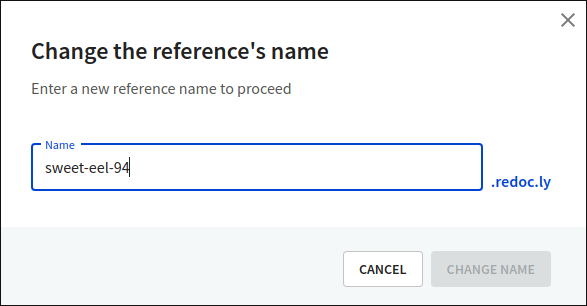
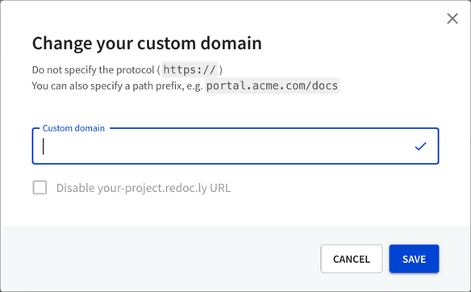

# Custom domain

You can edit the subdomain name and configure a custom domain for your API docs on the **Custom domain** page.

Custom domains are supported only in Professional and Enterprise plans.

## Edit the subdomain name

1. Access the **Settings > Custom domain** page of your API version.

2. Select the _Edit_ (pencil) icon next to the name. This opens the **Change the reference's name** dialog, where you can enter a new name for the API docs subdomain. You can exit the dialog at any time by selecting **Cancel**.

3. The name you enter is prepended to `.redoc.ly` and used as your subdomain. Together they make up the URL where you can access your API docs. Allowed characters are `[a-z],[0-9],-`. The name must be unique, and if it already exists in your or in another Workflows organization, the dialog warns you to change it.

4. After entering a new name, select **Change name** to save your changes. This does not trigger a new build.

## Configure a custom domain

1. Access the **Settings > Custom domain** page of your API version.

2. Select the _Edit_ (pencil) icon next to the custom domain. This opens the **Change your custom domain** dialog, where you can configure a custom domain for your API docs. You can exit the dialog at any time by selecting **Cancel**.

3. You must enter the custom domain without the protocol. Optionally, you can specify a path prefix to create a subdirectory in your custom domain from which the docs are served (for example, `portal.acme.com/docs`, where `/docs` is the path prefix).

4. Optionally, select the **Disable your-project.redoc.ly URL** checkbox. This disables the default `redoc.ly` URL.

5. After entering a custom domain, select **Save**. To complete the configuration process, point your domain's CNAME record to `ssl.redocly.com`.

## Disable default URL

To enable redirect requests from your default URL to your custom domain, disable the default URL.

1. Access the **Settings > Custom domain** page of your API version.

2. Select the _Edit_ (pencil) icon next to the custom domain. This opens the **Change your custom domain** dialog, where you can select a custom domain and disable the default URL for your API docs. You can exit the dialog at any time by selecting **Cancel**.

3. To disable the default `redoc.ly` URL, first configure a custom domain name.

4. The **Disable your-project.redoc.ly URL** checkbox becomes available when you configure a custom domain. Select it to disable the default URL.

5. Select **Save** to apply changes.


If you've [embedded your project](../../developer-portal/guides/embedding-portals.md) into an existing website, make sure you're sending the `X-Forwarded-For` header.

