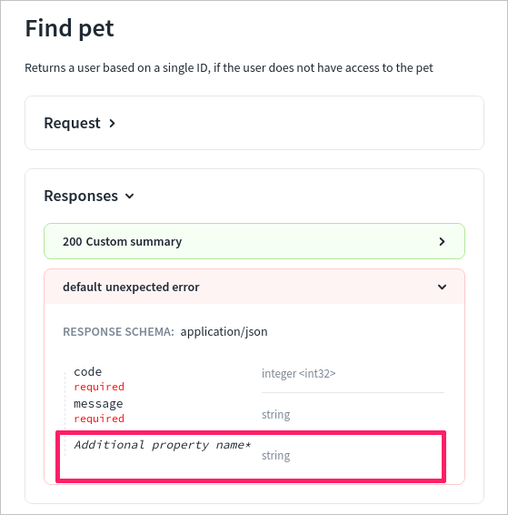

# x-additionalPropertiesName


This is a Redocly-specific extension unsupported by other tools.


## Usage

Use `x-additionalPropertiesName` to display a more descriptive property name in objects with `additionalProperties` when viewing the property list with an `object`. Add it to the `schema` OpenAPI object.

| Field Name                 |  Type  | Description                                                              |
| :------------------------- | :----: | :----------------------------------------------------------------------- |
| x-additionalPropertiesName | string | Specifies a custom, more descriptive name of additional properties keys. |

## Examples

```yaml
openapi: '3.0'
info: ...
tags: [...]
schemas:
  Player:
    required:
      - name
    properties:
      name:
        type: string
    additionalProperties:
      x-additionalPropertiesName: attribute-name
      type: string
```

### In Reference docs


