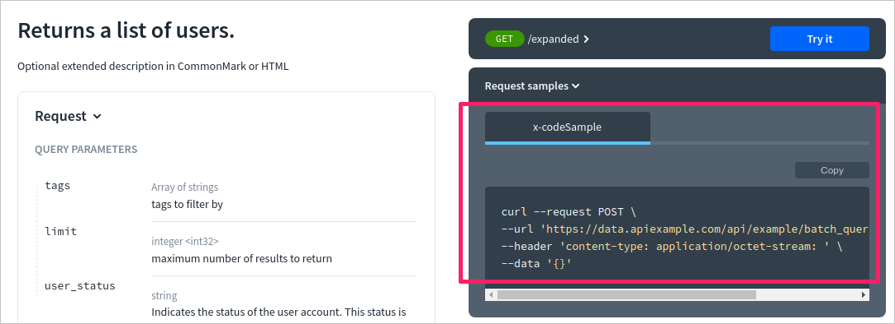

# x-codeSamples

## Usage

Use `x-codeSamples` (previously called `x-code-samples`) to add custom code samples in one or more languages to your operations. When specified, the code samples are rendered in the right panel of the API documentation. Add it to the `operation` OpenAPI object.

| Field Name    |                     Type                      | Description                                          |
| :------------ | :-------------------------------------------: | :--------------------------------------------------- |
| x-codeSamples | [ [Code Sample Object](#code-sample-object) ] | A list of code samples associated with an operation. |

### Code Sample Object

| Field Name |  Type  | Description                                                                                                                                |
| :--------- | :----: | :----------------------------------------------------------------------------------------------------------------------------------------- |
| lang       | string | Code sample language. Value should be one of the following [list](https://github.com/github/linguist/blob/master/lib/linguist/popular.yml) |
| label      | string | Code sample label, for example `Node` or `Python2.7`, _optional_, `lang` is used by default                                                   |
| source     | string | Code sample source code                                                                                                                    |

## Examples

Specify the language of the sample, and add it directly in the OpenAPI file, as shown below:

```yaml
openapi: '3.0.3'
info: ...
tags: [...]
paths:
  /example:
    get:
      summary: Example summary
      description: Example description
      operationId: examplePath
      responses: [...]
      parameters: [...]
      x-codeSamples:
        - lang: 'cURL'
          label: 'CLI'
          source: |
            curl --request POST \
            --url 'https://data.apiexample.com/api/example/batch_query/json?format=json' \
            --header 'content-type: application/octet-stream: ' \
            --data '{}'
```

### Code sample object

```yaml YAML
lang: JavaScript
source: console.log('Hello World');
```
```json JSON
{
  "lang": "JavaScript",
  "source": "console.log('Hello World');"
}
```

### Include an external code file

Putting the code samples in separate files gives you the opportunity to validate and reuse the content. You can use the following `$ref` syntax to refer to a separate code sample file:

```yaml
  x-code-samples:
    - lang: PHP
      source:
        $ref: ../code_samples/PHP/customers/post.php
```

### In Reference docs


