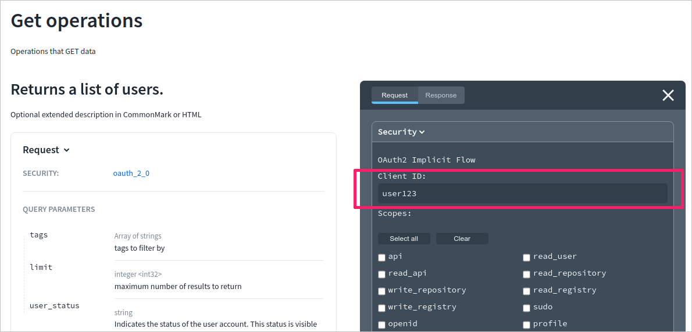

# x-defaultClientId

## Usage

Use `x-defaultClientId` to preset the default `clientId` value in relevant security definitions. Add it directly to the `flow` object or to the `securityScheme` object. When specified, the preset `clientId` value is displayed in the _Try it_ console. Note that the console must be enabled in the Reference docs configuration for this value to be visible.

This specification extension supports:

- OIDC
- `implicit`, `authorizationCode` and `clientCredentials` OAuth2 flows

| Field Name        |  Type  | Description                                                                      |
| :---------------- | :----: | :------------------------------------------------------------------------------- |
| x-defaultClientId | string | Specifies the default `clientId` value to be displayed in the API documentation. |

## Examples

### Flow level

```yaml
openapi: '3.0'
info: ...
tags: [...]
components:
  securitySchemes:
    oauth_2_0:
      type: oauth2
      flows:
        implicit:
          x-defaultClientId: user123
          authorizationUrl: https://example.com/api/oauth/dialog
          scopes:
            write:items: modify items in your account
            read:items: read your items
```

### Security scheme level


```yaml
openapi: '3.0'
info: ...
tags: [...]
components:
  securitySchemes:
    oauth_2_0:
      type: oauth2
      x-defaultClientId: user123
      flows:
        implicit:
          # ...
        clientCredentials:
          # ...
```


```yaml
openapi: '3.0'
info: ...
tags: [...]
components:
  securitySchemes:
    oauth_2_0:
      type: openIdConnect
      openIdConnectUrl: https://gitlab.com/.well-known/openid-configuration
      x-defaultClientId: user123
```


### In Reference docs


