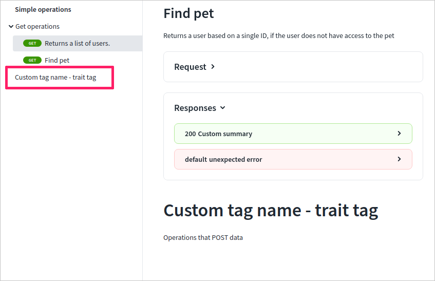

# x-displayName

## Usage

Use `x-displayName` to add a custom name for a tag. When defined, this custom name is used instead of the default name from the `name` value in the navigation sidebar and in section headings. Add it to the `tag` OpenAPI object.

| Field Name    |  Type  | Description                                                                        |
| :------------ | :----: | :--------------------------------------------------------------------------------- |
| x-displayName | string | Defines the text that is used for this tag in the sidebar and in section headings. |

## Examples

```yaml
openapi: '3.0'
info: ...
tags:
  - name: sample-123
    description: Example description
    x-displayName: Custom tag name - trait tag
```

### In Reference docs




Use [x-traitTag](x-trait-tag.md) and [x-tagGroups](x-tag-groups.md) to further customize tags.

